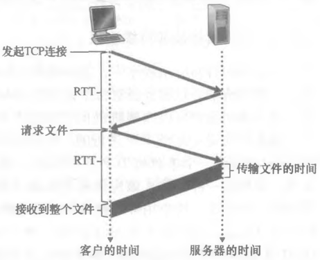
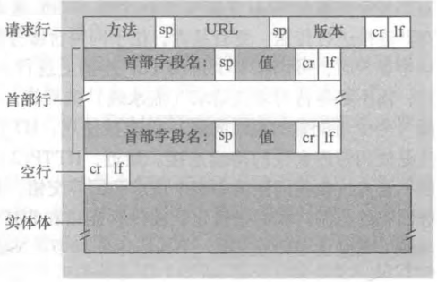
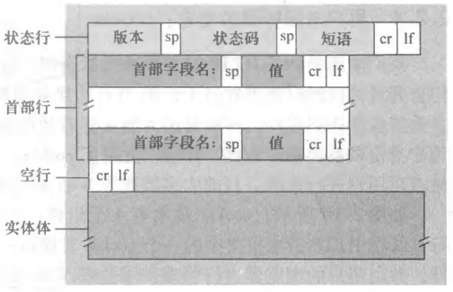
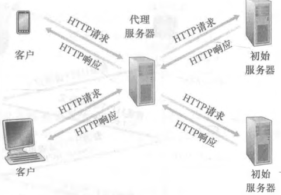
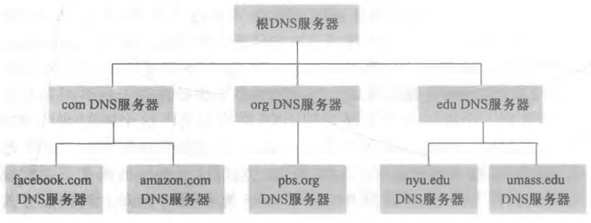
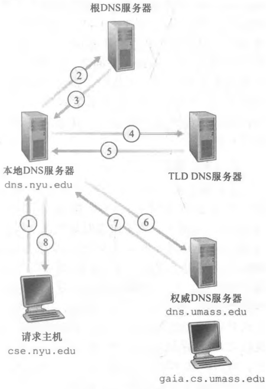

# 应用层

## 应用层协议原理

### 应用层协议

##### 应用层

- 应用层负责不同应用程序如何传递报文；
- 该层的分组称为报文；

##### 应用层协议

- 不同应用程序之间如何传递报文；
  - 交换的报文类型；
  - 不同报文类型的语法；
  - 报文字段的语义；
  - 何时发送报文，如何发送报文，如何响应报文的规则；

### 网络应用程序体系结构

##### cs 结构

- 客户端-服务器结构；
- 服务器：处理客户端的请求；
  - 服务器具有固定的 IP 地址；
  - 数据中心：服务器集群；

##### p2p 结构

- 服务器具有最小甚至没有作用；
- 主机之间直接通信；

### 进程通信

##### 客户和服务器进程

- 客户：发起通信的进程；
- 服务器：等待通信的进程；

##### 进程和计算机网络的接口

- 进程通过 socket (套接字) 向计算机网络发送和接受报文；

##### 进程寻址

- 目标主机的地址：IP 地址；
- 目标主机的对应进程的标识符：端口号；

## HTTP

### HTTP

##### HTTP

- 超文本传输协议 (HyperText Transfer Protocol)；
- RFC 1945 和 RFC 2616；
- 定义了 Web 客户端向 Web 服务器请求 Web 网页的方式；

##### 运输层协议

- TCP；

##### 无状态协议

- HTTP 不保存客户端的任何信息；

### 非持续连接和持续连接

##### 往返时间

- Round-Trip Time (RTT)；
- 一个分组从客户端到服务器再返回客户端话费的时间；

##### 非持续连接

- 不同 http 请求使用单独的 TCP 连接；
- Web 服务器负担重；

##### 持续连接

- 不同 http 请求使用同一个 TCP 连接；
- TCP 连接一定时间未被使用关闭该连接；

##### 请求并接收一个 HTML 的时间

- 三次握手；
  - 第一次握手：客户端向服务器发送一个小 TCP 报文段；
  - 第二次握手：服务器向客户端发送一个小 TCP 报文段做出确认和响应；
  - 第三次握手：客户端向服务器发送一个小 TCP 报文段返回确认；
- 三次握手的前两次花费一个 RTT；
- 第三次握手和服务器传输 HTML 花费了一个 RTT；
- 总时间为 2 个 RTT + 服务器传输 HTML 的时间；



### HTTP 报文格式

##### HTTP 请求报文

- 请求行：方法字段 + URL + HTTP 版本；
- 首部行：指明 HTTP 请求的信息；
- 空行；
- 实体体：POST 请求使用；



```typescript
POST /mcp/pc/pcsearch HTTP/1.1
Accept-Encoding: gzip, deflate, br
Accept-Language: zh-CN,zh;q=0.9
Connection: keep-alive
Content-Length: 56
Content-Type: application/json
Sec-Fetch-Dest: empty
Sec-Fetch-Mode: cors
Sec-Fetch-Site: same-site
User-Agent: Mozilla/5.0 (Windows NT 10.0; Win64; x64) AppleWebKit/537.36 (KHTML, like Gecko) Chrome/116.0.0.0 Safari/537.36
```

##### HTTP 响应报文

- 状态行：版本 + 状态码 + 短语；
- 首部行：指明 HTTP 请求的信息；
- 空行；
- 实体体：POST 请求使用；



```typescript
HTTP/1.1 200 OK
Access-Control-Allow-Credentials: true
Access-Control-Allow-Headers: Content-Type
Access-Control-Allow-Methods: POST, GET
Access-Control-Allow-Origin: https://www.baidu.com
Content-Length: 121
Content-Type: application/json; charset=utf-8
Date: Tue, 29 Aug 2023 11:46:39 GMT
Tracecode: 39767229801514423306082907
```

### cookie

- 存储用户信息；
- RFC 6265 定义；
- 但是具有一定的安全隐患；

### Web 缓存

##### Web 缓存器

- Web 缓存器又称代理服务器；
- 存储用户最近请求的副本；
- 用户的 HTTP 请求经过配置后首先指向 Web 缓存器；



##### Web 缓存器的作用

- 减少用户请求的响应时间；
- 减少因特网的 Web 流量；

##### 命中率

- Web 缓存器满足用户请求的比率；

## 电子邮件

### 电子邮件系统的组成

##### 电子邮件系统的组成

- 用户代理；
- 邮件服务器；
- 简单邮件传输协议 (SMTP)；


##### 流程

- 用户代理从邮件服务器发送和接受邮件；
- 邮件通过 SMTP 在发送方和接收方的邮件服务器进行传输；
- 若接收方邮件服务器无法正常工作；
- 邮件在发送方邮件服务器保持一段时间，并不断尝试发送；

### SMTP

##### SMTP

- Simple Mail Transfer Protocol；
- 基于 TCP；
- RFC 5321 定义；
- 作用；
  - 发送方的用户代理发送到发送方的邮件服务器；
  - 发送方的邮件服务器发送到接收方的邮件服务器；

##### 中间邮箱服务器

- SMTP 不使用中间邮箱服务器；
- 两个邮箱服务器直连；

##### SMTP 和 HTTP 的区别

- 区别一；
  - HTTP 使用 pull protocol，用户向服务器拉取数据；
  - SMTP 使用 push protocol，用户向邮件服务器推送数据；
- 区别二；
  - HTTP 数据类型不受限制；
  - SMTP 使用 7 bit ASCII 码；
- 区别三；
  - HTTP 把对象封装到 HTTP 响应报文中；
  - 邮件把所有对象封装到一个报文中；

### 报文邮件格式

##### 报文邮件格式

- 报文首部 (如下列代码)；
- 空白行；
- ASCII 表示的报文体；

```json
From: test@test.test
To: tt@tt.tt
Subject: test
```

### 邮件访问协议

##### 邮件访问协议

- 用户代理从邮件服务器拉取邮件的协议；


##### 常见的邮箱访问协议

- POP3；
- IMAP；

##### 基于 HTTP 的电子邮件

- 除了邮件服务器之间使用 SMTP；
- 其余过程使用 HTTP；

## DNS

### DNS

##### DNS

- Domain Name System (域名系统)；
- RFC 1034 和 RFC1035 定义；
- DNS 服务器实现的分布式数据库；
- 将 URL 的主机名到 IP 地址转换的目录服务；
  - 基于 UDP；
  - 使用 53 端口；

##### DNS 的其他任务

- 主机别名；
- 邮件服务器别名；
- 负载分配；
  - 一个主机名具有多个 IP 地址，对应多台服务器；
  - DNS 服务器可实现负载均衡；

##### 使用 udp 原因

- dns 报文数据量小，报文数量多；
- 使用 udp 协议速度快，首部开销小，减轻服务器负担；

### DNS 工作过程

##### 层次结构

- 根 DNS 服务器；
- 顶级域 DNS；
- 权威 DNS；



##### 本地 DNS 服务器

- 不属于 DNS 的层次结构；
- 每一个 IPS 具有一台本地 DNS 服务器；
- 本地 DNS 起中转和缓存作用，具有减少查询流量的作用；

##### 查询过程

- 客户端运行 DNS 的客户端；
- 浏览器从 URL 提取主机名，发送给 DNS 客户端；
- DNS 客户端向 DNS 服务器发送一个包含主机名的请求；
  - 递归查询；
    - 客户向本地 DNS 服务器发送请求报文；
    - 存在缓存，返回 ip 地址，否则进行迭代查询；
  - 迭代查询；
    - 本地 DNS 服务器首先与根 DNS 发送请求报文，返回一个 TLD DNS 的 IP 地址；
    - 本地 DNS 服务器其次与 TLD DNS 发送请求报文，返回一个权威 DNS 的 IP 地址；
    - 本地 DNS 服务器最后与权威 DNS 发送请求报文，返回主机名的 IP 地址；
- DNS 客户端收到一个回复报文，包含主机名的对应 IP 地址；
- 浏览器接受到 IP 地址，向 IP 地址的 80/443 端口的进程发送一个 TCP 连接；



##### DNS 缓存

- DNS 服务器接受到一个回复报文后，缓存到本地一段时间；
- 若另一台主机进行相同的查询，直接返回；

### DNS 记录和报文

##### 资源记录

- Resource Record (RR)；
- (Name，Value，Type，TTL)；
  - Name 和 Value 取决于 Type；
  - Type；
    - A：Name 和 Value 为主机名和 IP；
    - NS：Name 和 Value 为域和知道该域对应 IP 地址的权威 DNS 服务器的主机名 (dns。foo。com)；
    - CNAME：Name 和 Value 为主机的别名和规范主机名；
    - MX：Name 和 Value 为邮件服务器的别名和规范主机名；
  - TTL：RR 的缓存时间；

##### DNS 报文

- 查询报文和回复报文具有相同格式；
- 首部区域：报文的元数据；
- 问题区域：查询信息；
- 回答区域：回复信息；
- 权威区域：其他权威服务器的记录；
- 附加区域：其他有帮助的信息；


##### DNS 脆弱性

- DDos：向每个 DNS 根服务器发送大量分组，使得大多数合法请求得不到回答；

## P2P 文件分发

##### P2P

- 服务器具有最小的作用甚至没有作用；
- 客户端和客户端直接建立联系；

##### 分发时间

- 所有 N 个对等方得到该副本需要的时间；

##### BitTorrent

- 用于文件分发的 P2P 协议；
- 使用 TCP 连接；

## 视频流和内容分发网

### HTTP 流和 DASH

##### HTTP 流

- 服务器发送视频文件；
- 客户端缓存接受到的字节，到达一定数量便播放视频并缓存下一段；

##### DASH

- Dynamic Adaptive Streaming over HTTP (HTTP 的动态适应流)；
- 视频编码为多个版本，具有不同的比特率；
- 根据客户的网络质量自动选择不同的版本；

### 内容分发网

##### 内容分发网

- Content Distribution Network (CDN)；
- CDN 管理分布在多个地理位置的服务器；
- 缓存源站点数据；
- 将用户请求定向到最优的服务器上，加速访问速度；

##### 两种服务器安置原则

- 深入：在基于全球的 ISP 中部署服务器集群；
- 邀请做客：在少量关键位置建立服务器集群，邀请 ISP 访问，一般部署在 IXP 中；

##### CDN 的工作流程

- 确定适合该客户的 CDN 服务器集群；
- 将客户请求重定向到该集群：一般基于 DNS 实现；
  - 客户访问 URL 并发送 DNS 请求；
  - DNS 服务器返回 CDN 的主机名；
  - DNS 请求重定向到 CDN 的 DNS 服务中；
  - 返回 CDN 服务器的 IP 地址；
  - 客户与 CDN 建立 TCP 连接；

##### CDN 的集群选择策略

- 地理最邻近；
  - 地理最邻近不一定是网络上的最邻近；
- CDN 周期性的实时测量；

##### 存放内容

- 静态资源文件；
  - 图片/视频/音频；
  - 第三方库 js 文件；
  - 字体文件；
- 静态页面文件；

##### 优势

- 减低用户访问延迟；
- 减少源站点带宽；
- 增强安全性：cdn 服务商提供防御措施；
- 提高可用性：某服务器出现故障，向其他服务器请求；
