# 网络层

## 网络层概述

### 网络层

- 网络层负责将不同主机之间的通信服务;
  - IP;
- 网络层的分组称作数据报;

### 转发和路由选择: 数据平面和控制平面

##### 转发 (数据平面)

- 路由器将一条输入链路的分组移动到合适的输出链路;
- 通常耗费几纳秒;

##### 路由选择 (控制平面)

- 分组从发送方流向接收方时;
- 网络层确定分组使用的路由或路径;
- 通常耗费几秒;

##### 转发表

- 通过数据报首部的若干字段;
- 在转发表中进行索引, 从而实现分组转发;

##### 控制平面方法

- 传统方法;
  - 路由器具有一个和其他路由器通信的路由选择组件;
  - 基于路由选择算法配置转发表;
- SDN 方法;
  - 路由器仅实现转发功能;
  - 具有一个远程控制器实现路由选择;

### 网络服务模型

##### 网络服务模型

- 定义了数据报在发送端和接收端之间的运输特性;
- 服务;
  - 确保交付;
  - 具有时延上界的确保交付;
  - 有序分组交付;
  - 确保最小宽带;
  - 安全性;

##### 因特网的网络层

- 尽力而为服务;
- 实则就是不保证任何服务;

## 路由器工作原理

### 路由器体系结构

##### 路由器体系结构

- 数据平面: 硬件实现;
  - 输入端口;
  - 交换结构;
  - 输出端口;
- 控制平面: 软件实现;
  - 路由选择处理器;

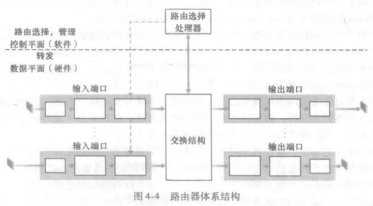

### 输入端口处理和基于目的地转发

##### 输入端口处理

- 线路端接;
- 数据链路处理;
- 查找, 转发, 排队;
- 进入交换结构;

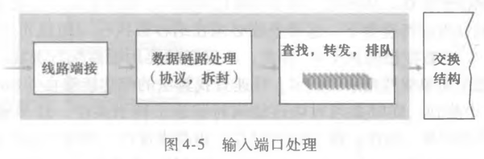

##### 转发表匹配机制

- 路由器使用最长前缀匹配规则;
- 在转发表中寻找最长的匹配项, 并向对应链路接口转发分组;

### 交换

##### 三种交换技术

- 经内存交换;
  - 使用内存交换分组;
  - 同一时间内仅能执行一次读或写;
- 经总线交换:
  - 多个输入端口和输出端口共享一条总线;
  - 同一时间只能一个分组使用总线;
- 经互联网络交换;
  - 使用一条 2N 条总线构成的互联网络;
  - 连接 N 个输入和输出端口;

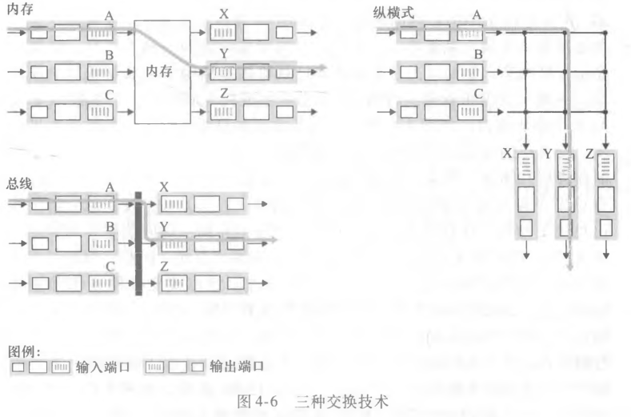

### 输出端口处理

##### 输出端口处理

- 离开交换结构;
- 排队;
- 数据链路处理;
- 线路端接;

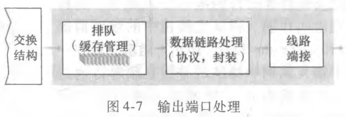

### 排队

##### 丢包

- 路由器缓存空间耗尽;
- 分组被路由器丢弃;

##### 输入排队

- 线路前部堵塞 (HOL 堵塞);
- 输入队列排队的分组必须等待队列前面的分组交换完毕;

##### 输出排队

- 主动队列管理 (AMQ);
  - 缓存空间耗尽;
  - 基于 AMQ 算法丢弃到达的分组或一个排队中的分组;

### 分组调度

##### 先进先出

- FIFO;
- 根据分组到达顺序一次处理;

##### 优先权排队

- 根据数据报的首部信息设置优先级;
- 不同优先级具有不同的等待队列;
- 优先选择优先级高的分组;
- 相同优先级用词使用 FIFO;

##### 非抢占式优先权排队

- 分组一旦传输就不能被中断;
- 即使优先级高的分组到达;

##### 循环和加权公平排队

- 循环排队规则;
  - 不存在严格的优先级;
  - 循环调度器在若干等待队列中循环选择;
- 加权公平排队 (WFQ);
  - 不存在严格的优先级;
  - 每个队列具有一个基于分组数量的加权平均值;
  - 每个队列至少可以分配到对应加权平均值的带宽;

## 网际协议

### IPv4

##### IPv4 数据报格式

- 首部字段;
  - TTL: IP 包被路由器丢弃之前 ICMP 包的转发次数 (跳数);
- 数据字段: TCP 或 UDP 报文段;

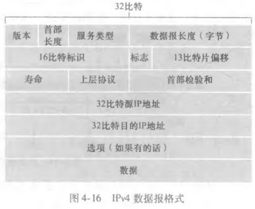

##### IPv4 数据报分片

- MTU 限制 IP 数据报的长度;
- 通过标识, 标志和偏移首部字段;
  - 发送方对 IP 数据报进行分片;
  - 接受方接受多个分片进行组装, 拼接成初始数据报;
- 分片发生在路由器或发送方;
- 组装只能发送在接收方;

##### IPv4 编址

- 32 bit;
- 点分十进制记法: 每个字节使用 10 进制表示, . 分隔;

##### 子网

- 多个主机和一个路由器的网络形成一个子网;
- 使用 CIDR 定义子网地址;
  - a.b.c.d/x;
  - x 表示地址子网地址的比特数, 称作前缀;
  - 剩余 32 - x 比特称作子网掩码, 标记子网设备;

##### 子网掩码的计算规则

- 将 ip 和子网掩码转换为二进制;
- 子网掩码中连续的 1 表示其网络地址, 后面的为主机地址;
- ip 地址与子网掩码进行与运算得到网络地址;
- 网络地址不变, 主机地址全变成 1, 即广播地址;

##### 路由聚合 (路由摘要)

- CIDR 定义子网地址, 如 223.23.15.0/20;
- 该子网可在内部再次划分子网, 外界不可知;
  - 如划分 8 个子网, 每个子网地址为 223.23.15.0/23;

##### IP 广播地址

- 255.255.255.255;
- 主机发送该地址, 报文会交付给同一网络中的所有主机;

##### 获得一块 IP 地址

- 主机向 ISP 进行请求;
- ISP 分配一块地址;

##### 动态主机配置协议 (DHCP)

- DHCP 允许主机自动获取一个 IP 地址;
  - 手动配置 DHCP 保证分配同一 IP 地址;
  - 自动分配一个临时 IP 地址;
- 流程 (仅有后三个步骤实际必要);
  - 客户端发送一个 DHCP 发现报文, 使用 UDP 和 IP 协议, 使用 IP 广播地址进行广播;
  - DHCP 服务器接受一个 DHCP 提供报文, 使用 IP 广播地址发送一个 DHCP 提供报文;
  - 客户端接受到对应的 DHCP 提供报文, 向选中的 DHCP 服务器发送一个 DHCP 请求报文;
  - DHCP 服务器接受到 DHCP 请求报文, 发送一个 DHCP ACK 报文;
  - 客户端接受 DHCP ACK 报文, 即可在 IP 租期内使用该 IP;

### 网络地址转换 (NAT)

##### 网络地址转换 (NAT)

- IPv4 保留一部分地址空间用于专用网络;
- 使用 NAT 进行外界 IP 地址和专用网络 IP 地址的转换;
  - NAT 使用 IP 地址和端口进行单射;
  - 最多支持 65535 个内网主机共享一个 IP;
- 专用网络中的主机具有唯一的专用网络 IP 地址, 共享一个外界 IP 地址;

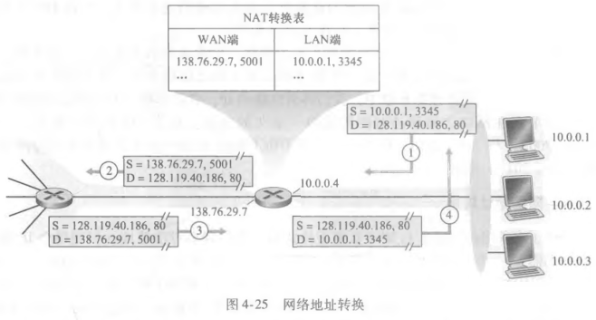

##### 优缺点

- 优点;
  - 节省 IP 地址;
  - 内网主机可通过 NAT 访问外网 IP;
  - 隐藏内网主机 IP 地址, 简单的安全保护;
  - 负载均衡...
- 缺点;
  - 网络延迟增大;
  - 无法进行端到端的 IP 追踪;
  - 部分应用层协议无法识别 (ftp, udp);

##### 中间盒

- 执行 NAT, 负载均衡, 流量防火墙 (IDS) 等功能的一个中间组件;

### IPv6

##### IPv6 数据报格式

- 首部字段;
- 数据字段: TCP 或 UDP 报文段;

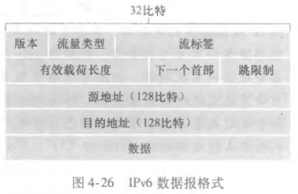

##### IPv6 编址

- 128 bit;

##### IPv4 和 IPv6

- IPv6 不支持在中间路由器进行数据报的分片和组装;
- IPv6 无首部检验和字段;

##### 迁移到 IPv6

- 建隧道 (tunneling);
- 使用一个 IPv4 中间路由器进行中转;
- 将 IPv6 数据报放到 IPv4 数据报的数据字段中;

## 通用转发

##### 通用转发

- 匹配 + 动作;
- 匹配: 匹配首部字段;
- 动作: 匹配后进行的操作;
  - 转发;
  - 负载均衡;

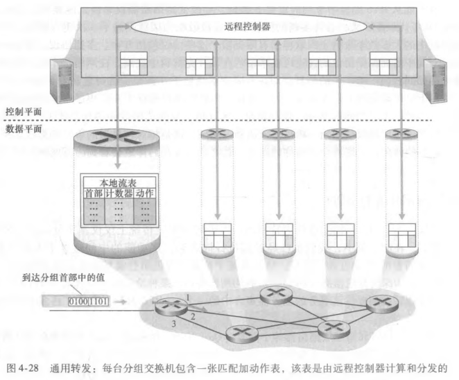

##### OpenFlow

- 通用转发的标准;
- 流表: OpenFlow 中的匹配 + 动作转发表;
  - 首部字段几何;
  - 计数器集合;
  - 动作集合;

##### OpenFlow 匹配字段

- 入端口为分组交换机接受分组的输入端口;

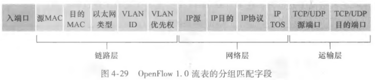

##### OpenFlow 动作

- 转发;
- 丢弃;
- 修改字段;

## 路由选择算法

### 路由选择算法分类

##### 集中式路由算法

- 已知全局状态信息的算法;
- 又称链路状态算法 (LS 算法);

##### 分散式路由选择算法

- 无全局状态信息, 仅知相邻节点信息;
- 通过相邻点的信息交换和迭代计算最短路径;
- 常用距离向量算法 (DV 算法);

##### 静态路由选择算法

- 链路开销几乎不随时间变化;

##### 动态路由选择算法

- 链路开销随网络状态变化;

##### 负载敏感算法

- 链路开销反应网络堵塞水平;

##### 负载迟钝算法

- 链路开销不明确反应网络堵塞水平;

### 链路状态路由选择算法

##### 常用算法

- Dijkstra 算法;
- Prim 算法;

##### 路由震荡

- 负载敏感算法由于实时网络堵塞情况的变化;
- 最短路径选择发生来回的切换;

### 距离向量路由选择算法

##### 常用算法

- DV 算法;

##### 路由选择环路

- 局部区域交换信息的局限性获取到错误的链路开销;
- 导致生成一个环路;
- 需要大量迭代才会获得准确开销;
- 若开销极大会导致迭代次数极大, 又称无穷计数问题;

##### LS 和 DV 算法的比较

- 信息;
  - LS 需要全局信息;
  - DV 只需要相邻节点的信息;
- 报文复杂性;
  - LS 需要 N+E 个报文;
  - DV 根据迭代次数而定;
- 收敛速度;
  - LS n^2;
  - DV 收敛速度慢且存在无穷级数问题;
- 健壮性;
  - LS 具有一定健壮性;
  - DV 局部节点的错误会扩散到整个网络;

## 路由选择

### 自治系统内部的路由选择 (OSPF)

##### 自治系统 (AS)

- AS 由处于相同控制下的路由器组成, 使用相同的路由选择算法;
- AS 对外部隐藏内部网络信息, 对内使用自己的路由选择算法;
- 一个 ISP 具有一个或多个 AS;
- 基于 ISP 的层级结构, AS 层层划分;
- 自治系统具有唯一的 AS 号;
- 在 AS 运行的路由选择算法叫做组织系统内部路由选择协议;

##### 开放最短路优先 (OSPF)

- 链路状态协议;
- 使用泛洪链路状态信息和 Dijkstra 算法;
- 链路开销人工设置;
- 自治系统的不同路由器链路状态发生变化即实时广播链路状态信息, 反之周期性广播;

##### OSPF 的优点

- 安全;
- 允许使用多条相同开销的路径;
- 多播 OSPF (MOSPF) 和单播的综合支持;
- 支持在单个 AS 中的层次结构;

### ISP 之间的路由选择: BGP

##### 自治系统间路由选择协议

- 所有 AS 使用同一路由选择协议;
- 称作边界网关协议 (BGP);

##### BGP 的作用

- 从相邻 AS 中获得 IP 前缀的可达性信息;
- 确定到某 IP 前缀 的最好路由;

##### 网关路由器

- 位于 AS 边缘的路由器;
- 与其他 AS 的网关服务器进行连接;

##### 内部路由器

- 仅连接 AS 内部的主机和路由器;

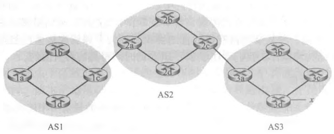

##### 通告 BGP 路由器信息

- 使用 TCP 协议和 179 端口发送 BGP 报文;
- 同一 AS 的 BGP 连接称作内部 BGP 连接 (iBGP);
- 跨越 AS 的 BGP 连接称作外部 BGP 连接 (eBGP);

##### IP 任播

- BGP 用于 IP 任播协议;
- 将请求通过 BGP 路由到最近的服务器;

### SDN 控制平面

##### 关键特征

- 基于流的转发;
- 数据平面与控制平面分离;
- 网络控制功能;
- 可编程的网络;
- openFlow 协议;

##### SDN 控制平面组成部分

- SDN 控制器;
- SDN 网络控制应用程序;

##### SDN 控制器

- 通信层: SDN 控制器和受控网络设备的通信;
- 网络范围状态管理层: 受控网络设备的状态信息;
- 对于网络控制应用程序层的接口;

## ICMP

##### ICMP

- 因特网控制报文协议;
- 用于主机和路由器对于网络层信息的通信;
- 位于 IP 数据报数据字段中;

##### ICMP 报文类型

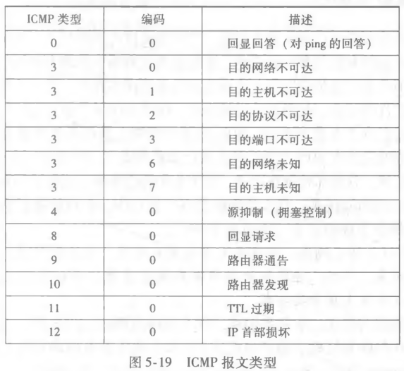

##### TTL

- IP 数据报首部字段中;
- 表示 ICMP 允许的最大转发次数;

## SNMP

##### 网络管理框架

- 管理服务器;
- 被管设备;
- 管理信息库;
- 网络管理代理;
  - 运行在被管设备的一个进程;
  - 与管理服务器通信;
- 网络管理协议;
  - 允许管理服务器通过网络管理协议查询被管设备状态并通过代理采取行动;

##### 简单网络管理协议

- SNMP;
- 用于在管理服务器和网络管理代理之间传递网络管理控制和报文;
  - 请求响应模式;
    - 管理服务器发送请求;
    - 代理响应请求并执行动作;
  - 非请求报文 (陷阱报文);
    - 代理向管理服务器通知异常情况;
