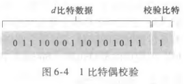
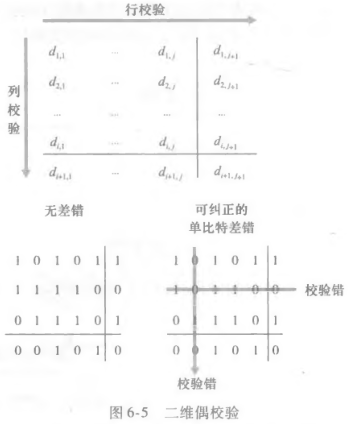
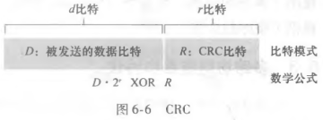
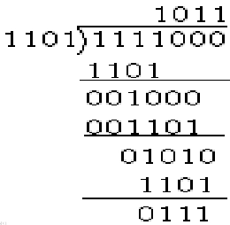
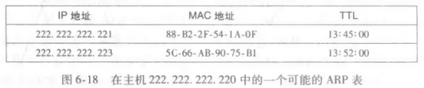
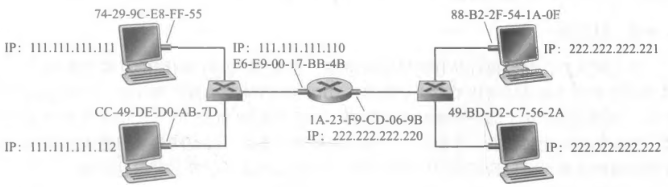
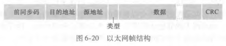
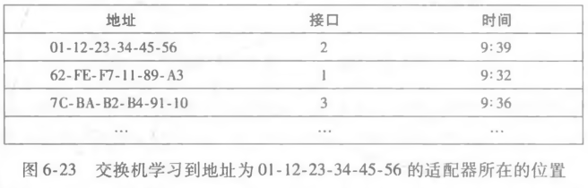
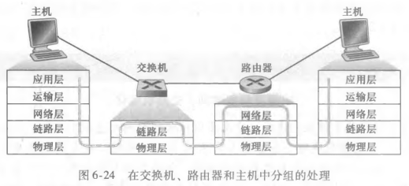
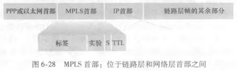

# 链路层

## 链路层概述

### 基本术语

##### 链路层

- 链路层负责将数据报通过通信链路从一个节点移动到另个一个节点；
- 链路层的分组称作帧；

##### 节点

- 运行链路层协议的任何设备；

##### 链路

- 沿着通信路径连接相邻节点的通信信道；

##### 链路层帧

- 链路层的分组；
- 数据报封装在帧中；

### 链路层提供的服务

- 成帧：封装数据报为链路层帧；
- 链路接入；
- 可靠交付；
- 差错检测和纠正；

### 链路层的主体部分

- 网络适配器，又称网络接口卡，简称网卡；
- 网络适配器的核心为链路层控制器；

## 差错检测和纠正技术

### 奇偶校验

##### 奇偶检验

- 额外附加一个比特；
- 使得 d + 1 个比特中 1 的总数为偶数；

##### 二维奇偶校验

- 将 d 个比特划分为 i 行 j 列；
- 通过 i + j + 1 个奇偶比特进行差错检测；

##### 前向纠错 (FEC)

- 接收方检测和纠正差错；

### 检验和方法

##### 检验和方法

- 将帧中的所有 16 bit 数据进行求和；
- 和的反码作为检验和；
- 接受方求和检验和和数据字节；
- 根据结果是否全为 1 比特判断是否出现差错；

### 循环冗余检测

##### 循环冗余检测编码 (CRC)

- CRC 又称多项式编码；
- 发送方和接受方法协商一个 r + 1 比特模式，称作生成多项式，简写为 G；
- 对于一个 d 比特的数据字段 D，发送方选择 r 个附加比特附加至 D；
  - d + r 比特模式可以被 G 使用模 2 算术整除；
- 接受方使用 G 与 d + r 比特进行模 2 算术整除，通过检测余数是否为 0 进行差错检测；

##### 模 2 整除

- 每一位结果不影响其他位；
- 实则就是求异或；

## 多路访问链路和协议

### 基础术语

##### 点对点链路

- 单个发送方 + 单个接收方；

##### 广播链路

- 多个发送方 + 多个接受方；

##### 多路访问问题

- 如何协调多个发送节点和接受节点对于一个共享广播信道的访问；

##### 多路访问协议

- 多路访问协议规范节点在共享广播信道的传输行为；

### 信道划分协议

##### 时分多路复用 (TDM)

- TDM 将时间划分为时间帧；
- 每个时间帧为 N 个时隙；
- 将一个时隙分配个一个节点；

##### 频分多路复用 (FDM)

- FDM 将信道划分为不同的频段；
- 将一个频段分配给一个节点；

##### 码分多址 (CDMA)

- CDMA 分配给每个节点不同的编码；
- 节点使用其唯一编码对数据进行编码并发送；

### 随机接入协议

##### 随机接入协议

- 随机接入协议中，节点使用信道的全部速率进行发送；
- 遭遇碰撞时，等待一个随机时延后重发该链路层帧；

##### ALOHA

- 帧一旦到达，节点立刻发送；
- 若发生碰撞，节点立刻以概率 p 重传该节点，否则等待；
  - 每个节点的概率 p 为独立事件；
- 之后每个时隙以概率 p 重传该帧；
- 最大效率为 1/2e；

##### 时隙 ALOHA 协议

- 所有帧由 L 比特组成；
- 时间划分为 L/R 的时隙 (传输一帧的时间)；
- 节点在时隙起点传输帧；
- 所有节点的时隙起点是一致的；
- 若一个时隙中发生碰撞，则所有节点在该时隙结束前检测到该碰撞，发生碰撞的节点在后续的每个时隙中以概率 p 重传该帧，直至不发生碰撞；
  - 每个节点的概率 p 为独立事件；
- 最大效率为 1/e；

##### 载波侦听多路访问 (CSMA)

- 节点在传输前监听信道；
- 如果其他节点的帧正在发送；
- 该节点等待，直至检测到一段时间信道无帧传输，然后才开始传输；

##### CSMA 发送碰撞的原因

- 帧在信道存在传播时延；
- 节点无法监听到整个链路；

##### 具有碰撞检测的载波侦听多路访问 (CSMA/CD)

- 一个传输节点在传输时监听信道；
- 如果传播过程中检测到其他节点的帧，立刻停止传输；
- 在 "侦听 - 空闲时传播" 动作之前等待一段时间；

##### 二进制指数后退

- CSMA/CD 节点经历 n 次碰撞后；
- 在 [0，1，2，。。。，2^n - 1] 中选择一个 K 值；
- 等待时间为 K \* 512 bit / R (信道传输速率)；

### 轮流协议

##### 轮询协议

- 设置一个节点为主节点；
- 主节点轮询每个节点；
- 告诉每个节点能够传输帧的最多数量；

##### 轮询协议的缺点

- 具有轮询时延；
- 主节点故障，信道瘫痪；

##### 令牌传递协议

- 使用一个称为令牌的特殊帧在节点之间以固定的次序传递；
- 节点收到令牌后，若需要传输数据，发送最大数目的帧，然后转发令牌至下一个节点；
- 否则直接转发令牌；

##### 令牌传递协议的缺点

- 一个节点的故障可能是整个信道崩溃；
- 节点可能忘记释放令牌；

## 交换局域网

### 链路层寻址和 ARP

##### MAC 地址

- 主机和路由器网络接口的链路层地址；
- 6 字节；
- 使用 16 进制表示；

##### 广播 MAC 地址

- FF-FF-FF-FF-FF-FF；

##### 地址解析协议 (ARP)

- ARP 用于 IP 地址和 MAC 地址的转换；
- ARP 只为同一个子网的主机和路由器解析 IP 地址；
- 路由器和主机具有一个 ARP 表；
  - 对于未知的 MAC 地址，使用 MAC 广播地址向其他主机和路由器发送 ARP 查询分组并更新 ARP 表；
    - ARP 分组包括源地址 MAC，IP 和 目标地址 IP；
  - 查询 ARP 报文使用广播帧，响应 ARP 报文使用标准帧；
- 跨越链路层和网络层的协议；

##### 发送数据到子网外

- 使用一台网关路由器进行中转；
- 子网 1 内主机使用 ARP 获得网关路由器 MAC 地址；
- 子网 1 内主机向网关路由器发送帧；
- 网关路由器使用 ARP 获得子网 2 主机 MAC 地址；
- 网关路由器向子网 2 内主机发送帧；

### 以太网

##### 拓扑结构

- 星型拓扑；
- 位于中心的主机称作交换器；

##### 以太网帧结构

- 数据字段：MTU 为 1500 字节；
- 目标地址：MAC 地址；
- 源地址：MAC 地址；
- 类型字段；
- CRC；
- 前同步码：唤醒目标适配器；

##### 无连接服务和不可靠服务

- 以太网为网络层提供无连接服务和不可靠服务；
- 以太网不知道其传输的数据报是一个全新的数据报还是重传的数据报；

### 链路层交换机

##### 链路层交换机

- 即插即用设备；

##### 交换机转发和过滤

- 过滤：决定帧转发还是丢弃；
- 转发：确定帧转发至那个接口；
- 过滤和转发借助交换机表完成；
  - 无对应接口，广播帧；
  - 对应接口为来源地址，过滤丢弃；
  - 对应接口不是来源地址，转发至对应接口；

##### 自学习

- 交换机的交换机表自动，动态和自治建立；
- 建立流程；
  - 交换机表初始为空；
  - 对于每个接口接受的入帧，记录其源地址 MAC，达到的接口和当前时间；
  - 若一段时间后没有接受到以该地址作为源地址的帧，删除该表；

##### 链路层交换机的性质

- 消除碰撞；
- 同时支持不同种类的链路；
- 具有管理功能；

##### 交换机和路由器的比较

- 路由器为使用 IP 地址转发分组的存储转发分组交换机；
- 链路层交换机为使用 MAC 地址转发分组的存储转发分组交换机；

##### 交换机毒化

- 向路由器发送大量伪造的 MAC 地址填满交换机表；
- 迫使交换机广播大多数帧；
- 攻击者便可以嗅探到广播帧；

### 虚拟局域网

##### 虚拟局域网 (VLAN)

- 支持 VLAN 的交换机允许一个物理局域网建立多个虚拟局域网；
- 交换机的多个端口划分为多个组；
- 一个组对应一个虚拟局域网；

## 链路虚拟化

##### 多协议标签交换 (MPLS)

- 使用 MPLS 首部加快 IP 路由器转发速度；

## 数据中心网络

##### 负载均衡

- 平衡主机的工作负载；

##### 等级体系结构

- 路由器和交换机等级结构：不同等级之间的路由器一对多；

##### 数据网络中心的发展趋势

- 全连接拓扑：不同等级之间的路由器多对多；
- 模块化数据中心；

## Web 页面请求的历程

##### 解析 URL

- 浏览器解析 URL；
- 若格式不正确，使用搜索引擎搜索；
- 反之转义 URL；

##### DNS

- 客户端生成一个 DNS 查询报文；
- 客户端发送 DNS 查询报文；
- 依次查询 DNS 根服务器，顶级服务器，权威服务器获得 URL 对应的 IP 地址；

##### TCP 和 HTTP

- 根据目标的 IP 地址生成 TCP 连接，TCP 三次握手过程；
- 主机在 TCP 套接字中解析 HTTP 响应报文，获得相应数据，进行下一步操作；
- 关闭 TCP 连接，TCP 四次握手过程；

##### HTTPS

- SSL 四次握手过程；

##### 渲染网页

- 根据请求内容渲染网页；
  - 读取响应内容，加载 HTML；
  - 解析 HTML，构造 DOM；
  - 加载外部资源 (js，css，多媒体)；
  - 应用 css/js 至 DOM；

##### 网络层和链路层

- 网络层；
  - 通过 DHCP 获得 IP 地址；
  - 数据平面：路由器实现数据包的存储转发；
  - 控制平面：路由选择；
    - 使用 OSPF 进行自治系统内部的路由选择；
    - 通过 BGP 进行自治系统间的路由选择；
- 链路层；
  - 使用 CRC 进行差错检测；
  - 使用多路访问协议解决多路访问问题；
  - 使用 ARP 获取子网内的 MAC 地址；
  - 使用 ARP 和网关转发请求至其他子网；
  - 使用交换机和自学习机制实现帧的存储转发；
