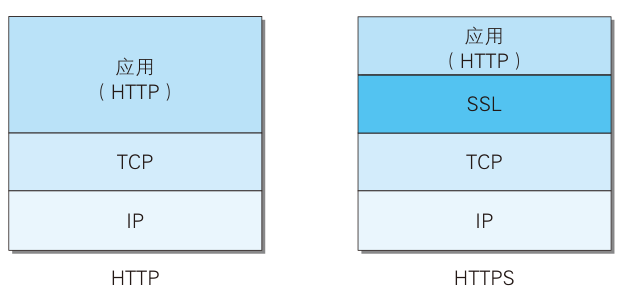
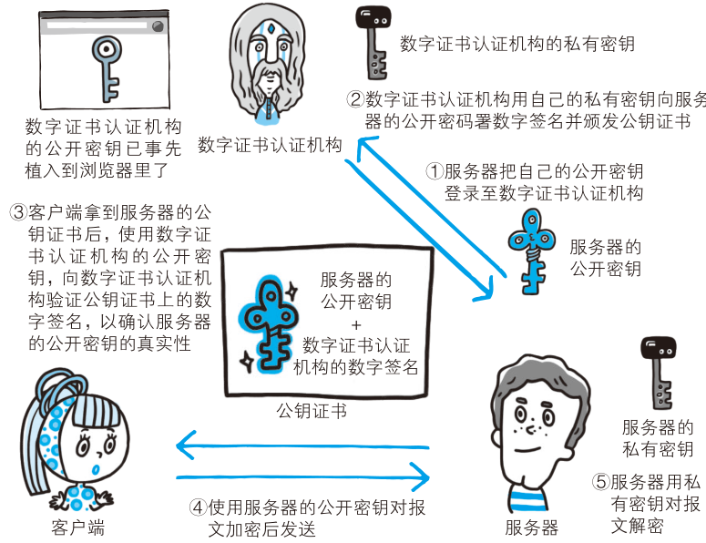
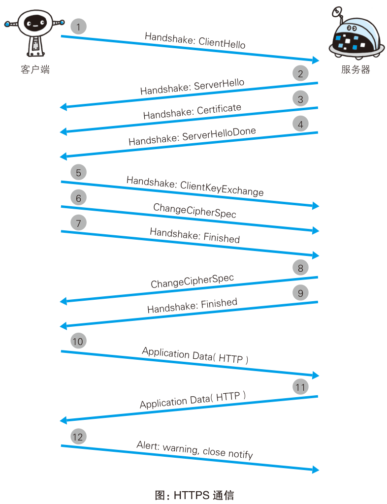
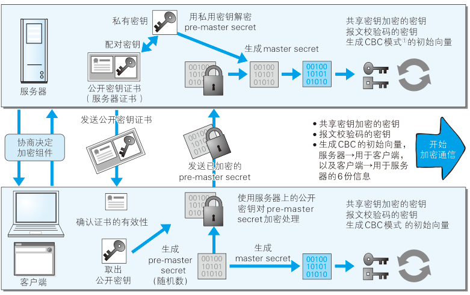

# https 基础

## HTTP 不足

### 明文通信

##### 明文通信

- HTTP 使用明文方式发送；
- 具有窃听风险；

##### 协议加密

- HTTP + SSL：即 HTTPS；
- HTTP + TLS；

##### 报文内容加密

- 非对称加密；
- 对称加密；
- 内容仍具有篡改风险；

### 无身份验证

##### 无身份验证

- HTTP 不会验证通信方身份；
- 无法确定接收方和发送方；
- 无法进行访问权限控制；
- 无法阻止 DDOS 攻击；
- 服务器端和客户端具有伪装的风险；

##### SSL 证书

- SSL 具有证书机制；
- 证书由值得信任的第三方颁发，用于验证身份；

### 报文完整性

##### 报文完整性

- HTTP 无法保证报文完整性；
- 无法阻止攻击者篡改报文内容，即中间人攻击 (MITM)；

##### 防止篡改

- 使用 MD5/SHA 等散列值校验；

## HTTPS 加密机制

### HTTPS 加密机制

- HTTP 基础之上加入加密处理，认证和完整性保护等机制；
- 将 HTTP 通讯接口部分使用 SSL 和 TLS 协议代替；

### 公钥秘钥加密技术

#### 对称秘钥加密

##### 对称秘钥加密

- 加密和解密共享一个秘钥；

##### 风险

- 使用对称秘钥加密需要传递秘钥；
- 无法保证秘钥的安全传递和保管；

#### 非对称秘钥加密

##### 非对称秘钥加密

- 使用一对非对称秘钥；
- 使用公开秘钥进行加密，使用私有秘钥进行解密；

##### 使用方法

- 加密方使用对方的公开密钥加密；
- 解密方使用自己的私有秘钥解密；
- 避免的私有秘钥的传递；

##### 缺点

- 加密和解密速度慢；

### HTTPS 的混合加密机制

- HTTPS 使用对称加密和非对称加密两者并用的混合加密方式；
- 首先使用非对称加密方式安全转发稍后使用的对称加密的秘钥；
- 确保传递秘钥安全的前提下使用对称加密；

## HTTPS 证书

### 背景

- HTTPS 的混合机密机制只能保证公开密钥的安全转发；
- 不能保证公开秘钥是真正的公开秘钥；
- 传输途中具有掉包的风险；

### 机制

- 数字证书认证机构 (CA) 为可信赖的第三方机构；
- 服务器端人员向 CA 申请公开秘钥的数字签名；
- CA 基于自己的私有秘钥加密数字签名，生成公开密钥证书；
  - 基于明文信息，使用散列算法生成信息摘要；
  - 基于 CA 私钥加密信息摘要，生成证书签名；
- 客户端基于 CA 的公开秘钥确定对公开秘钥证书进行验证；
  - CA 的公开秘钥事先保存至浏览器中；
  - 使用相同散列算法生成信息摘要；
  - 基于 CA 公钥，解密证书签名；
  - 对比证书签名和信息摘要，两者一致则合法；

### OpenSSL

- 基于 OpenSSL 构建私有认证机构，即自认证机构；
- 该机构颁发的证书称为自签名证书；

## HTTPS 安全通信机制

### 安全机制

- 使用非对称加密进行身份验证和传递对称加密秘钥；
- 使用对称加密进行数据加密；
- 使用哈希算法验证数据完整性；
- 使用 HTTPS 证书保证服务器端的真实性；

### 通信简要步骤

- 客户端发送链接请求；
- 服务器发送公钥证书；
- 客户端验证公钥证书；
- 客户端生成随机秘钥，使用服务器公钥加密随机秘钥；
- 服务器使用私钥解密随机秘钥；
- 对方使用随机秘钥进行通信 (对称加密)；

### 通信具体步骤

- 第一次握手；
  - 客户端发送 Client Hello 报文开始 SSL 通信；
    - 随机数 1；
    - 支持的加密算法；
    - 支持的协议版本；
  - 服务器端发送 Server Hello 报文响应；
    - 随机数 2；
    - 选择的加密算法；
    - 选择的洗衣版本；
  - 服务器端发送 Certificate 报文；
    - 公钥证书；
  - 服务器端发送 Server Hello Done 报文，第一次 SSL 握手结束；
- 第二次握手；
  - 客户端发送 Client Key Exchange；
    - 随机数 3；
    - 基于随机数 1，2，3 构造 pre-master secret，使用公钥加密发送；
  - 客户端发送 Change Cipher Spec 报文，表明之后通信使用 Pre-master secret 校验；
  - 客户端发送 Finished 报文；
  - 服务器端发送 Change Cipher Spec 报文；
  - 服务器端发送 Finished 报文；
- 第三次握手；
  - 客户端发送 HTTP 请求；
  - 服务器端响应 HTTP 请求；
- 第四次握手；
  - 客户端发送 close_notify 报文断开 SSL 连接，之后发送 TCP FIN 报文；

### 恢复 ssl 连接

- ssl 建立在 tcp 之上；
- ssl 断开，tcp 依旧保持连接；
- 使用重新握手建立 ssl 连接；
  - 前两次握手的基础之上，移除 Change Cipher Spec 报文；
  - 客户端结束到 Finished 报文后，使用 Pre-master secret 再次发送一个 Finished 报文；

### 三个随机数意义

- 增加解密难度；
- 确保每个会话使用不同的秘钥

### https 证书作用

- 验证服务器身份；
- 传递服务器公钥，用于加密通信使用的对称加密秘钥；

### SSL 和 TLS

- TLS 是基于 SSL 为原型开发的协议；
