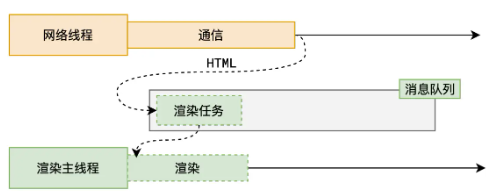
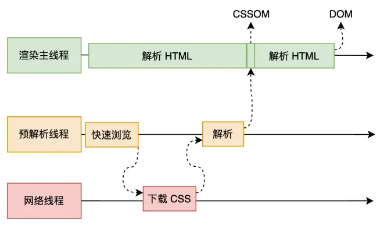
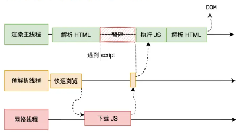
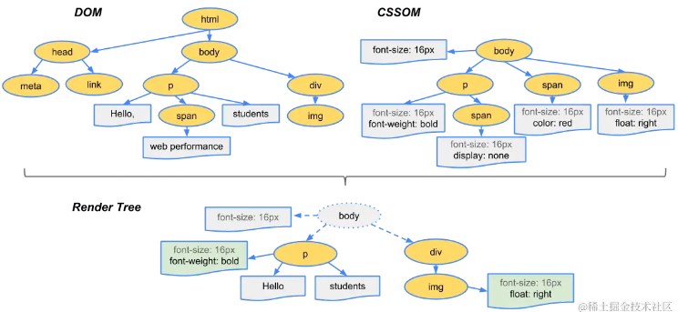
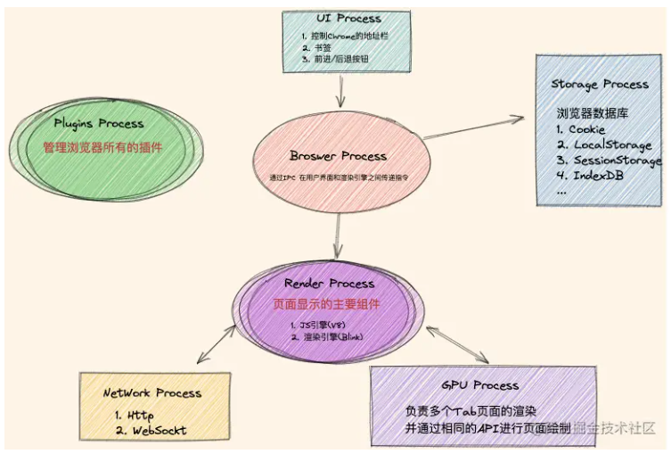

# 浏览器

## 浏览器缓存

### 缓存位置

- Service Worker；
  - 独立线程；
- Memory Cache；
  - 会话数据；
- Disk Cache；
  - 持久性数据；
  - 用于强缓存和协商缓存；
- Push Cache；
  - 会话数据；
  - HTTP2 内容；

### 强缓存

##### 相关首部

- Expires；
- Cache-Control；

##### Expires

- http/1。0 使用；
- 指定资源过期时间；
- 当前时间早于 Expires，强制使用缓存，反之不使用缓存；
- 服务器时间可能与浏览器时间不一致，http/1。1 废弃；

##### Cache-Control

- http/1。1 使用；
- 控制缓存行为，返回响应指定时间内可以使用缓存；
- 默认属性值为 private；
- 相关属性；
  - private：对应响应只能被浏览器缓存；
  - public：对应响应可以被浏览器和代理服务器缓存；
  - no-cache：跳过缓存，进入协商缓存阶段；
  - no-store：不使用任何缓存；
- Cache-Control 优先级高于 Expires；

```bash
Cache-Control:public, max-age=86400
```

### 协商缓存

##### 工作机制

- 强缓存失效；
- 服务器根据协商缓存相关字段确定浏览器能否使用缓存；

##### 相关首部

- Last-Modified/If-Modified-Since；
- ETag/If-None-Match；

##### Last-Modified/If-Modified-Since

- 浏览器首次发送请求，服务器在响应报文添加 Last-Modified 首部；
- 浏览器再次发送请求，设置 If-Modified-Since 首部为 Last-Modified 值；
- 服务器比较两者对应时间；
  - 若请求报文首部时间晚于响应报文首部时间，使用缓存，返回 304；
  - 反之返回 200，即新资源；
- 最小更新时间为秒，若文件 1s 内发生变化，无法识别；

##### ETag/If-None-Match

- 服务器根据资源文件，哈希生成 ETag，通过响应报文发送给浏览器；
- 浏览器设置 If-None-Match 首部值为 ETag 值，发送给服务器；
- 服务器对比浏览器 If-None-Match 和 ETag；
  - 若两者相同，使用缓存，返回 304；
  - 反之返回 200，即新资源；
- If-None-Match 优先级高于 If-Modified-Since；

### 使用场景

- 强制缓存：使用本地缓存；
  - 静态文件；
  - 首部设置强制缓存命令；
  - 不敏感的资源文件；
- 协商缓存：发送唯一标识，与服务器进行通信，验证资源是否变化；
  - 频繁变动的实时数据；
  - 需要验证缓存有效性；

### 优缺点

- 强制缓存：使用本地缓存，无须服务器通信，响应速度快；
- 协商缓存；
  - 需要计算文件哈希，性能耗费大；
  - 精确度高；

## 渲染过程

### 基本步骤

- 构建 DOM 树：解析 HTML；
- 构建 CSSOM 树：计算 CSS；
- 解析 js；
- 构建渲染树：合并 DOM 和 CSSOM；
- 构建布局树：计算 HTML 元素布局 (位置和大小)；
- 分层：对布局树进行分层，优化后续渲染效率，只对一层进行渲染；
- 绘制：对布局树各图层生成绘制指令；
- 合成：通过 GPU 显示；
  - 分块：分块渲染；
  - 光栅化：生产像素位图；
  - 画：绘制；

### 解析 HTML

- 字节数据 ==> 字符串 ===> token ===> Node ===> DOM；



### 解析 CSS

- 等同于解析 HTML；
- 字节数据 ==> 字符串 ===> token ===> Node ===> CSSOM；
- 解析 css 不会堵塞 html 解析，因为 css 解析在预解析线程执行；
- 但 css 会堵塞渲染树解析，进而堵塞浏览器渲染；



### 解析 js

- 解析 js 会堵塞 html；
- 因为 js 中可能修改当前 DOM；



### 构建渲染树

- 合并 DOM 树和 CSSOM 树；
- 包括显示节点极其样式信息；



## 渲染堵塞

### 发生原因

##### 网络问题

- 网络请求过多，网络延迟导致外部文件加载缓慢，进而堵塞浏览器渲染；

##### css 和 js 解析

- 遇到 link/style/script 时，引入外部 css 和 js 文件；
- js 堵塞 html 解析，css 堵塞渲染树生成；
- js 和 css 执行时间过长均会堵塞浏览器渲染；

##### GPU 渲染

- gpu 某帧渲染操作过多，无法在 16ms 中渲染完成；

##### js

- 执行时间过长：长时间任务堵塞主线程事件循环，导致堵塞浏览器渲染；
- 垃圾回收：垃圾回收堵塞主线程事件循环，导致堵塞浏览器渲染；

### 解决方法

- js；
  - 避免 js 存在耗时操作；
    - web worker；
    - 分片执行：setTimeout/requestAnimation；
  - 将 script 标签放置于 body 底部；
  - 使用 defer/async 属性延迟或异步加载；
- css；
  - 内联 css 于 HTML 中；
  - 将大体积 css 放置于 body 底部；
  - 使用 js 动态加载 css；
- gpu；
  - 分片渲染；

## 浏览器进程

### 主要进程

- 基于 IPC 进行进程间的通信；
- Browser：管理不同进程；
- Render Process：js 引擎和渲染引擎；
- NetWork Process：负责网络协议；
- GPU Process：负责页面渲染；
- Plugins Process：负责浏览器插件；
- UI Process：负责地址栏/书签/跳转等；
- Storage Process：负责本地存储；



## 内存泄露

### 导致原因

- 意外生成的全局变量，导致无法被垃圾回收；
- 遗忘的定时器或回调函数；
- 大量的 console；
- 不正确的使用闭包；
- 不正确的删除 DOM，浏览器依旧保持对 DOM 的引用；
- 循环引用问题；

## GPU

### 加速操作

- 页面滚动；
- transform；
- css 动画；
- canvas 绘图；

## 安全措施

- https；
- 同源策略；
- 内容安全策略 (CSP)：设置可信内容，减少 XSS 风险；
- XSS 防护：cookie httpOnly；
- CSRF 防护：cookie SameSite；
- 证书验证；
- 隐私模式；
- 弹窗拦截；
- 下载扫描；
- 拓展扫描；
- 密码管理器；
- 表单自动填充保护；

## 最佳实践

### 监控 fps

- 开发环境；
  - 开发者工具 - more tools - rendering - frame rendering stats；
- 生产环境；
  - requestAnimationFrame；
