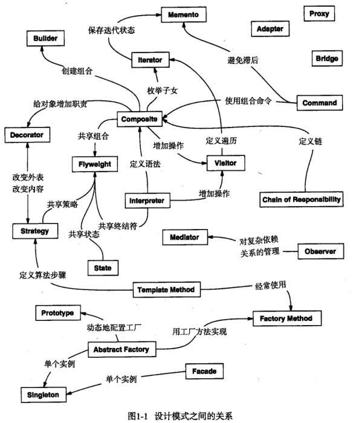

# 绪论

## 基础

##### 设计模式

- 一种通用设计结构；
- 用于构造可复用的面向对象设计；

##### 类型

- 创建型：用于对象的创建；
- 结构型：用于处理类和对象的组合；
- 行为型：用于类和对象的交互；

##### 设计模式的关系



##### 类继承和接口继承

- 类继承：子类复用父类；
- 接口继承；
  - 接口定义复用的方法；
  - 对象实现接口；

##### 复用机制

- 白箱复用：类继承；
  - 父类对子类可见；
- 黑箱复用：组合；
  - 组合对象作为对象的一个属性；
  - 组合对象内部细节不可见；
  - 只知道组合对象的接口；

##### 委托

- 一种组合方法；
- 使组合具有继承相同的复用能力；
- 额外创建一个对象作为组合对象的代理者，代理对象实现组合对象的逻辑；
- 对于组合对象的请求委托给代理对象；

##### 原则

- 面向接口编程，而不是针对实现编程；
- 组合优于继承；

## 组合代替继承

##### 使用组合代替继承

- 使用抽象类作为基类继承；
- 子类不可能都具有父类的行为；
  - 需要重写不具备的行为；
  - 减少复用性而且暴露了不应该存在的接口；

```typescript
abstract class AbstractBird {
  public abstract fly(): void;
  public abstract eat(): void;
}

class MaQue extends AbstractBird {
  public fly(): void {
    //
  }

  public eat(): void {
    //
  }
}

class TuoNiao extends AbstractBird {
  public fly(): void {
    // 鸵鸟不会飞, 需要重写该方法
  }

  public eat(): void {
    //
  }
}
```

##### 接口实现组合

- 对象根据自己的行为选择对应接口进行实现；
- 但是没有实现逻辑的复用；

```typescript
interface IFlyAble {
  fly(): void;
}

interface IEatAble {
  eat(): void;
}

class MaQue implements IFlyAble, IEatAble {
  eat(): void {
    //
  }
  fly(): void {
    //
  }
}

class TuoNiao implements IEatAble {
  eat(): void {
    //
  }
}
```

##### 接口 + 委托实现组合

- 使用委托将接口的逻辑进行复用；
- 对象借助委托复用公共逻辑并按需实现自己的私有逻辑；
- 创建委托时根据实际情况选择合理的粒度；

```typescript
interface IFlyAble {
  fly(): void;
}

interface IEatAble {
  eat(): void;
}

// 创建委托
class FlyAbility {
  fly() {
    // fly() 的逻辑实现
  }
}

class EatAbility {
  eat() {
    // eat() 的逻辑实现
  }
}

class MaQue implements IFlyAble, IEatAble {
  private _flyAbility;
  private _eatAbility;

  construct() {
    this._flyAbility = new FlyAbility();
    this._eatAbility = new EatAbility();
  }

  eat(): void {
    this._eatAbility.eat();
    // 私有实现
  }

  fly(): void {
    this._flyAbility.fly();
    // 私有实现
  }
}

class TuoNiao implements IEatAble {
  private _eatAbility;

  construct() {
    this._eatAbility = new EatAbility();
  }

  eat(): void {
    this._eatAbility.eat();
  }
}
```
