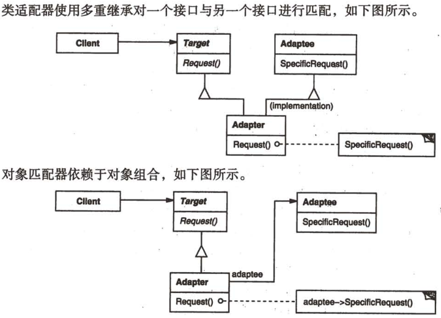
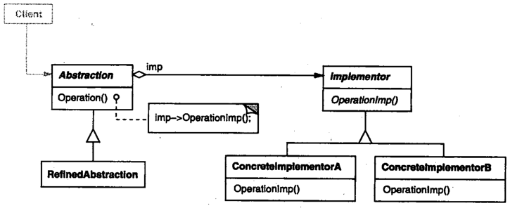
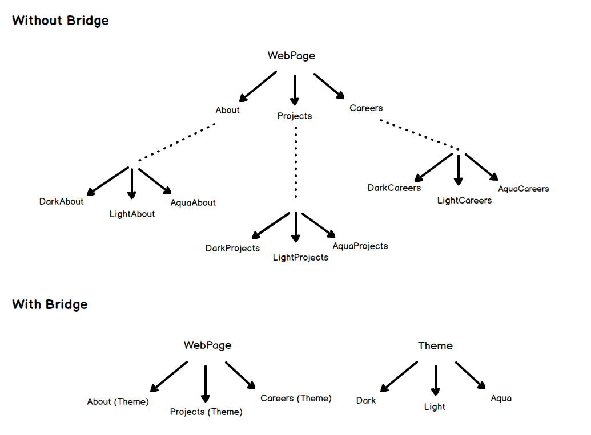
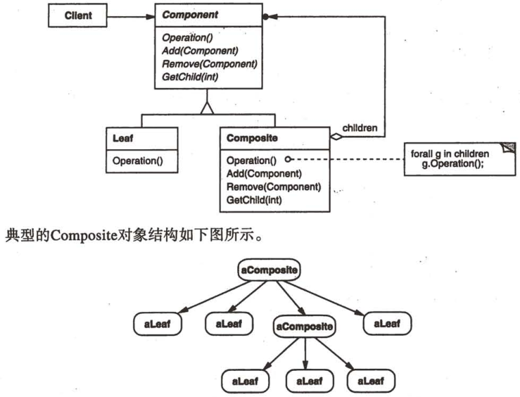
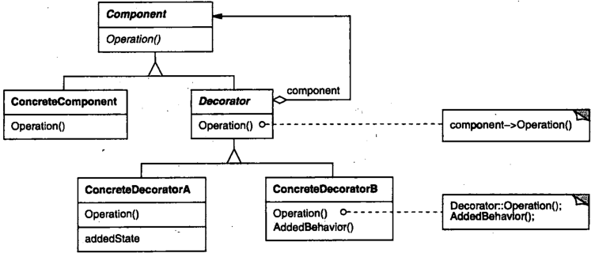
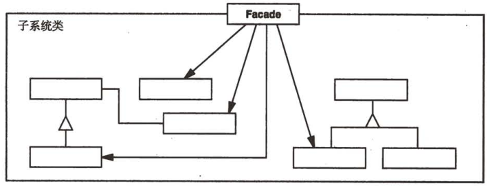
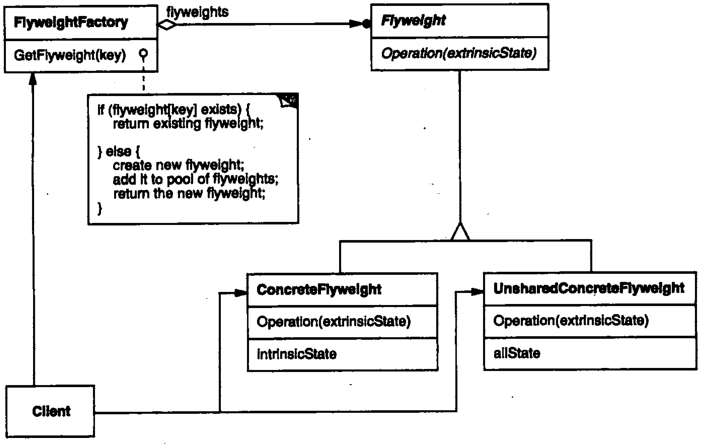
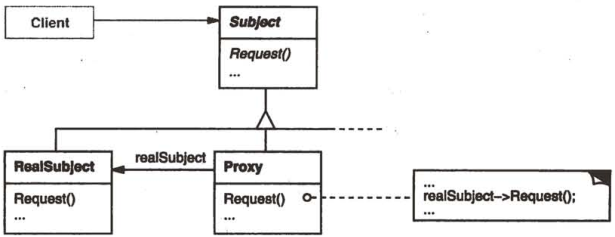

# 结构型设计模式

## 适配器 (ADAPTER)

##### 使用场景

- 转换某个类的接口形式；
- 将两个不兼容的类协同工作；

##### 结构

- Target：期望的接口；
- Adaptee：需要适配的接口；
- Adapter：适配器，适配 Target 和 Adaptee；
- 适配器模式；
  - 类适配器；
    - 继承 Target 接口和 Adaptee 接口；
    - 在 Target 对应方法中调用 Adaptee 对应方法；
  - 对象适配器；
    - 继承 Target 接口，使用组合将 Adaptee 作为 Adapter 的一个属性；
    - 在 Target 对应方法中调用 Adaptee 实例的方法；



##### 使用方法

- Client 借助 Adaptee 使用 Adaptee 的方法；

##### 示例代码

```typescript
interface Lion {
  roar();
}

class AfricanLion implements Lion {
  roar() {
    console.log("AfricanLion ");
  }
}

// Hunter 中的 hunt 需要接受 Lion 类型的参数
class Hunter {
  hunt(lion: Lion) {
    lion.roar();
  }
}

// Dog 非 Lion, hunt() 方法无法使用
class Dog {
  bark() {
    console.log("Dog");
  }
}

// 定义 DogAdapter, 实现 Lion 的所有接口, 将 Dog 作为其一个属性
// 在 Lion 对应接口的实现中调用 Dog 需要适配的方法
class DogAdapter implements Lion {
  protected _dog: Dog;

  constructor(dog: Dog) {
    this._dog = dog;
  }

  roar() {
    this._dog.bark();
  }
}

const dog = new Dog();
const dogAdapter = new DogAdapter(dog);
const hunter = new Hunter();
hunter.hunt(dogAdapter); // Dog
```

## 桥接 (BRIDGE)

##### 使用场景

- 分离类的抽象和实现；

##### 结构

- Abstraction：抽象类接口，Implementor 作为其一个属性；
- RefinedAbStraction：基于 Abstraction 改动的接口；
- Implementor：实现类的接口，Abstraction 和 Implementor 不要求一一对应；
- ConcreteImplementor：实现 Implementor 接口；



##### 使用方法

- Implementor 作为 Abstraction 的一个属性；
- Abstraction 将 Client 的请求转发给 Implementor；

##### 示例代码

- 个人感觉桥接和委托非常像；
- 将自己的逻辑分离，使用组合的方法将委托作为其属性；



```typescript
// Abstraction 接口
interface WebPage {
  getContent(): void;
}

// Implementor 接口
interface Theme {
  getColor(): void;
}

// Implementor Theme 类作为 Abstraction 的属性
class About implements WebPage {
  protected _theme: Theme;

  constructor(theme: Theme) {
    this._theme = theme;
  }

  getContent() {
    console.log("About in " + this._theme.getColor());
  }
}
class Careers implements WebPage {
  protected _theme: Theme;

  constructor(theme: Theme) {
    this._theme = theme;
  }

  getContent() {
    console.log("Careers in " + this._theme.getColor());
  }
}

// Theme 类的实现
class DarkTheme implements Theme {
  getColor() {
    return "Dark Black";
  }
}
class LightTheme implements Theme {
  getColor() {
    return "Off white";
  }
}

const darkTheme = new DarkTheme();
const about = new About(darkTheme);
const career = new Careers(darkTheme);
about.getContent(); // About in Dark Black
career.getContent(); // Careers in Dark Black
```

## 组合 (COMPOSITE)

##### 使用场景

- 通过组合的方式代替继承；

##### 结构

- Component；
  - Component 使用 Leaf 和 Composite 作为属性；
  - Component 的若干个方法中，使用 Leaf 和 Composite 的方法实现；
- Leaf：Leaf 为没有子 Component 的类；
- Composite：具有子 Component 的类；



##### 使用方法

- Client 通过 Component 的接口对 Component 组合的对象 Composite 进行操作；

##### 示例代码

```typescript
// 定义 Leaf 或 Composite
interface Employee {
  getName(): string;
  setSalary(salary: number): void;
  getSalary(): number;
}

class Developer implements Employee {
  protected _salary;
  protected _name;

  constructor(name: string, salary: number) {
    this._name = name;
    this._salary = salary;
  }

  getName(): string {
    return this._name;
  }

  setSalary(salary: number): void {
    this._salary = salary;
  }

  getSalary(): number {
    return this._salary;
  }
}

// 定义 Component, Developer 作为其一个属性而不是继承 Developer
// Component 的方法中, 使用 Developer 实例的方法
class Organization {
  protected _employees: Employee[];

  constructor() {
    this._employees = [];
  }

  addEmployee(employee: Employee) {
    this._employees.push(employee);
  }

  getNetSalaries(): number {
    let netSalary = 0;
    this._employees.forEach((value) => {
      netSalary += value.getSalary();
    });
    return netSalary;
  }
}

const jake = new Developer("jake", 100);
const john = new Developer("john", 200);

const factory = new Organization();
factory.addEmployee(jake);
factory.addEmployee(john);
console.log(factory.getNetSalaries()); // 300
```

## 装饰 (DECORATOR)

##### 使用场景

- 运行时中动态给某个类添加额外行为；

##### 结构

- Component：定义一个接口；
- ConcreteComponent：Component 的具体实现；
- Decorator；
  - 接受一个 Component 作为其属性；
  - 实现 Component 的所有接口；
  - 在其逻辑中修改 Component；
- ConcreteDecorator：Decorator 的具体实现；



##### 使用方法

- 通过 Decorator 将请求转发给 Component；
- 在转发前后执行额外行为；

##### 示例代码

```typescript
// 定义 Component 接口 Coffee
interface Coffee {
  getCost(): number;
  getDescription(): string;
}

// Coffee 接口的具体实现
class SimpleCoffee implements Coffee {
  getCost() {
    return 10;
  }

  getDescription() {
    return "Simple coffee";
  }
}

// 定义 Decorator, typescript interface 无法定义私有字段, 故省略
// 定义 Decorator 的不同实现
class MilkCoffee implements Coffee {
  protected _coffee: Coffee;

  constructor(coffee: Coffee) {
    this._coffee = coffee;
  }

  // 添加额外行为
  getCost() {
    return this._coffee.getCost() + 2;
  }
  getDescription() {
    return this._coffee.getDescription() + " milk";
  }
}

class WhipCoffee implements Coffee {
  protected _coffee: Coffee;

  constructor(coffee: Coffee) {
    this._coffee = coffee;
  }

  getCost() {
    return this._coffee.getCost() + 3;
  }
  getDescription() {
    return this._coffee.getDescription() + " whip";
  }
}

let coffee = new SimpleCoffee();
console.log(coffee.getCost()); // 10
console.log(coffee.getDescription()); // Simple coffee
coffee = new MilkCoffee(coffee);
console.log(coffee.getCost()); // 12
console.log(coffee.getDescription()); // Simple coffee milk
coffee = new WhipCoffee(coffee);
console.log(coffee.getCost()); // 15
console.log(coffee.getDescription()); // Simple coffee milk whip
```

## 外观 (FACADE)

##### 使用场景

- 提供一个高层的接口，封装包含若干组件的复杂子系统；
- 屏蔽子系统内部细节，提供一个简单的视图用于简单操作；

##### 结构

- Facade：封装 Subsystem class；
- Subsystem class：子系统中的若干组件；



##### 使用方法

- 用户直接通过 Facade 调用 Subsystem class 中的实现；

##### 示例代码

```typescript
// 创建 Subsystem class Computer
class Computer {
  getElectricShock() {
    console.log("Ouch!");
  }

  makeSound() {
    console.log("Beep beep!");
  }

  showLoadingScreen() {
    console.log("Loading..");
  }

  bam() {
    console.log("Ready to be used!");
  }

  closeEverything() {
    console.log("Bup bup bup buzzzz!");
  }

  sooth() {
    console.log("Zzzzz");
  }

  pullCurrent() {
    console.log("Haaah!");
  }
}

// 创建 Facade ComputerFacade, 对 Computer 进行封装
// 屏蔽 Computer 内部细节, 提供 Computer 若干简单操作的接口
class ComputerFacade {
  protected _computer;

  constructor(computer: Computer) {
    this._computer = computer;
  }

  turnOn() {
    this._computer.getElectricShock();
    this._computer.makeSound();
    this._computer.showLoadingScreen();
    this._computer.bam();
  }

  turnOff() {
    this._computer.closeEverything();
    this._computer.pullCurrent();
    this._computer.sooth();
  }
}

const facade = new ComputerFacade(new Computer());
facade.turnOff();
facade.turnOn();
```

## 享元 (FLYWEIGHT)

##### 状态

- 外部状态：独立于共享对象的信息；
- 内部状态：共享对象的共享信息；

##### 使用场景

- 应用程序中存在大量对象；
- 对象的大多数信息可以被共享；

##### 结构

- Flyweight：对象接口；
- ConcreteFlyweight：Flyweight 的具体实现，存储内部信息；
- UnsharedConcreteFlyweight：Flyweight 的具体实现，存储外部信息，通常使用组合将 ConcreteFlyweight 作为其一个属性；
- FlyweightFactory：使用工厂方法和单例模式管理 ConcreteFlyweight 对象；
- Client：存储多个对 Flyweight 的引用；



##### 使用方法

- 通过 FlyweightFactory 获得 flyweight；
- 内部状态和外部状态分别存储在 ConcreteFlyweight 和 UnsharedConcreteFlyweight；

##### 示例代码

```typescript
// 创建 Flyweight 接口 Car
interface Car {
  getPosition(x: number, y: number): void;
}

// 创建 ConcreteFlyweight 接口 CarShared
// 仅存储共享睡醒
class CarShared implements Car {
  _type: string;

  constructor(type: string) {
    this._type = type;
  }

  getPosition(x: number, y: number): void {
    console.log(`${this._type} in ${x}, ${y}`);
  }
}

// 创建 UnsharedConcreteFlyweight 接口 CarUnshared
// CarShared 作为其一个属性
// 仅存储私有属性
class CarUnshared implements Car {
  _carShared: CarShared;
  _x: number;
  _y: number;

  constructor(x: number, y: number, car: CarShared) {
    this._x = x;
    this._y = y;
    this._carShared = car;
  }

  getPosition(): void {
    this._carShared.getPosition(this._x, this._y);
  }
}

// 创建 FlyweightFactory CarFactory
// 使用工厂方法和单例模式管理 CarShared
class CarFactory {
  static _carShared: Map<string, CarShared> = new Map();

  static getCarShared(type: string) {
    const share = this._carShared.get(type);

    if (!share) {
      const share = new CarShared(type);
      this._carShared.set(type, share);
      return share;
    }

    return share;
  }
}

// 创建 Client
// 存储若干 CarShared 和 CarUnshared 的引用
class Client {
  _cars: CarUnshared[];

  constructor() {
    this._cars = [];
  }

  makeCar(type: string, x: number, y: number) {
    const share = CarFactory.getCarShared(type);
    const unshared = new CarUnshared(x, y, share);
    this._cars.push(unshared);
  }

  getAllPosition() {
    for (const car of this._cars) {
      car.getPosition();
    }
  }

  getAllCar() {
    return this._cars;
  }
}

const client = new Client();
client.makeCar("kxh", 1, 1);
client.makeCar("kxh", 3, 3);
client.makeCar("nnu", 2, 2);
client.makeCar("402", 1, 2);
client.makeCar("402", 1, 10);
client.getAllPosition();

const cars = client.getAllCar();
console.log(cars[0]._carShared === cars[1]._carShared); // true
console.log(cars[3]._carShared === cars[4]._carShared); // true
```

## 代理 (PROXY)

##### 使用场景

- 用于对象 A 操作开销大的场景；
- 创建一个代理代替对象 A，处理其他对象对 A 的操作；
- 根据实际情况，代理选择是否将操作转发给对象 A；

##### 结构

- Subject：对象接口；
- Proxy；
  - 实现 Subject 接口，代替 RealSubject；
  - 保存对 RealSubject 的引用；
- RealSubject：Subject 的具体实现；



##### 使用方法

- 对 Proxy 执行对 RealSubject 的操作；

##### 示例代码

```typescript
// 创建 Subject 接口 Door
interface Door {
  getPassword(): string;
  open(password: string): void;
  close(): void;
}

// 创建 RealSubject LabDoor
class LabDoor implements Door {
  getPassword(): string {
    return "123456";
  }

  open(password: string) {
    if ((password = "123456")) {
      console.log("Opening lab door");
    } else {
      console.log("The password is wrong.");
    }
  }

  close() {
    console.log("Closing the lab door");
  }
}

// 创建 LabDoor 的 Proxy SecuredDoor
// SecuredDoor 代替 LabDoor, 接受对于 LabDoor 的操作, 根据实际情况 SecuredDoor 选择是否将操作转发给对象 A
class SecuredDoor implements Door {
  _door: Door;
  _password: string;

  constructor(door: Door) {
    this._door = door;
    this._password = door.getPassword();
  }

  getPassword(): string {
    return "No right";
  }

  open(password: string) {
    if (password === this._password) {
      this._door.open(password);
    } else {
      console.log("The password is wrong.");
    }
  }

  close() {
    this._door.close();
  }
}

const door = new SecuredDoor(new LabDoor());
console.log(door.getPassword()); // No right
door.open("123456"); // Opening lab door
door.open("123"); // The password is wrong.
door.close(); // Closing the lab door
```
