# 信息的表示和处理

## 信息存储

### 基本术语

##### 字节

- 8 bit 的块;
- 最小的可寻址的内存单位;

##### 地址

- 字节在内存中的唯一数字表示;

##### 虚拟地址空间

- 地址的集合;

### 十六进制表示法

##### 十六进制

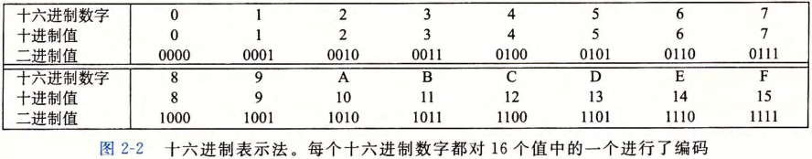

##### 二进制和十六进制的转换

- 二进制每 4 位分为一组;
- 总数不是 4 的倍数, 最左边一组补 0;
- 每 4 位 一组转换为对应十六进制;

##### 十进制和十六进制的转换

- 整数部分: 十进制 x 整数部分整除 16, 余数倒序排列;
- 小数部分;
  - 十进制 x 小数部分乘以 16, 记录整数部分;
  - 截取小数部分重复上一步操作, 直至乘积小数部分均为 0;
  - 顺序排列整数部分;

### 二进制表示法

- 同十六进制;

### 字数据大小 (字长)

- 决定虚拟地址空间的最大大小;
  - 32 位: 4GB;
  - 64 位: 16EB;

### 字节顺序

- 小端: 低位排在前面;
- 大端: 高位排在前面;

### 字符串

- ASCII 编码 (英文字符, 8 位);
- Unicode 编码 (32 位);
- 不同操作系统具有相同的结果, 兼容性好;

### 代码

- 二进制编码;
- 不同操作系统结果不同;

### 布尔代数

- 与/或/非/异或;

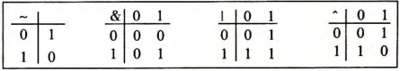

## 整数表示

### 整数数据类型

- 32 位 / 64 位;
- 无符号 / 有符号;

### 无符号数编码

- 设向量 $[x_{w-1},\cdots,x_0]$;
- 取值范围为 $[0,2^w-1]$;

$$B2U_w(x)=\sum_{i=0}^{w-1}x_i2^i$$

### 有符号数

#### 补码

##### 计算公式

- 设向量 $[x_{w-1},\cdots,x_0]$;
- 取值范围为 $[-2^{w-1},2^{w-1}-1]$;

$$B2T_w(x)= -x_{w-1}2^{w-1}+  \sum_{i=0}^{w-2}x_i2^i$$

##### 最值

- 由于 0 表示为非负数;
- |TMin| = |TMax| + 1

##### 重要数字

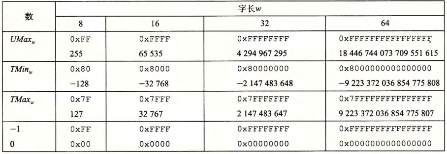

#### 原码和反码

##### 原码

- 最高位表示符号位;
- 其余位当作无符号数表示;

##### 反码

- 最高位权为 $-x_{w-1}(2^{w-1}-1)$;
- 其余同补码;

##### 原码和反码的缺点

- -0 和 +0 的编码不同;

#### 从原码到反码/补码

##### 反码

- 原码按位取反;

##### 补码

- 反码最低位 +1;

### 有符号数和无符号数的转换

##### 原理

- 位模式不变, 改变位模式的解释方式;

##### 无符号数和补码的转换

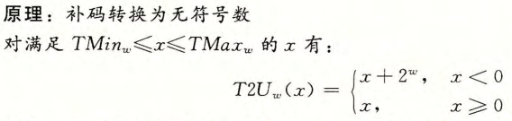
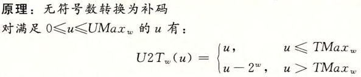

### 无符号数和有符号数的拓展

##### 无符号数拓展 (零拓展)

- 无符号数转换为一个更大的数据类型;
- 只需要在位开头添加 0;

##### 补码拓展 (符号拓展)

- 补码表示的有符号数转换为一个更大的数据类型;
- 只需要在位开头添加符号位;

### 截断数字

##### 截断无符号数

- 截断高位, 保留低位 k 位;
- $x'= x mod 2^k$;

##### 截断补码数值

- 截断高位, 保留低位 k 位;
- $x'= U2T(x mod 2^k)$;

## 整数运算

### 无符号加法

##### 加法

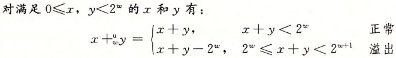

##### 求反

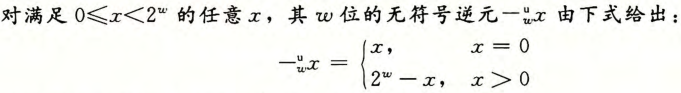

### 补码加法

##### 加法

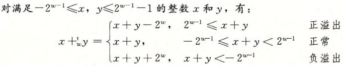

##### 求反

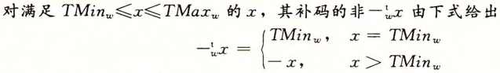

### 无符号乘法

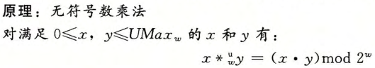

### 补码乘法

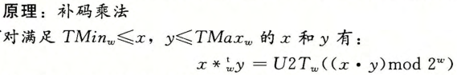

### 乘以常数

##### 乘以 2 的幂

- 进行左移操作;
- 位模式右端补 0;

##### 乘以常数

- 整数乘法耗费大;
- 编译器试图通过加减和移位的组合实现整数乘法;

### 除以 2 的幂

- 进行右移操作;
- 保留位模式左端;
- $x'= \lfloor x / 2^k \rfloor$;

## 浮点数

### 二进制小数

- 二进制小数 $b_m \cdots b_0.b_{-1} \cdots b_{-n}$;
- 其十进制数值为 $b = \sum^m_{i=-n}2^i \times b_I$

### IEEE 浮点表示

##### IEEE 浮点标准

- 使用 $V = (-1)^s \times M \times 2^E$ 的形式近似表示数字;
- 符号位 s;
- 尾数 M: 一个二进制小数;
- 阶码 E: 对浮点数进行加权;

##### 32 位和 64 位

- 32 位: 1 + 8 + 23;
- 64 为: 1 + 11 + 52;

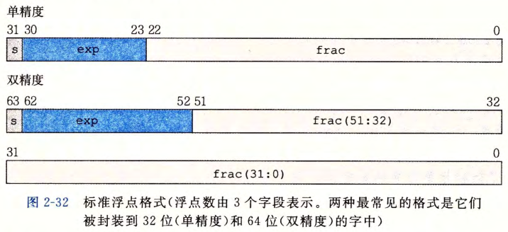

##### 规格化的浮点数

- 阶码不能全为 1 或 0;
- 尾数的小数点在最高位有效数字的左边, 即 1.xxxx 的形式;

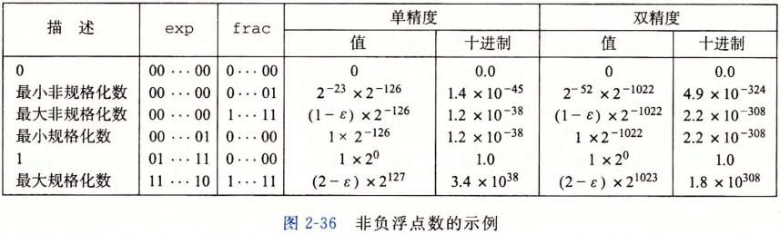

### 十进制浮点数和 IEEE 的转换

##### 偏执量

- 阶码具有 n 位;
- 其偏执量为 2^(n-1) - 1;

##### 转换方法

- 十进制浮点数转换为二进制小数;
- 二进制小数转换为规格化的浮点数, 即 1.xxx \* 2^n 的形式;
- 取 xxx 并向后补 0 构造尾数;
- n + 偏执量构造阶码;
- 添加符号位;

```bash
例: 用IEEE754标准将176.0625转换为单精度浮点数
将 176.0625 转换为二进制小数为 10110000.0001
规格化处理: 10110000.0001=1.01100000001 × 2^7, 取小数部分扩展为23位尾数为
01100000001000000000000
阶码为7, 加上偏移量 +127 为 134, 用二进制小数表示为 10000110
符号位为 0
最终单精度浮点数为 01000011001100000001000000000000
```

### 舍入

- 浮点数只能近似表示数值;
- 找到最接近的匹配值;

### 浮点运算

##### 机制

- $\odot$ 表示任一运算;
- 浮点运算结果是计算后的舍入结果, 是不精确的结果;

$$x \odot y = Round(x \odot y)$$
