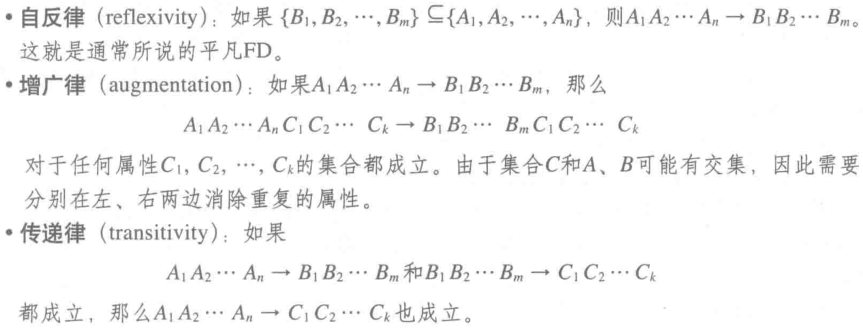
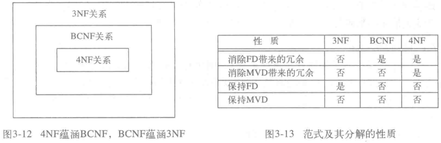

# 关系数据库设计理论

## 函数依赖

##### 函数依赖

- 关系 R 上的函数依赖是指若 R 的两个元组在若干属性 A 上属性值相同；
- 那两者必定在若干属性 B 上属性值相同；
- 记作 $A_1A_2 \cdots A_n \rightarrow B_1B_2 \cdots B_m$；
- 称 A 函数决定 B；

##### 关系的键

- 若下列条件满足，则认为属性集 \{$A_1A_2 \cdots A_n$\} 是关系 R 的键；
- 关系 R 不可能存在两个元组在属性集 A 上存在相同的属性值；

##### 最小的键

- 若属性集 A 是关系 R 的键；
- 若属性集 A 的任一真子集都不是 R 的键；
- 则称属性集 A 是最小的键；

##### 超键

- 包含键的属性集；

##### 传递依赖和直接依赖

- 传递依赖：使用传递规则成立的依赖；
- 直接依赖：非传递依赖；

##### 部分依赖

- 若 A 函数决定 B，存在 A 的真子集函数决定 B；
- 则称 B 部分函数依赖 A；

##### 完全依赖

- 若 A 函数决定 B，任一 A 的真子集都不函数决定 B；
- 则称 B 完全函数依赖 A；

##### 多值依赖 (MVD)

- 对于 R 中每个在 A 上属性一致的元组对 t 和 u，R 中总满足下列条件的元组；
  - 在 A 上取值与 t 和 u 相同；
  - 在 B 上取值与 t 相同；
  - 在不属于 A 和 B 的其他属性上与 u 相同；

## 函数依赖规则

##### 分解/结合规则

- 左边 FD 等效于右边 FD；
- 分解规则；
  - $A_1A_2 \cdots A_n \rightarrow B_i (i=1,2,\cdots ,m) \Rightarrow A_1A_2 \cdots A_n \rightarrow B_1B_2 \cdots B_m$
- 结合规则；
  - $A_1A_2 \cdots A_n \rightarrow B_1B_2 \cdots B_m  \Rightarrow A_1A_2 \cdots A_n \rightarrow B_i (i=1,2,\cdots ,m)$

##### 传递规则

- 若 $A_1A_2 \cdots A_n \rightarrow B_1B_2 \cdots B_m$，$B_1B_2 \cdots B_m  \rightarrow C_1C_2 \cdots C_k$；
- 则 $A_1A_2 \cdots A_n \rightarrow C_1C_2 \cdots C_k$；

##### Armstrong 公理

## 关系数据库模式设计

### 常见异常

- 冗余：属性在多个元组重复；
- 更新异常：修改某一元组属性，但没有修改其他元祖的相同属性；
- 删除异常：一个值集变为空值引起副作用；

### 函数范式

##### 第一范式 (1NF)

- 各属性为原子属性，不可再次分解；

##### 第二范式 (2NF)

- 关系表必须有一个主键；
- 关系表其他列必须完全依赖于主键；
- 消除部分函数依赖；

##### 第三范式 (3NF)

- 若 R 中的任意非平凡 FD $A_1A_2 \cdots A_n \rightarrow B_1B_2 \cdots B_m$ 成立；
- 或属性集 A 是关系 R 的超键，或 B 是关系表键的子集；
  - 关系表必须有一个主键；
  - 关系表其他列必须直接依赖于主键；
- 消除传递依赖；

##### BCNF

- 若 R 中的任意非平凡 FD $A_1A_2 \cdots A_n \rightarrow B_1B_2 \cdots B_m$ 成立；
- 则属性集 A 是关系 R 的超键，即任意非平凡函数依赖的左边必须是键；
- BCNF 是修正后，更为严格的 3NF；

##### 第四范式 (4NF)

- 若 R 中的任意非平凡 MVD $A_1A_2 \cdots A_n \rightarrow \rightarrow B_1B_2 \cdots B_m$ 成立；
- 则属性集 A 是超键，即任一非平凡 MVD 的左边必须是超键；
- 消除多值依赖；

#### 范式的联系

### 分解方法

##### BCNF

- 找到违反 BCNF 的非平凡依赖；
  - 保留右边的一个属性于原关系表；
  - 将其右边建立一个新的关系表；
- 接着对新建立的关系表进行 BCNF 分解；

##### 多值依赖

- 找到违反 MVD 的非平凡依赖；
  - 将属性集 A 和 B 建立一个关系表；
  - 不属于 A 和 B 的属性建立另一个关系表；
- 接着对新建立的关系表进行 MVD 分解；
