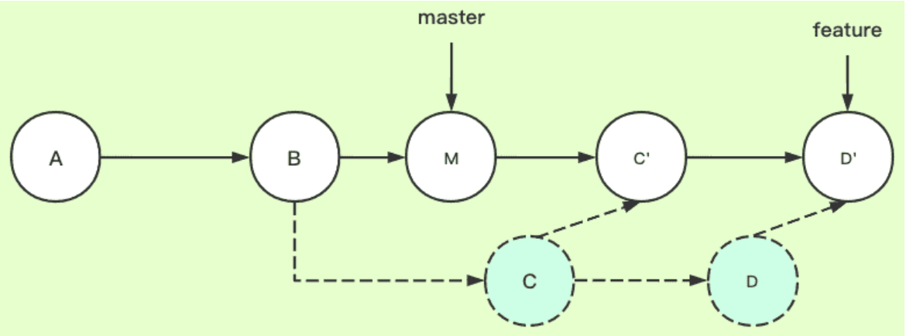
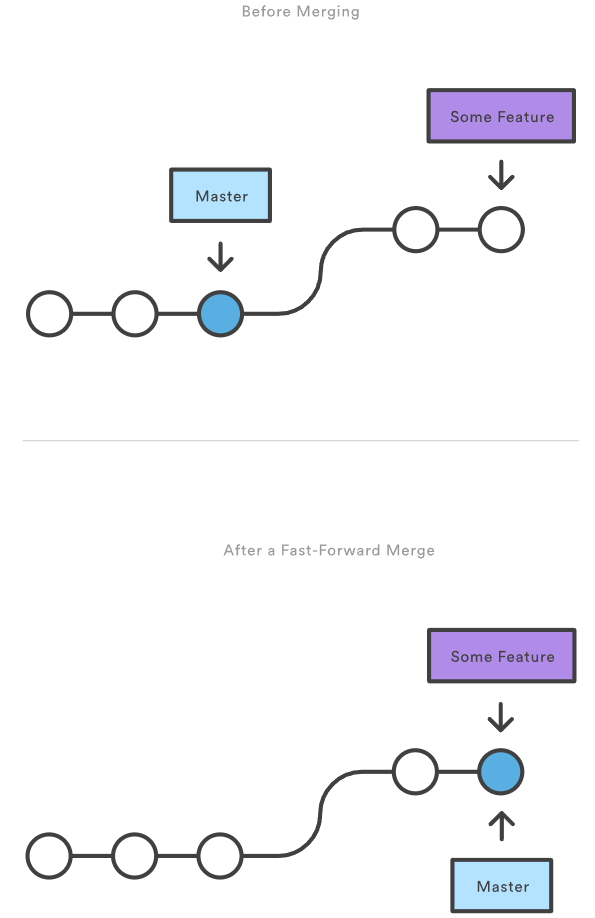
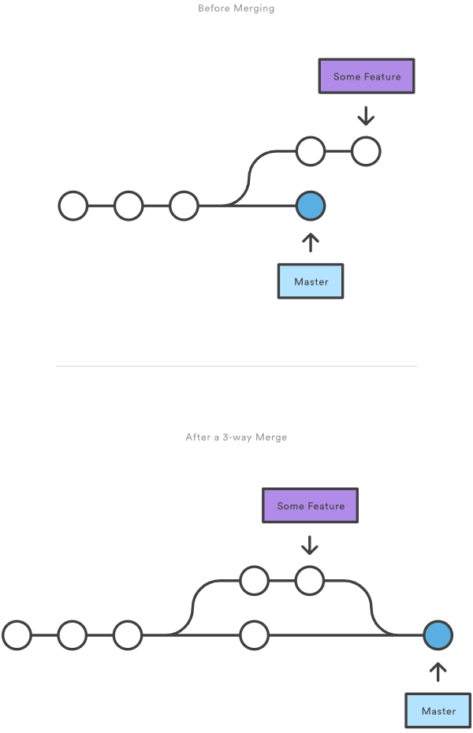

# git 教程

## git 基础

##### linux 安装

```bash
sudo apt-get install git
```

##### git

- 分布式版本控制工具;
- 完整克隆代码仓库;

##### .gitignore

- git 忽略该文件下的目录, 文件;

##### 文件状态

- 未提交: 未被 git 管理的文件;
- 已修改: 修改但未提交;
- 已暂存: 修改, 已提交到缓存区;
- 已提交: 已提交到本地仓库;

##### 四个部分

- 工作区;
- 暂存区;
- 本地仓库;
- 远程仓库;

## 创建 git 仓库

### git init

##### git init

- 创建一个 git 仓库;

```bash
# 当前目录
git init
# 指定目录
git init <directory>
```

##### git init --bare

- 创建一个裸的 git 仓库;
- 该仓库无工作目录;

### git clone

##### git clone

```bash
git clone <repo>
git clone <repo> <directory>
```

### git config

##### 配置用户信息

```bash
git config --global user.name "kxh4892636"
git config --global user.email "kxh4892636@gmail.com"
```

##### 不同级别的配置文件

- /.git/config: 特定仓库的配置;
- ~/.gitconfig: 特定用户的配置;
- $(prefix)/etc/gitconfig: 系统层面的配置;

## 保存更改

### 基础

##### 缓存区

- 工作目录和历史之间的缓冲区;

### git add

##### git add

- 提交工作目录中的变化至缓存区;

```bash
git add <file>
git add <directory>
git add .
```

### git commit

##### git commit

```bash
# 交互性添加提示信息
git commit
# 直接添加提示信息
git commit -m "<message>"
```

### git diff

##### git diff

```bash
# 工作目录和缓存区比较
# 详细信息
git diff
# 简单信息
git diff --stat
# 比较文件
git diff <file>

# 工作目录和历史记录比较
git diff <commit>

# 历史记录和历史记录比较
git diff <commit1> <commit2>

# 分支和分支比较
git diff <branch1> <branch2>
```

### git stash

##### git stash

- 暂时从工作区移除;
- 使用栈进行存储;

```bash
# 暂时保存
git stash
# 列出所有暂时保存的工作
git stash list
# 恢复指定工作
git stash apply stash@{1}
# 恢复最近一次 stash 的工作
git stash pop
# 删除最近一次 stash 的工作
git stash drop
# 删除所有 stash
git stash clear
```

## 检查仓库状态

### git status

##### git status

- 列出已缓存, 未缓存, 未追踪的文件;

```bash
git status
```

### git log

##### git log

```bash
# 所有提交历史
git log
# 限制显示数量
git log -n <limit>
# 显示详细信息
git log --stat
# 指定作者
git log --author="<pattern>"
```

### git checkout

##### git checkout

- 加载之前的提交;
- 只读操作, 不会影响当前状态;

```bash
# 回到 master 分支
git checkout master
# 检出 commit 提交中 file
git checkout <commit> <file>
# 检出 commit 提交
git checkout <commit>
```

## 回滚修改

### git revert

##### git revert

- 撤销某次 commit;
- 该 commit 之前和之后的 commit 和 history 保留;

```bash
# 撤销最新提交
git revert HEAD
# 撤销上一次提交
git revert HEAD^
# 撤销 commit 引入的修改, 并应用至当前分支;
git revert <commit>
```

### git reset

##### git reset

```bash
# 缓存区移除文件, 不改变工作目录
git reset <file>
# 分支末端移动至 commit, 缓存区重设到该提交, 不改变工作目录, 即未执行 git add
git reset <commit>
# 分支末端移动至 commit, 不改变缓存区和工作目录, 即已执行 git add, 未执行 commit
git reset --soft <commit>
# 分支末端移动至 commit, 缓存区和工作目录重设到该提交
git reset --hard <commit>
```

##### 注意

- 不要重设公共仓库中的历史;
- 只能用于本地仓库中历史的修改;

### git clean

##### git clean

- 删除未跟踪的文件;
- 无法撤销;

```bash
# 告知那些文件会被移除, 并未真正删除
git clean -n
# 移除未跟踪的文件
git clean -f
# 移除指定目录下的未跟踪的文件
git clean -f <path>
# 移除未跟踪的文件和目录
git clean -df
# 移除未跟踪的文件和 .gitignore 中的文件
git clean -xf
```

## 重写历史

### git commit --amend

##### git commit --amend

- 合并当前缓存区和上一次提交;
- 用一个新的提交代替上一次提交;

```bash
git commit --amend
# 不修改提交信息
git commit --amend --no-edit
```

##### 注意

- 不要重设公共仓库中的历史;
- 只能用于本地仓库中历史的修改;

### git rebase

##### git rebase

- 改变分支基底;
- 将一个分支的基底移动至指定提交;

```bash
# 将当前分支基底移动到 base
git rebase <base>
```



##### git rebase -i

- 交互式 rebase

```bash
git rebase -i <base>
```

##### 注意

- 不要重设公共仓库中的历史;
- 只能用于本地仓库中历史的修改;

### git reflog

##### git reflog

- 显示所有分支的操作日志;
- 包括已经删除的 commit 和 reset 操作;

```bash
git reflog
```

## 保持同步

### git remote

##### git remote

- 连接远程仓库;

```bash
# 列举所有远程仓库
git remote
# 列举所有远程仓库
git remote -v
# 连接 url 对应的远程仓库并使用 name 作为别名
git remote add <name> <url>
# 移除 name 对应的远程仓库
git remote rm <name>
# 重命名
git remote rename <old_name> <new_name>
```

### git fetch

##### git fetch

- 拉取远程仓库, 存储为远程分支;

```bash
# 拉取所有 remote 的所有分支
git fetch --all
# 拉取 remote 的所有分支
git fetch <remote>
# 拉取 remote 的指定分支
git fetch <remote> <branch>
```

##### git pull

- fetch 与 merge/rebase 合二为一;

```bash
# 等效于 git fetch <remote>, git merge origin/.
git pull <remote>
# 等效于 git fetch <remote>, git rebase origin/.
git pull --rebase <remote>
```

### git push

##### git push

- 提交分支至远程仓库;

```bash
# 推送指定分支
git push <remote> <branch>
# 强制推送分支
git push <remote> --force
# 推送所有分支
git push <remote> --all
```

## 使用分支

### git branch

##### git branch

```bash
# 列举所有分支
git branch
# 创建一个名为 branch 的分支
git branch <branch>
# 删除 <branch> 分支
git branch -d <branch>
# 强制删除 <branch> 分支
git branch -D <branch>
# 重命名
git branch -m <branch>
```

### git checkout

##### git checkout

- 切换分支, 并更新工作目录;
- 读写操作;

```bash
# 切换分支, 并更新工作目录;
git checkout <existing-branch>
# 创建并切换分支
git checkout -b <new-branch>
```

### git merge

##### git merge

- 合并分支;

```bash
# 合并指定分支到当前分支, git 自动选择某种算法
git merge <branch>
# 合并指定分支到当前分支, 禁止快速向前合并, 使用三路合并
git merge --no-ff <branch>
# 合并指定分支到当前分支, 指定分支所有历史合并为一个历史
git merge --squash <branch>
```

##### 快速向前合并

- 当前分支与目标分支路径为线性;



##### 三路合并

- 当前分支和目标分支已经分叉;



### 解决冲突

##### 冲突

- 使用三路合并或拉取远程仓库时可能发生冲突;

##### 忽略本地所有修改

```bash
git fetch --all
git reset --hard origin/main
git pull
```

##### 解决冲突

```bash
git reset --mixed HEAD^ # 回退到分叉分支
git stash save # 保存并隐藏修改代码
git pull # 拉取代码
git stash pop # 恢复隐藏代码
```

## 最佳实践

### merge 和 rebase 的选择

##### 个人看法

- 本地分支使用 rebase;
- 公共分支使用 merge;

##### 示例

```bash
# 假设存在本地分支 kxh
# 切换至 kxh 分支
git checkout kxh
# 拉取远程分支
git fetch origin main
# 本地分支进行 rebase 合并 main 分支
git rebase main
# 切换至 main 分支
git checkout main
# main 使用 merge 合并 kxh 分支
git merge kxh
```

### github

##### 代理

```bash
git config --global http.proxy http://127.0.0.1:7890
git config --global https.proxy https://127.0.0.1:7890
git config --global --unset http.proxy
git config --global --unset https.proxy
```

##### 上传至 github

- github 中添加本机 ssh 证书;
  - 用户 - setting - SSH and GPG keys;
- 新建一个仓库, 建立后自带提示, 按提示输入 git 命令;

```bash
git config --global user.name "kxh4892636"
git config --global user.email "kxh4892636@gmail.com"
ssh-keygen -t rsa -C "kxh4892636@gmail.com"
git remote add origin git@github.com:kxh4892636/model_interaction_platform.git
git add .
git commit -m 'init'
git push origin main
```

## 疑难杂症

##### Could not resolve host: github.com

- 问题描述: git commit 时出现上述错误代码;
- 问题原因: 用户计算机无法 ping 通 github.com;
- 解决方法;
  - 修改 hosts 文件;
  - 添加 github 的 ip 地址;
  - ip 地址可通过 https://www.ipaddress.com/ 查询;

```txt
140.82.113.3    github.com
```
