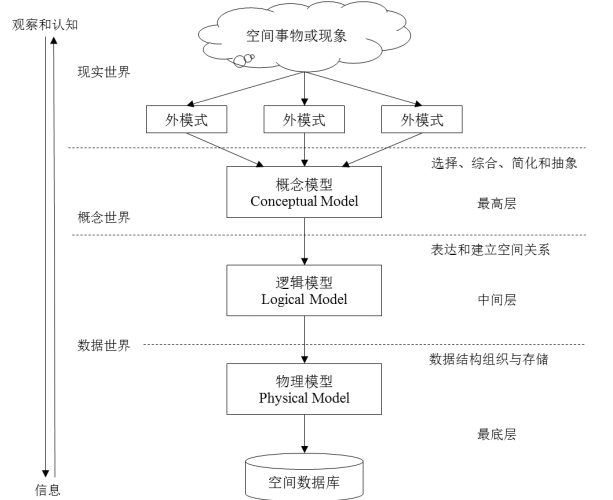
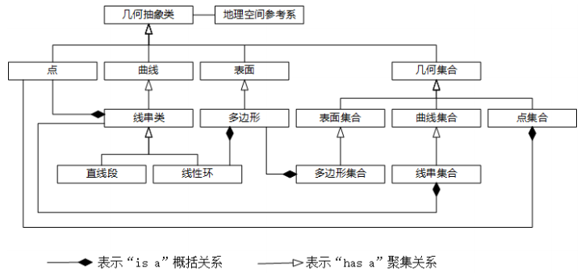

# 空间数据模型

## 基本概念

### 空间数据模型

##### 空间数据

- 矢量数据：点(0 维)，线(1 维)，面(2 维)，体(3 维)及其组合体；
- 栅格数据；
- 属性数据；
- 元数据：关于数据的数据；

##### 空间数据模型

- 概念模型；
- 逻辑模型；
- 物理模型；

### 地理空间

##### 地理空间

- 地球表面及近地表空间；

##### 空间实体

- 复杂空间对象的抽象简化；

##### 特征

- 空间特征；
- 属性特征；
- 时间特征；
- 空间关系特征；

### 空间抽象

- ISO 模式；

## 概念模型

### 基本概念

##### 概念模型

- 空间对象的抽象简化；

##### 分类

- 对象模型；
- 场模型；
- 网络模型；
- 时空数据模型；

### 对象模型

##### 对象模型

- 将研究区域看作一个空域；
- 空间对象独立分布；
- 离散型空间数据模型；
- 适用于具有明确界限的地理对象；

### 场模型

##### 场模型

- 将地理对象作为连续变量或体；
- 使用函数关系式表示；
- 连续型空间数据模型；

##### 常见场模型

- 规则分布的点；
- 不规则分布的点；
- 规则多边形；
- 不规则多边形；
- 等值线；

### 网络模型

##### 网络模型

- 对象模型的特例；
- 强调其交互作用；

### 时空数据模型

##### 时空数据模型

- 地理对象随时间变化的动态过程和静态结果；

##### 常见时空模型

- 时空棱柱模型；
- 时空立方体模型；

### 多维数据模型

- 具有多个多个维度的空间数据模型；

## 逻辑模型

### 基本概念

- 概念模型实体及其关系的逻辑结构；

### 逻辑数据模型的设计

##### 实体属性的逻辑建模

- 非空间属性；
- 空间属性；
- 属性域；

##### 实体关系的逻辑建模

- 一般关系；
  - 一对一；
  - 一对多；
  - 多对多；
- 空间关系；

##### 实体行为的逻辑建模

- 客观约束；
- 主观约束；

### 逻辑数据模型的表示

- UML (统一建模语言) ，面向对象模型的表示方法；

## 物理模型

- 概念模型在计算机内部的储存形式和操作机制；

## 面向对象技术

### 基本概念

##### 对象

- 同类对象共享相同的属性和方法，也可有特有的属性和方法；

##### 类

- 具有部分相同属性和方法的对象的集合；

##### 对象和类的关系

- 类是对象的共性抽象；
- 对象是类的实例；

##### 超类

- 类的共性抽象；

### 抽象技术

##### 抽象技术

- 分类：对象进行共性抽象，形成类；
- 概括：类进行共性抽象，形成超类；
- 联合：同类对象组合形成集合对象，其中个体称为成员对象；
- 聚集：不同类对象组合形成复合对象，其中个体称为组件对象；

### 抽线工具

##### 抽象工具

- 继承：子类继承父类的属性和方法，分为单继承和多继承；
- 传播；
  - 作用于联合和聚集的语义工具；
  - 复杂对象的属性和方法不单独描述，在其子对象中提取派生；

## 空间关系

### 拓扑空间关系

##### 九交模型

### 顺序空间关系

- 基于空间对象的空间分布；
- 即上下左右，东西南北；
- 计算复杂，随投影和几何变化而变化；

### 度量空间关系

- 空间对象的距离关系；
- 计算复杂，随投影和几何变化而变化；
