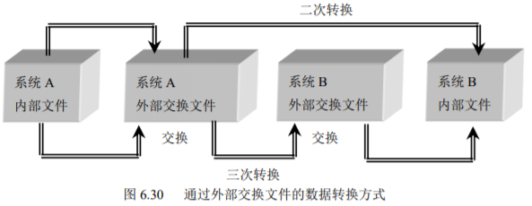

# 空间数据采集与处理

## 概述

### 数据源分类

##### 按获取方式

- 基础测绘数据;
- 遥感图像数据;
- 导航定位数据;
- 互联网数据, 物联网数据;

##### 按表现方式

- 文本资料数据;
- 数字化数据;
- 多媒体数据;

### 空间数据采集与处理的基本流程

- 数据源的选择;
  - 应用要求;
  - 使用经验;
  - 获取成本;
- 采集方法的确定;
- 数据的编辑与处理;
- 数据质量控制与评价;
- 数据入库;

## 数据采集

**数据采集**: 利用各种方法采集数据;

### 空间数据采集

**野外数据采集**: 利用全站仪, 数字测图软件等.  
**适用范围**: 小范围地区, 大比例尺数据;

---

**地图数字化**: 扫描矢量化;

- 扫描仪扫描纸质地图形成栅格图像;
- 经几何校正后矢量化;

---

**摄影测量方法**

##### 立体摄影测量

- 同一地物多张重叠的相片;
- 恢复其摄影方位, 重构地形表面;
- 要求航向测量和旁向测量;

##### 数字摄影测量

- 应用计算机技术, 数字图像处理, 摄影测量等理论, 技术和方法;
- 提取目标物体信息;

##### 倾斜摄影测量技术

- 同一平台搭载多台传感器;
- 从一个垂直, 四个倾斜五个角度同时采集;

---

##### 遥感图像处理

- 数据输入;
- 校正处理;
- 变换处理;
- 分类处理;
- 数据输出;

### 属性数据的采集

##### 属性数据的来源

- 社会环境数据;
- 自然环境数据;
- 资源和能源;

---

**属性数据分类**: 相应国际, 国家和行业规范;

##### 属性数据的编码

- 层级分类法;
  - 采用树状结构;
  - 同级类并列关系;
  - 上下级类隶属关系;
- 多源分类法: 独立分类法;
  - 不同分类依据分别编码;
  - 各编码之间没有隶属关系;

## 数据编辑和拓扑关系

### 数据编辑

**图形数据编辑**

##### 检查内容

- 伪结点: 未一次性录入产生实际不存在的结点;
- 悬挂结点: 一个结点只和一条线连接;
- 碎屑多边形: 重复录入同一多边形且位置偏移;

##### 检查方法

- 叠合比较法;
- 目视检查法;
- 逻辑检查法;

---

**属性数据编辑**

##### 检查内容

- 逻辑一致性;
- 准确性;
- 属性域;

##### 检查方法

- 逻辑检查法;
- 目视检查法;

### 拓扑关系

- 点线拓扑关系;
- 多边形拓扑关系;
  - 独立多边形;
  - 具有公共边的多边形;
  - 嵌套多边形;
- 网络拓扑关系;

## 数学基础变换

### 几何校正

##### 校正原因

- 地图实际尺寸变化;
- 地图数字化误差;
- 遥感图像几何变形;
- 坐标系统, 地图编码不同;
- 数据拼接误差;

##### 地形图的校正

- 四点校正法;
  - 利用一定数学变换函数;
  - 输入图幅行列号, 比例尺, 生成标准图廓;
  - 采集四个图廓控制点完成;
- 逐网格校正法: 四点校正法的复杂版, 逐网格进行;

##### 遥感图像的校正

- 粗校正;
- 精校正;

### 坐标变换

##### 变换方法

- 投影变换;
- 仿射变换;
  - 不同方向上;
  - 不同的压缩和扩张;
- 相似变化: 从一个图形变换为另一个图形;
  - 平移;
  - 旋转;
  - 缩放;
- 橡皮拉伸: 不清楚准确定义;

### 栅格数据重采样

**重采样**: 匹配栅格分辨率;

##### 重采样方法

- 最邻近像元法: 最近像元值;
- 双线性内插法;
  - 最近 4 个像元值;
  - 双线性多项式;
- 双三次卷积法;
  - 最近 16 个像元值;
  - 双三性多项式;

## 数据重构

### 数据结构转换

- 矢量数据到栅格数据;
- 栅格数据到矢量数据;

### 数据格式转换

##### 转换内容

- 空间数据;
- 属性数据;
- 空间关系;
- 元数据;

##### 转换方式

- 外部数据交换方式;
  
- 标准空间数据交换方式;
  
- 空间数据的互操作方式;
  
- 数据转换模型: 基于语义层次建立;

## 图形拼接

##### 拼接原因

- 数字化误差, 实体无法衔接;
- 坐标系统, 编码方式等不统一;

##### 步骤

- 逻辑一致性的处理;
  - 逻辑接边: 属性值;
  - 几何接边;
- 识别和检索相邻图幅;
- 相邻图幅边界点坐标数据的匹配;
- 相邻实体公共边界的删除;

## 数据压缩

##### 数据压缩

- 数据集合抽取子集;
- 规定精度范围内;
- 最好地逼近原集合;
- 尽可能大的压缩比;

### 栅格数据压缩

- 游程长度编码;
- 四叉树;
- 二维行程编码;

### 矢量数据压缩

##### 压缩方法

- 间隔取点法;
  - 一定距离或 k 个点;
  - 首末点保留;
- 垂距法和偏角法;
  - 垂距或偏角的限差;
  - 保留符合或舍弃;
- 道格拉斯法;
  - 连接曲线首尾两点;
  - 计算曲线每点到直线的距离, 若均小于限差, 全部舍去;
  - 若上步条件不满足, 保留最大距离对应的点, 将原曲线分成两段, 递归使用道格拉斯法;

## 数据质量评价和控制

### 空间数据质量评价

##### 评价指标

- 完备性;
- 逻辑一致性;
- 位置准确度: 绝对, 相对;
- 时间准确度: 绝对, 次序, 有效性;
- 专题准确度;

##### 评价方法

- 直接评价: 验收度量;
  - 数据全面检测或抽样检测;
- 间接评价: 预估度量;
  - 数据的来源, 质量和生产方法等间接信息检测;

### 空间数据的误差源和误差传播

##### 分类

- 随机误差;
- 系统误差;
- 粗差;

##### 误差类型分析

- 几何误差;
- 属性误差;
- 时间误差;
- 逻辑误差;

### 空间数据质量的控制

##### 方法

- 手工方法;
- 元数据;
- 地理相关法: 地理实体之间相关性;

##### 空间数据生产过程中的质量控制

- 数据源的选择;
- 数字化过程的质量控制;
  - 数字化设备选择;
  - 数字化限差;
  - 数据的精度检查;

## 数据入库

### 数据入库流程

##### 数据按管理属性分类

- 现势性最好的成果数据;
- 历史数据;
- 对成果数据分析建立的工作数据;

##### 流程

- 检查待入库数据, 直至满足要求;
- 建立存储目录;
- 统一命名;
- 数据数字化;
- 更新元数据;
- 存入目录;

### 元数据及其作用

##### 元数据

- 关于数据的数据;
- 描述地理数据的性质, 特征和状态;

##### 作用

- 帮助用户了解数据;
- 空间数据质量控制;
- 数据集成;
- 数据存储;
- 数据共享;

**标准**: CSDGM;
