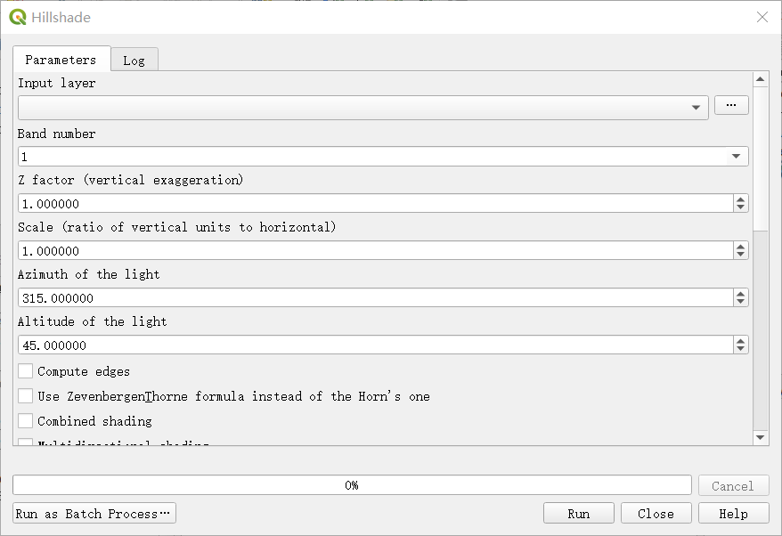

# 栅格数据分析

## 数据分析

### 提取栅格值至点图层

##### 操作步骤

- `工具栏 - raster analysis - sample raster values`；
  - 一次仅能提取一个栅格图像；
- `工具栏 - saga - features - features raster tools - add raster values to points/features`；
  - 一次可提取多个栅格图像；

### 图层统计

##### 操作步骤

- `工具栏 - raster analysis - raster layer statistics`；

## 栅格计算

### 栅格计算器

##### 空值

- 0/0 即可表示 null/no data；

##### if 函数

- 语法格式：if(expression，value_1，value_2)；
- 工作原理：expression 为真，取 value_1，反之取 value_2；

##### 示例

- if(dem>500，dem，500)；
- 如果 dem 数据栅格值大于 500；
- 则保持原来的栅格值；
- 否则修改栅格值为 500；

## 表面分析

### 地形因子计算

##### 坡度

- `工具栏 - gdal - raster analysis - slope`；

##### 坡向

- `工具栏 - gdal - raster analysis - aspect`；

##### sos

- 即坡度之坡度；

##### soa

- 即坡向之坡度

##### 地表粗糙度

- `工具栏 - gdal - raster analysis - roughness`；

### 山体阴影/地貌

##### hillshade

- `工具栏 - gdal - raster analysis - hillshade 工具`；
  - input layer：dem；
  - z factor：山体阴影夸张程度，越大山体阴影越明显；
  - azimuth/altitude of the light：太阳方位角设置，默认即可；
    

##### relief

- `工具栏 - gdal - raster terrain analysis - relief 工具`；
  - input layer：dem；
  - z factor：山体阴影夸张程度，越大山体阴影越明显；
  - 设置色带或选择 generate relief classes automatically；
    - 色带推荐设置为黑白色带，使用 symbol 中的 multiply 配置色带；

##### 注意

- 生成的栅格图像裁剪时要选择 create an output alpha band，否则无法裁剪成功；
