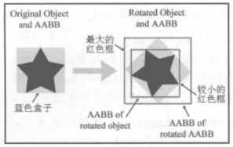
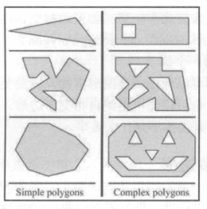
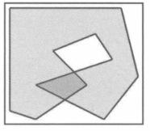
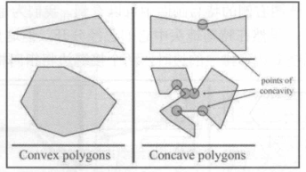
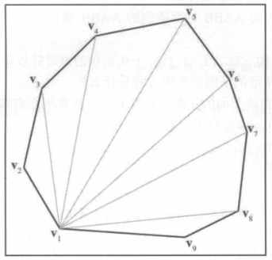

# 几何图元

## 表示形式

##### 隐含形式

$$x^2+y^2+z^2=1$$

##### 参数形式

$$x(t)=\cos2\pi t \qquad y(t)=\sin2\pi t$$

## 线

### 直线

##### 向量定义

$$p(t)=p_0+tu$$

### 光线

##### 光线

- 与射线不同；
- 图形学中的光线为有向线段；

##### 向量定义

- d 有方向和大小；

$$p(t)=p_0+td \qquad t\in[0,1]$$

### 线段

##### 几何定义

- [p1，p2]；

## 球和圆

##### 球和圆

- 中心为 c，半径为 r；
- c 和 p 皆为向量；

$$||p-c||=r$$

##### 初等几何公式

$$D=2r$$
$$C=2\pi r$$
$$A = \pi r^2$$
$$S = 4 \pi r^2$$
$$V=\frac{4}{3}\pi r^3$$

## AABB

### AABB 的表示形式

##### 向量表示

$$p_{min}=[x_{min},y_{min},z_{min}] \qquad p_{max}=[x_{max},y_{max},z_{max}]$$

### 计算 AABB

##### 计算过程

- 首先将 p_min 设置为正无穷大和 p_max 设置为负无穷大；
- 根据各点依次比较；

```typescript
for (let index = 0; index < length; index++) {
  const vertex = vertices[index];
  const [x, y, z] = vertex.get();
  if (x < minX) minX = x;
  if (y < minY) minY = y;
  if (z < minZ) minZ = z;
  if (x > maxX) maxX = x;
  if (x > maxY) maxY = y;
  if (z > maxZ) maxZ = z;
}
```

### AABB 和包围球

##### AABB 的优点

- AABB 易于实现，计算速度高；
- AABB 有三个自由度，包围球只有一个自由度；

### 变换 AABB

##### 变换原理

- 对 AABB 4 个顶点进行旋转；
- 基于旋转前的 4 个顶点和旋转后的 4 个顶点 (8 个顶点) 计算一个新的 AABB；



##### 快速算法

- 基于 AABB 的结构加快运算；
- 以 x_min 为例；
  - 若想下述公式总和最小，要求 3 个乘积都为最小；
    - 若 m11 > 0，取 x_min，反之取 x_max；
    - 若 m21 > 0，取 y_min，反之取 y_max；
    - 若 m31 > 0，取 z_min，反之取 z_max；
  - x，y，z 根据上述步骤以此类推；

$$x=m_{11}x+m_{21}y+m_{31}z$$

## 平面

### 平面方程

##### 向量表示

- p 为平面一点；
- n 为平面法线；
- d 为平面到原点距离；

$$p\cdot n = d$$

##### 三点定义一个平面

$$e_1=p_2-p_1 \quad e_2 = p_3-p_2 \quad \hat{n} = \frac{e_1 \times e_2}{||e_1 \times e_2||}$$

##### 超过三个点的最佳拟合平面

$$n_x=\sum^n_{i=1}(y_i-y_{i+1})(z_i+z_{i+1})$$
$$n_y=\sum^n_{i=1}(z_i-z_{i+1})(x_i+x_{i+1})$$
$$n_z=\sum^n_{i=1}(x_i-x_{i+1})(y_i+y_{i+1})$$
$$d=\frac{1}{n}(\sum^n_{i+1}p_i)\hat{n}$$

## 三角形

##### 向量表示

- 顺时针表示 3 个顶点；

##### 中心坐标

- 中线交点；

$$\frac{v_1+v_2+v_3}{3}$$

##### 内心坐标

- 角平分线交点；
- l 为 v 对应的边；

$$\frac{l_1v_1 + l_2v_2 + l_3v_3}{l_1 + l_2 + l_3}$$

##### 外心坐标

- 垂直平分线交点；
- 太长了记不住，用的时候 google；

## 多边形

##### 简单多边形

- 无孔的多边形；

##### 复杂多边形

- 有孔的多边形；



##### 自相交多边形

- 边相交的多边形；



##### 凸多边形和凹多边形

- 凸多边形中的任意两点之间的直线完全在多边形内；
- 凸多边形沿边移动，顶点朝一个方向旋转；



##### 凸多边形的判断

- 凸多边形的内角和为 (n-2)\*180 度；

##### 三角剖分

- 非常复杂，简单的凸多边形可以使用扇形分割代替；


