# phonogram

[元音对照复习](#元音对照复习)  
[辅音对照复习](#辅音对照复习)

## 字母读音

### 易错读音

|     |     |     |
| --- | --- | --- |
| g   | j   | w   |

### 音频文件

<audio src = 'docs/1044_英语/104410_赖世雄美语音标/images/abc.mp3' controls></audio>

## 元音

### 单元音 [i]

##### 口腔

- 上下唇微开；
- 上下齿微开；
- 舌尖微抵下齿；
- 嘴角尽量向两侧移动。

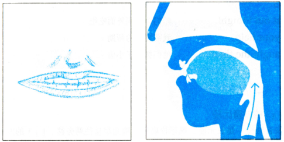

##### 发音

- 类似于 yi；
- 声音拉长。

### 单元音 [I]

##### 口腔

- 上下唇微开；
- 上下齿微开；
- 舌尖微抵下齿。

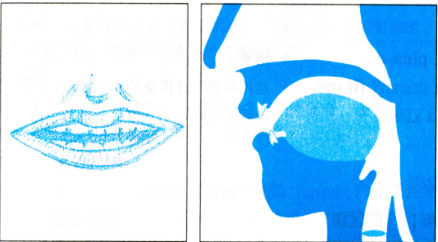

##### 发音

- 类似于 ai + ei，；
- 声音短促。

### 双元音 [e]

##### 口腔

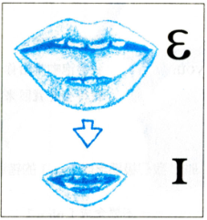

##### 发音

- 先 [ε] 后 [I]；
- 类似于 ei 音。

### 单元音 [ε]

##### 口腔

- 上下唇中开；
- 上下齿中开；
- 舌尖微抵下齿。

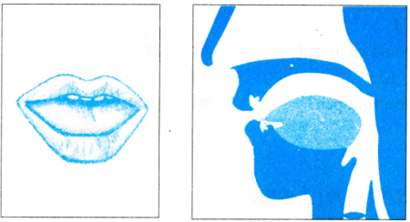

##### 发音

- [I] 嘴型放大版，
- 更加像 ai，但还有 ei 的感觉；

### 单元音 [æ]

##### 口腔

- 上下唇张开；
- 上下齿张开；
- 舌尖微抵下齿。

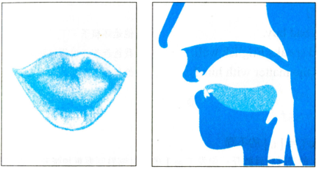

##### 发音

- [x] 嘴型放大版；
- 类似于 ai 。

### 单元音 [a]

##### 口腔

- 上下唇全张；
- 上下齿全张；
- 舌尖自然平放，不碰下齿。

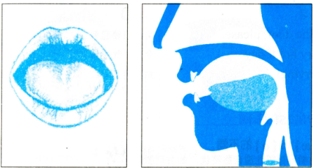

##### 发音

- 类似于 a，
- 但要更张大。

### 双元音 [ar]

##### 口腔

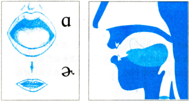

##### 发音

- 慢读像 'a er'；
- 快读像 ao + er，一点点 er；

### 单元音 [ɔ]

##### 口腔

- 上下唇张开；
- 上下齿张开；
- 舌尖自然平放。

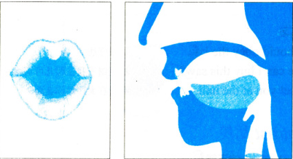

##### 发音

- 类似于 ao + ou，一点点 ou。

### 双元音 [ɔr]

##### 口腔

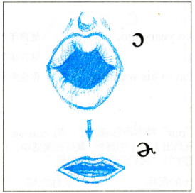

##### 发音

- 先念 [ɔ]；
- 然后舌头卷起发 er，一点点。

### 双元音 [ɔI]

##### 口腔

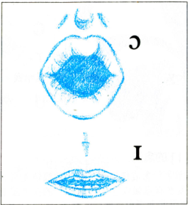

##### 发音

- [ɔ] + [I]；
- 先念 [ɔ]；
- 后念 [I]，一点点。

### 双元音 [o]

##### 口腔

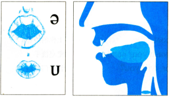

##### 发音

- [ə] + [u]；
- 先念 [ə]；
- 后念 [u]；
- 类似于 e + ou 四声，一点点 e。

### 单元音 [u]

##### 口腔

- 嘴型略扁；
- 嘴唇稍微翘起。

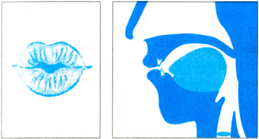

##### 发音

- 类似于 wu 四声，
- 但要长读。

### 单元音 [υ]

##### 口腔

- 嘴型略扁；
- 嘴唇稍微翘起。

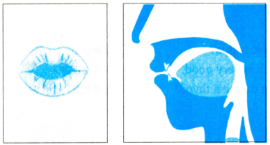

##### 发音

- 类似于 wu + e，一点点 wu；

### 双元音 [υr]

##### 口腔

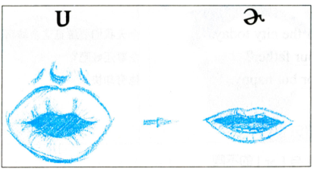

##### 发音

- [υ] + er；
- 先念一点点 [υ]；
- 快速卷舌念 er。

### 单元音 [ʌ]

##### 口腔

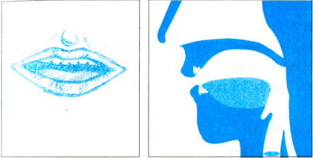

##### 发音

- e；
- 很短。

### 单元音 [ə]

##### 口腔

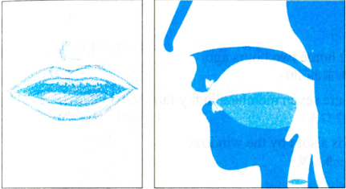

##### 发音

- e；
- 很短，
- 比 [ʌ] 轻很多。

### 双元音 [ʌr]

##### 口腔

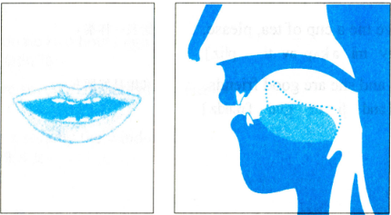

##### 发音

- [ʌ] + er；
- 先念一点点 [ʌ]；
- 快速卷舌念 er。

### 双元音 [ər]

##### 口腔

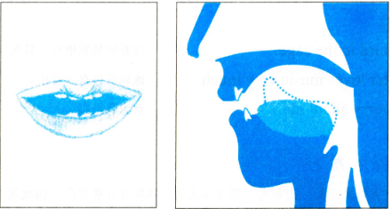

##### 发音

- [ə] + er；
- 先念一点点 [ə]；
- 快速卷舌念 er，
- 比 [ʌr] 轻很多。

### 双元音 [aI]

##### 口腔

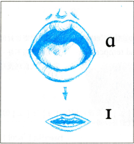

##### 发音

- [a] + [I]，
- 类似于 a + ai，a 很短。

### 双元音 [aυ]

##### 口腔

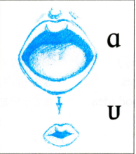

##### 发音

- [a] + [υ]；
- 类似于 a + ou。

### 双元音 [εr]

##### 口腔

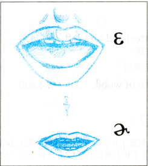

##### 发音

- [ε] + [r]，
- 发 [ε] 后，舌头快速向后卷。

### 双元音[Ir][iə][iə]

##### 口腔

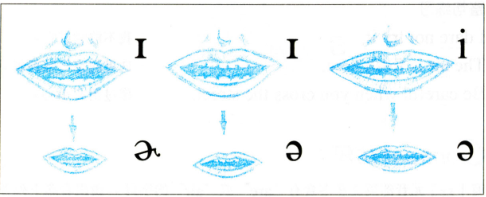

##### 发音

- [Ir]；
  - [I] + er；
  - 卷舌。
- [Iə]；
  - [I] + [ə]；
  - 不卷舌。
- [iə]；
  - [i] + [ə]；
  - 不卷舌。

### 元音对照复习

<audio src = '/1060_english/106030_phonogram/images/vowel.m4a' controls></audio>
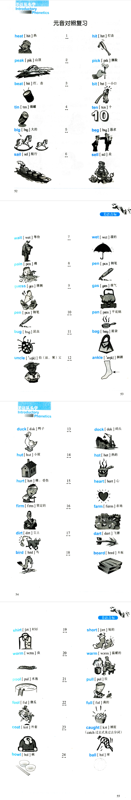

## 辅音

### 清辅音 [p]

##### 口腔

- 双唇闭合；
- 压迫气息；
- 气息突破双唇。

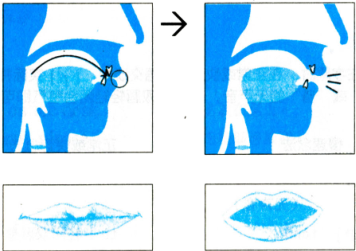

##### 发音

- 元音之前：pe；
- 元音之后：轻轻的 pu。

### 浊辅音 [b]

##### 口腔

- 同 [p]，
- 震动声带。

##### 发音

- 元音之前：be；
- 元音之后：轻轻的 bu，几乎听不见。

### 清辅音 [t]

##### 口腔

- 舌尖抵上齿牙龈；
- 憋气；
- 弹开舌头；
- 不震动声带。

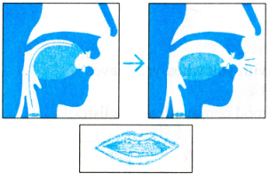

##### 发音

- 无声的 te，
- 快速度的时候不发，即舌尖抵上齿牙龈，但不弹开。

### 浊辅音 [d]

##### 口腔

- 同 [t]，
- 震动声带。

##### 发音

- 无声的 de，
- 快速度的时候不发，即舌尖抵上齿牙龈，但不弹开。

### 清辅音 [k]

##### 口腔

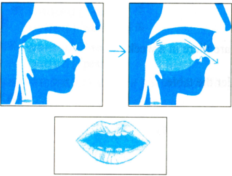

##### 发音

- 无声的 ke，
- 快读时憋气但气息不冲出。

### 浊辅音 [g]

##### 口腔

- 同 [k]，
- 震动声带。

##### 发音

- 无声的 ge，
- 快读时憋气但气息不冲出。

### 清辅音 []

##### 口腔

##### 发音

- fu。

### 浊辅音 [v]

##### 口腔

- 同 [v]，
- 震动声带。

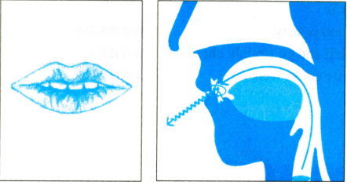

##### 发音

- 浊化的 [f]

### 清辅音 [θ]

##### 口腔

- 双唇微开，
- 轻咬舌头，
- 吹气，
- 不震动声带。

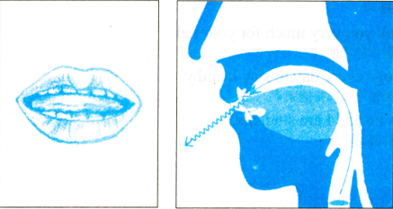

##### 发音

- 无声音的 si。

### 浊辅音 [δ]

##### 口腔

- 同 [θ]，
- 震动声带。

##### 发音

- ri。

### 清辅音 [s]

##### 口腔

- 双唇微开，
- 舌尖抵上齿牙龈，
- 吹气，
- 不震动声带。

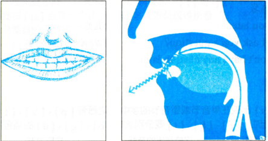

##### 发音

- 无声音的 si。

### 浊辅音 [z]

##### 口腔

- 同 [s]，
- 震动声带。

##### 发音

- ri。

### 清辅音 [ʃ]

##### 口腔

- 双唇突出，
- 舌尖抵上齿牙龈，
- 吹气，
- 不震动声带。

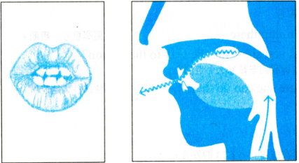

##### 发音

- 类似 shi；

### 浊辅音 [ʒ]

##### 口腔

- 双唇突出，
- 舌尖抵上齿牙龈，
- 吹气，
- 震动声带。

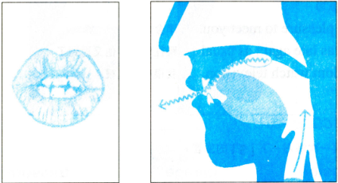

##### 发音

- 类似 ri。

### 清辅音 [tʃ]

##### 口腔

- 双唇突出，
- 舌尖抵上齿牙龈，
- 憋气，
- 吐气，
- 不震动声带。

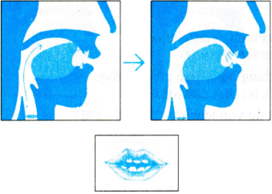

##### 发音

- [t] + [ʃ]，
- qie 和 che 的结合。

### 浊辅音 [dʒ]

##### 口腔

- 双唇突出，
- 舌尖抵上齿牙龈，
- 憋气，
- 吐气，
- 不震动声带。

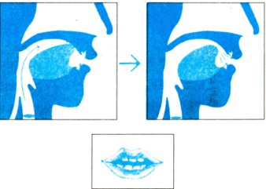

##### 发音

- [d] + [ʒ]；
- 开头很像 zhe，词尾很想 zhi。

### 浊辅音 [m]

##### 口腔

- 双唇闭合；
- 舌头平放；
- 发 en 音。

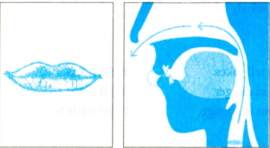

##### 发音

- 开头像 m；
- 词尾像 en；

### 浊辅音 [n]

##### 口腔

- 双唇微张；
- 舌头上扬；
- 发 en 音。

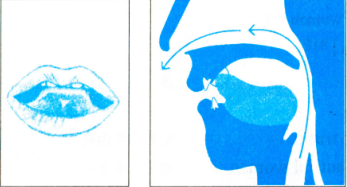

##### 发音

- 开头像 n；
- 词尾像 en。

### 浊辅音 [ŋ]

##### 口腔

- 双唇闭合；
- 舌头平放；
- 舌后根上扬；
- 发 en 音。

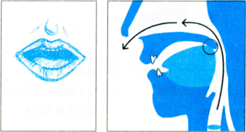

##### 发音

- 类似 eng + wong；

### 浊辅音 [l]

##### 口腔

- 双唇张开；
- 舌尖上扬；
- 发 le 音。

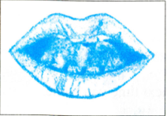

##### 发音

- 开头像 l；
- 词尾像 ou。

### 浊辅音 [r]

##### 口腔

- 双唇张开；
- 舌尖上扬；
- 发 ruo 音；

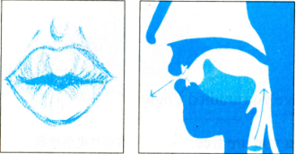

##### 发音

- 开头像 r；
- 词尾像 er；

### 浊辅音 [j]

##### 口腔

- 双唇微开；
- 舌尖抵住下齿龈。

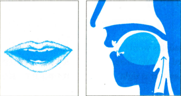

##### 发音

- 类似 ye。

### 清辅音 [h]

##### 口腔

- 嘴半开；
- 舌头自然平放；
- 发 he，
- 不震动声带。

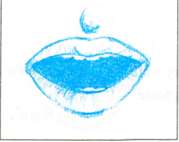

##### 发音

- he 的轻声。

### 浊辅音 [w]

##### 口腔

- 双唇突出，
- 发 ve。

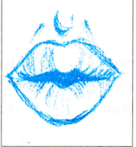

##### 发音

- ve 音。

### 辅音对照复习

<audio src = '/1060_english/106030_phonogram/images/consonants.m4a' controls></audio>
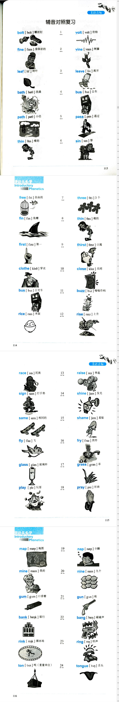
