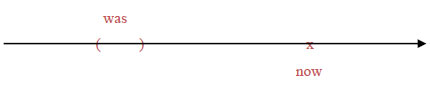
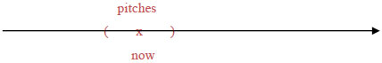
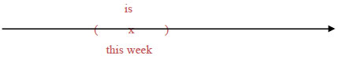

# 动词时态

## 基础

##### 简化动词时态

- 动词时态繁多；
  - 主动/被动；
  - 现在/过去/未来；
  - 一般时/完成时/进行时/完成进行时；
- 简化；
  - 视 be 动词为动词；
  - 分词短语视为形容词补语；
  - 只保留一般时和完成时两种状态；
    - 一般时：be；
    - 完成时：have been；

##### 静态动词

- 名不符实的动词；
- 称为动词，但不含有动作，表示一种状态；
- 静态动词无时态之分；

##### 常见的静态动词

|         |      |          |           |
| ------- | ---- | -------- | --------- |
| be      | have | belong   | resembles |
| believe | like | consider |           |

##### 时态一致性

- 一个句子具有多个从句；
- 从句时态保持一致；
  - 并非时态必须相同；
  - 而是符合逻辑关系；

```json
// 不佳
// that 从句表明过去时间, 但建筑物建造时间应在地震发生之前, 不应该使用一般时
Some buildings that were destroyed in the 921 earthquake were poorly constructed.
// 修改
Some buildings that were destroyed in the 921 earthquake had been poorly constructed.
```


## 一般时

### 基础

##### 一般时

- 交代动作发生于什么时间；
- 除非上下文暗示；
- 必须指明时间；

##### 时间

- 时间如同一个括弧；
- 现在时间是以 now 为中心的括弧；
- 括弧的大小不收限制；
- 过去时间是在 now 之前的括弧，未来时间是在 now 之后的括弧；

### 过去时间

##### 句法结构

- been；

##### 一般用法

```json
// declare 使用过去式
The U.S. declared independence in 1776.
```


##### 被动

```json
// be 动词使用过去式, invented 作为形容词, 使用过去式表示被动
The dynamite was invented by the Chinese.
```



##### 正在进行

```json
// when 从句表示过去时间, 主句保持一致
// be 动词使用过去式, playing 作为形容词, 使用进行式表示正在进行(短时间)
I was playing a video game when the power suddenly went out.
```


##### 被动进行

```json
// when 从句表示过去时间, 主句保持一致
// be 动词使用过去式
// being renovated 作为形容词补语, being 表示正在进行(短时间), renovated 表示被动语态, 整体表示正在被翻修
The house was being renovated when it collapsed on the workers .
```


### 现在时间

##### 句法结构

- be；

##### 一般用法

```json
// 暗示现在
Wang Chien-Ming pitches for the Yankees.
```



##### 被动

```json
// is 暗示为现在时间
// located 作为形容词, 使用过去式表示被动
Our summer house is located on the lake.
```


##### 正在进行

```json
// now 表明现在时间
// be 动词使用原型, sleeping 作为形容词, 使用现在时表示正在进行
Please be quiet, because everybody is sleeping now.
```




##### 被动进行

```json
// now 表示现在时间
// be 动词使用原型, closed 作为形容词, 使用过去式表示被动
// being widened 作为形容词, being 使用现在时表示正在进行, widened 使用过去式表示被动, 整体表示正在被拓宽
This road is closed to traffic now because it is being widened.
```

### 未来时间

##### 句法结构

```json
// will + do
// 具有最浓厚的不确定语气, 表示可能会
John will leave tomorrow.

// be going to do
// 类似于 will, 口语化, 语气偏重于现在的意图, 打算, 预期
John is going to leave tomorrow.

// be to do, be doing 和 will be doing 等效于 be going to do, 省略 going
John is to leave tomorrow.
John is leaving tomorrow.
John will be leaving tomorrow.

// do
// 具有最肯定的语气, 将未来发生的事情作为事实
John leaves tomorrow.
```

##### 一般用法

```json
// next 表示未来时间
// 使用 will + do 表示可能会
I will discuss the plan with my boss next week.
```


##### 过去时间的未来

- 以过去某个时间为基准；
- 使用 would + do；

```json
// mid-1945 表示过去时间
// would 表示过去时间的未来
It was mid-1945; Japan would soon raid Pearl Harbor.
```


## 完成时

### 基础

##### 一般时

- 交代动作在某个时间之前完成；
- 无具体时间，为一个时间段；

##### 时间

- 时间如同一个箭头，指出截止时间；
- 现在时间是指向 now 的箭头；
- 过去时间是指向 now 之前的箭头，未来时间是指向 now 之后的箭头；

### 过去时间

##### 句法结构

- had been；

##### 普通

```json
// before 引导的从句表示完成时且发生在过去
// had 使用过去式
Everybody had left before she got to the station.
```


##### 被动

```json
// when 引导的从句表示完成时且发生在过去
// had been 使用过去式
// killed 作形容词补语, 使用过去分词表示被动
More than 60,000 soldiers had been killed when the President finally decided to pull out of the war.
```


##### 进行

```json
// when 引导的从句表示完成时且发生在过去
// had been 使用过去式
// preparing 作形容词补语, 使用现在分词表示持续进行
The students had been preparing for the college entrance exam for three years when the Education Ministry suddenly announced a change of regulations.
```


### 现在时间

##### 句法结构

- have been；

##### 使用场景

- 除非明确或暗示时间；
- 完成时一律使用现在完成时；

##### 普通

```json
// now 暗示为现在时间
// has already 使用现在时
You can' t enter now because the concert has already begun.
```


##### 被动

```json
// now 暗示为现在时间
// has been 使用现在时, done 形容词补语, 使用过去分词表示被动
Everything that can be done has been done; now we can only wait and see.
```


##### 进行

```json
// now 暗示为现在时间, for 使用完成时
// has been 使用现在时, running 形容词补语, 使用现在分词表示持续进行
Those marathon runners have been running for two whole hours without stop now.
```


##### 使用现在分词作补语

- 与不使用现在分词相比；
- 根据不同语境，有的无差别，有的差别大；

```json
// 无差别, 都表示住了 20 年
I have lived here for 20 years.
I have been living here for 20 years.

// 有差别
I have read your book. // 已经读完
I have been reading your book. // 还未读完
```

### 未来时间

##### 句法结构

- will have been；

##### 被动

```json
// by the middle of this century 表示未来时间, 使用完成时
// 动词使用 will have been, depleted 使用过去分词表示被动
Experts estimate that the last of our oil reserves will have been depleted by the middle of this century.
```


##### 进行

```json
// In two more minutes 表示未来时间, for three hours 表示使用完成时
// 动词使用 will have been, talking 使用现在分词表示持续进行
In two more minutes, she will have been talking on the phone for three hours!
```


