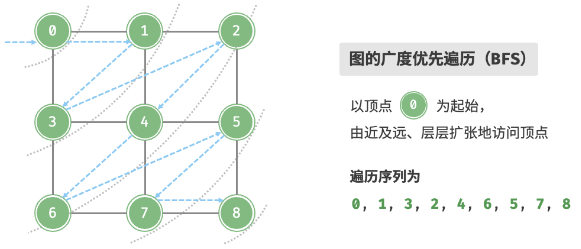

# 图

## 图

### 基础

##### 图

- 一组顶点 V 和一组边 E 的集合;

### 常见类型

##### 有向图和无向图

- 根据边是否具有方向判定;


##### 连通图和非连通图

- 从任一顶点出发, 可以到达任一顶点, 称作连通图;
- 反之称作非连通图;


##### 无权图和有权图

- 根据边是否具有权重判定;


### 常用术语

##### 邻接

- 两顶点存在边相连;

##### 路径

- 从任一顶点到其余任一顶点经过的边构成的序列;

##### 度

- 一个顶点具有的边数;
  - 入度: 多少条边指向该顶点;
  - 出度: 多少条边从该顶点指出;

### 图的表示

### 邻接矩阵

##### 邻接矩阵

- 若图顶点数量为 n;
- 使用 n\*n 的矩阵表示图;
- 通过 0 或 1 表示两顶点是否存在边;


##### 特性

- 邻接矩阵主对角线无意义, 恒为 0;
- 无向图关于主对角线对称;

##### 空间复杂度

- O(n^2);

### 邻接表

##### 邻接表

- 使用 n 个链表表示图;
- 链表节点表示顶点;
- 链表存储顶点的所有邻接顶点;


##### 空间复杂度

- 远小于 O(n^2);

##### 哈希表优化

- 链表使用哈希表;
- n 个哈希表使用哈希表存储;

## 图的基本操作

### 基于邻接矩阵

##### 添加和删除边

- 修改矩阵对应元素即可;

##### 添加顶点

- 邻接矩阵尾部添加一行一列;

##### 删除顶点

- 邻接矩阵删除一行一列;

##### 代码

```typescript
export class GraphAdjMat {
  _adjMat: number[][];
  _size: number;
  _isDirection: boolean;
  _index: {
    [propName: number]: string;
  };

  _vertices: {
    [propName: string]: number;
  };

  constructor(vertices: string[], edges: [string, string][]) {
    this._vertices = {};
    this._adjMat = [];
    this._size = 0;
    this._isDirection = false;
    this._index = {};
    for (let index = 0; index < vertices.length; index++) {
      const vertex = vertices[index];
      this.addVertex(vertex);
    }
    for (let index = 0; index < edges.length; index++) {
      const edge = edges[index];
      this.addEdge(edge[0], edge[1]);
    }
  }

  size() {
    return this._size;
  }

  getVertexIndex(value: string) {
    const index = this._vertices[value];
    if (typeof index === "number") {
      return index;
    } else {
      return null;
    }
  }

  addVertex(value: string) {
    const size = this._size;
    const newRow = new Array(size).fill(0);
    this._vertices[value] = size;
    this._index[size] = value;
    this._adjMat.push(newRow);
    for (let index = 0; index < this._adjMat.length; index++) {
      const row = this._adjMat[index];
      row.push(0);
    }
    this._size += 1;
  }

  removeVertex(value: string) {
    const vertexIndex = this.getVertexIndex(value);
    if (!(typeof vertexIndex === "number")) {
      throw new Error("the graph don't have this vertex");
    }
    delete this._vertices[value];
    delete this._index[vertexIndex];
    this._adjMat.splice(vertexIndex, 1);
    for (let index = 0; index < this._adjMat.length; index++) {
      const row = this._adjMat[index];
      row.splice(vertexIndex, 1);
    }
    this._size -= 1;
  }

  addEdge(startVertex: string, endVertex: string) {
    const startVertexIndex = this.getVertexIndex(startVertex);
    const endVertexIndex = this.getVertexIndex(endVertex);
    if (
      !(
        typeof startVertexIndex === "number" &&
        typeof endVertexIndex === "number"
      )
    ) {
      throw new Error("the graph don't have this vertex");
    }
    this._adjMat[startVertexIndex][endVertexIndex] = 1;
    if (!this._isDirection) {
      this._adjMat[endVertexIndex][startVertexIndex] = 1;
    }
  }

  removeEdge(startVertex: string, endVertex: string) {
    const startVertexIndex = this.getVertexIndex(startVertex);
    const endVertexIndex = this.getVertexIndex(endVertex);
    if (
      !(
        typeof startVertexIndex === "number" &&
        typeof endVertexIndex === "number"
      )
    ) {
      throw new Error("the graph don't have this vertex");
    }
    this._adjMat[startVertexIndex][endVertexIndex] = 0;
    if (!this._isDirection) {
      this._adjMat[endVertexIndex][startVertexIndex] = 0;
    }
  }
}
```

### 基于邻接表

##### 添加边

- 顶点对应链表末尾添加指定顶点;

##### 删除边

- 顶点对应链表删除指定顶点;

##### 添加顶点

- 添加一个链表并作为链表第一个节点;

##### 删除顶点

- 遍历链表, 删除指定顶点;

##### 代码实现

```typescript
import { DoublyLinkedList } from "../linked_list/doubly_linked_list";
import { DoublyLinkedListNode } from "../linked_list/doubly_linked_list_node";

export class GraphVertex {
  _value: string;
  constructor(value: string) {
    this._value = value;
  }

  get value() {
    return this._value;
  }

  set value(value: string) {
    this._value = value;
  }
}

export class GraphLinkedList {
  _linkList: DoublyLinkedList<GraphVertex>[];
  _size: number;
  _isDirection: boolean;

  constructor(vertices: GraphVertex[], edges: [GraphVertex, GraphVertex][]) {
    this._linkList = [];
    this._size = 0;
    this._isDirection = false;
    for (let index = 0; index < vertices.length; index++) {
      const vertex = vertices[index];
      this.addVertex(vertex);
    }
    for (let index = 0; index < edges.length; index++) {
      const edge = edges[index];
      this.addEdge(edge[0], edge[1]);
    }
  }

  size() {
    return this._size;
  }

  getVertexIndex(vertex: GraphVertex) {
    for (let index = 0; index < this._size; index++) {
      const linkedList = this._linkList[index];
      if (vertex === linkedList.head.next?.value) return index;
    }
    return null;
  }

  addVertex(vertex: GraphVertex) {
    const newLinkedList = new DoublyLinkedList<GraphVertex>();
    const node = new DoublyLinkedListNode(vertex);
    newLinkedList.insert(node, newLinkedList.head);
    this._linkList.push(newLinkedList);
    this._size += 1;
  }

  removeVertex(vertex: GraphVertex) {
    const vertexIndex = this.getVertexIndex(vertex);
    if (!(typeof vertexIndex === "number")) {
      throw new Error("the graph don't have this vertex");
    }
    this._linkList.splice(vertexIndex, 1);
    for (let index = 0; index < this._size - 1; index++) {
      const linkedList = this._linkList[index];
      const node = linkedList.find(vertex);
      if (node) {
        linkedList.delete(node);
      }
    }
    this._size -= 1;
  }

  addEdge(startVertex: GraphVertex, endVertex: GraphVertex) {
    const startVertexIndex = this.getVertexIndex(startVertex);
    const endVertexIndex = this.getVertexIndex(endVertex);
    if (
      !(
        typeof startVertexIndex === "number" &&
        typeof endVertexIndex === "number"
      )
    ) {
      throw new Error("the graph don't have this vertex");
    }

    const linkedList = this._linkList[startVertexIndex];
    const node = new DoublyLinkedListNode(endVertex);
    linkedList.insert(
      node,
      linkedList.head.next as DoublyLinkedListNode<GraphVertex>
    );
    if (!this._isDirection) {
      const linkedList = this._linkList[endVertexIndex];
      const node = new DoublyLinkedListNode(startVertex);
      linkedList.insert(
        node,
        linkedList.head.next as DoublyLinkedListNode<GraphVertex>
      );
    }
  }

  removeEdge(startVertex: GraphVertex, endVertex: GraphVertex) {
    const startVertexIndex = this.getVertexIndex(startVertex);
    const endVertexIndex = this.getVertexIndex(endVertex);
    if (
      !(
        typeof startVertexIndex === "number" &&
        typeof endVertexIndex === "number"
      )
    ) {
      throw new Error("the graph don't have this vertex");
    }
    const linkedList = this._linkList[startVertexIndex];
    const node = linkedList.find(endVertex);
    if (node) linkedList.delete(node);
    if (!this._isDirection) {
      const linkedList = this._linkList[endVertexIndex];
      const node = linkedList.find(startVertex);
      if (node) linkedList.delete(node);
    }
  }
}
```

### 效率对比

##### 效率对比

- n 个顶点和 m 条边;

|              | 邻接矩阵 | 邻接表 (链表) | 邻接表 (哈希表) |
| ------------ | -------- | ------------- | --------------- |
| 判断是否邻接 | $O(1)$   | $O(m)$        | $O(1)$          |
| 添加边       | $O(1)$   | $O(n)$        | $O(1)$          |
| 删除边       | $O(1)$   | $O(m)$        | $O(1)$          |
| 添加顶点     | $O(n)$   | $O(1)$        | $O(1)$          |
| 删除顶点     | $O(n^2)$ | $O(n + m)$    | $O(n)$          |
| 内存空间占用 | $O(n^2)$ | $O(n + m)$    | $O(n + m)$      |

## 图的遍历(基于邻接表(哈希表))

### 广度优先遍历

##### 思想

- 从一个顶点出发;
- 首先遍历该顶点的所有邻接顶点;
- 然后遍历下一顶点的所有邻接顶点;
- 直至所有顶点遍历完毕;

##### 算法实现

- 使用队列实现, 并使用一个哈希表记录顶点是否已经加入队列;
- 起始顶点加入队列并开始迭代;
- 每次迭代弹出队首并记录访问, 然后将该顶点的所有邻接顶点加入队尾;
- 循环上一步, 直至所有顶点访问完毕;



##### 复杂度

- 时间复杂度: O(V + E);
- 空间复杂度: O(V);

```typescript
const graph = {
  0: ["1", "2"],
  1: ["0", "2", "3"],
  2: ["0", "1", "3", "4"],
  3: ["1", "2", "4", "5"],
  4: ["2", "3"],
  5: ["3", "6"],
  6: [],
};

const bfs = (node) => {
  const visited = new Set([node]);
  const res = [node];
  const queue = [node];

  while (queue.length !== 0) {
    const curNode = queue.shift();
    for (const node of graph[curNode]) {
      if (!visited.has(node)) {
        res.push(node);
        visited.add(node);
        queue.push(node);
      }
    }
  }

  return res;
};

bfs("0"); // 0 1 2 3 4 5 6
```

### 深度优先遍历

##### 思想

- 从一个顶点出发;
- 首先遍历该顶点的某个邻接顶点, 走到尽头再返回;
- 依次类推, 直至所有顶点遍历完毕;

##### 算法实现

- 使用一个哈希表记录顶点是否已经被访问;


```typescript
const graph = {
  A: ["B", "C"],
  B: ["A", "C", "D"],
  C: ["A", "B", "D", "E"],
  D: ["B", "C", "E", "F"],
  E: ["C", "D"],
  F: ["D", "G"],
  G: [],
};

// 递归实现
const dfs = (node) => {
  const res = [node];
  const visited = new Set([node]);

  const loop = (node) => {
    for (const tempNode of graph[node]) {
      if (!visited.has(tempNode)) {
        visited.add(tempNode);
        res.push(tempNode);
        loop(tempNode);
      }
    }
  };

  loop(node);

  return res;
};

// stack 实现
const dfs = (node) => {
  const res = [node];
  const visited = new Set([node]);
  const stack = [node];

  while (stack.length !== 0) {
    const curNode = stack.pop();
    for (const node of graph[curNode]) {
      if (!visited.has(node)) {
        res.push(node);
        visited.add(node);
        stack.push(node);
      }
    }
  }

  return res;
};

dfs("A"); // A B C D E F G
```

##### 复杂度

- 时间复杂度: O(V + E);
- 空间复杂度: O(V);

### 岛屿问题 dfs 模板代码

```typescript
const dfs = (grid, i, j) => {
  const rows = grid.length;
  const cols = grid[0].length;
  if (i < 0 || i >= rows || j < 0 || j >= cols || grid[i][j] !== "1") {
    return 0;
  }
  grid[i][j] = "2";
  dfs(grid, i, j + 1);
  dfs(grid, i, j - 1);
  dfs(grid, i + 1, j);
  dfs(grid, i - 1, j);
};
```

## 图的遍历题目

### 岛屿数量

##### 题目

- [200](https://leetcode.cn/problems/number-of-islands/);

##### 思路

- 即求解有多少个连通块;
- 遍历 gird;
  - 对于每一个字符为 1 的元素, 遍历其上下左右, 并赋值为 2;
  - 超出边界或字符为 0, 返回;
  - 每遍历一次, count++;

```typescript
/**
 * @param {character[][]} grid
 * @return {number}
 */
var numIslands = function (grid) {
  const dfs = (grid, i, j) => {
    const rows = grid.length;
    const cols = grid[0].length;
    if (i < 0 || i >= rows || j < 0 || j >= cols || grid[i][j] !== "1") {
      return 0;
    }
    grid[i][j] = "2";
    dfs(grid, i, j + 1);
    dfs(grid, i, j - 1);
    dfs(grid, i + 1, j);
    dfs(grid, i - 1, j);
  };

  let count = 0;
  for (let i = 0; i < grid.length; i++) {
    for (let j = 0; j < grid[0].length; j++) {
      if (grid[i][j] === "1") {
        dfs(grid, i, j);
        count++;
      }
    }
  }

  return count;
};
```

##### 复杂度

- 时间: m \* n;
- 空间: m \* n;

### 岛屿的最大面积

##### 题目

- [695](https://leetcode.cn/problems/max-area-of-island/);

##### 思路

- 深度优先遍历岛屿;
- 每次遍历中, 每搜索一次 1, 该岛屿面积 +1;
- 遍历结束, 维护最大岛屿面积;

```typescript
/**
 * @param {number[][]} grid
 * @return {number}
 */
var maxAreaOfIsland = function (grid) {
  const dfs = (grid, i, j) => {
    const rows = grid.length;
    const cols = grid[0].length;
    if (i < 0 || i >= rows || j < 0 || j >= cols || grid[i][j] !== 1) {
      return 0;
    }
    grid[i][j] = 2;
    const tem0 = dfs(grid, i, j + 1);
    const tem1 = dfs(grid, i, j - 1);
    const tem2 = dfs(grid, i + 1, j);
    const tem3 = dfs(grid, i - 1, j);
    return 1 + tem0 + tem1 + tem2 + tem3;
  };

  let res = 0;
  for (let i = 0; i < grid.length; i++) {
    for (let j = 0; j < grid[0].length; j++) {
      if (grid[i][j] === 1) {
        const area = dfs(grid, i, j);
        res = Math.max(area, res);
      }
    }
  }

  return res;
};
```

##### 复杂度

- 时间: m \* n;
- 空间: m \* n;

### 求根节点到叶节点数字子和

##### 题目

- [129](https://leetcode.cn/problems/sum-root-to-leaf-numbers/);

##### 思路

- 基于深度优先遍历;
  - 记录路径构成数字;
  - 遇到叶节点, 返回当前叶节点值;
  - 反之遍历左右子树, 累加结果;
- 基于回溯;
  - 记录路径数字;
  - 到达叶节点, 路径转换为数字, 累加至结果;

```typescript
/**
 * Definition for a binary tree node.
 * function TreeNode(val, left, right) {
 *     this.val = (val===undefined ? 0 : val)
 *     this.left = (left===undefined ? null : left)
 *     this.right = (right===undefined ? null : right)
 * }
 */
/**
 * @param {TreeNode} root
 * @return {number}
 */
var sumNumbers = function (root) {
  const dfs = (node, sum) => {
    if (node == null) return 0;
    sum = node.val + 10 * sum;
    if (node.left == null && node.right == null) return sum;
    const left = dfs(node.left, sum);
    const right = dfs(node.right, sum);
    return left + right;
  };

  const res = dfs(root, 0);

  return res;
};
```

```typescript
/**
 * Definition for a binary tree node.
 * function TreeNode(val, left, right) {
 *     this.val = (val===undefined ? 0 : val)
 *     this.left = (left===undefined ? null : left)
 *     this.right = (right===undefined ? null : right)
 * }
 */
/**
 * @param {TreeNode} root
 * @return {number}
 */
var sumNumbers = function (root) {
  const backtrack = (res, state, node) => {
    if (node.left == null && node.right == null) {
      res.push(Number(state.join("")));
      return;
    }
    if (node.left != null) {
      state.push(node.left.val);
      backtrack(res, state, node.left);
      state.pop();
    }
    if (node.right != null) {
      state.push(node.right.val);
      backtrack(res, state, node.right);
      state.pop();
    }
  };

  const res = [];
  if (root == null) return 0;
  backtrack(res, [root.val], root);
  return res.reduce((a, b) => a + b, 0);
};
```

##### 复杂度

- 时间: n;
- 空间: n;

### 二叉树的直径

##### 题目

- [543](https://leetcode.cn/problems/diameter-of-binary-tree/);

##### 思路

- 树中两个节点之间的最大距离;
  - 经过根节点: 左子树高度 + 右子树高度;
  - 不经过根节点: 子树的最大路径长度;
- 二叉树直径 = max(所有子树的最大路径, 左子树高度 + 右子树高度);

```typescript
/**
 * Definition for a binary tree node.
 * function TreeNode(val, left, right) {
 *     this.val = (val===undefined ? 0 : val)
 *     this.left = (left===undefined ? null : left)
 *     this.right = (right===undefined ? null : right)
 * }
 */
/**
 * @param {TreeNode} root
 * @return {number}
 */
var diameterOfBinaryTree = function (root) {
  let res = -1;
  const dfs = (node) => {
    if (node == null) return 0;
    const left = dfs(node.left);
    const right = dfs(node.right);
    res = Math.max(res, right + left);
    return Math.max(left, right) + 1;
  };
  dfs(root);
  return res;
};
```

##### 复杂度

- 时间: n;
- 空间: n;

### 二叉树最大宽度

##### 题目

- [662](https://leetcode.cn/problems/maximum-width-of-binary-tree/);

##### 思路

- 基于广度优先遍历;
- 对于 level, 同时记录节点索引;
- level 构建完毕, 计算索引差值, 维护最大宽度;
- 此题会超出 js 最大 Int, 使用 BigInt;

```typescript
/**
 * Definition for a binary tree node.
 * function TreeNode(val, left, right) {
 *     this.val = (val===undefined ? 0 : val)
 *     this.left = (left===undefined ? null : left)
 *     this.right = (right===undefined ? null : right)
 * }
 */
/**
 * @param {TreeNode} root
 * @return {number}
 */
var widthOfBinaryTree = function (root) {
  const queue = [[root, 0n]];
  let res = 0n;
  while (queue.length !== 0) {
    const size = queue.length;
    const width = queue[size - 1][1] - queue[0][1] + 1n;
    if (width > res) res = width;
    for (let i = 0; i < size; i++) {
      const [node, index] = queue.shift();
      if (node.left != null) queue.push([node.left, 2n * index + 1n]);
      if (node.right != null) queue.push([node.right, 2n * index + 2n]);
    }
  }
  return res;
};
```

##### 复杂度

- 时间: n;
- 空间: n;

## 拓扑排序

##### 应用场景

- 验证有向无环图是否存在环路;

##### 基本思想

- 基于队列优先遍历;
- 不断删除入度为 0 的节点;

##### 算法步骤

- 初始化一个栈;
  - 添加所有入度为 0 的节点至栈;
- 循环执行以下步骤直至栈为空;
  - 栈中取出一个节点, 添加至结果队列;
  - 遍历该节点的所有邻接节点, 将邻接节点入度 -1;
  - 若邻接节点的入度变为 0, 添加至栈;
- 若结果队列中包含图中的所有节点, 则 DAO 中不存在环, 反之存在环;

```typescript
const graph = {
  1: ["2", "3"],
  2: ["3", "4"],
  3: ["4", "5"],
  4: ["5", "6"],
  5: [],
  6: [],
};

const topologicalSort = (graph) => {
  const inDegree = {};
  for (const node of Object.keys(graph)) {
    inDegree[node] = 0;
  }
  for (const neighbors of Object.values(graph)) {
    for (const neighbor of neighbors) {
      inDegree[neighbor]++;
    }
  }

  const res = [];
  const stack = [];
  for (const [node, degree] of Object.entries(inDegree)) {
    if (degree === 0) {
      stack.push(node);
      res.push(node);
    }
  }

  while (stack.length !== 0) {
    const curNode = stack.pop();
    for (const neighbor of graph[curNode]) {
      inDegree[neighbor]--;
      if (inDegree[neighbor] === 0) {
        res.push(neighbor);
        stack.push(neighbor);
      }
    }
  }
  return res.length === Object.keys(graph).length ? [true, res] : [false, null];
};

topologicalSort(graph); // true
```

## 拓扑排序题目

### 课程表 1

##### 题目

- [207](https://leetcode.cn/problems/course-schedule/);

##### 思路

- 根据课程关系构建图;
- 使用拓扑排序, 判断结果数量和课程数量;

```typescript
/**
 * @param {number} numCourses
 * @param {number[][]} prerequisites
 * @return {boolean}
 */
var canFinish = function (numCourses, prerequisites) {
  const topology = (graph, numCourses) => {
    const inDegree = {};
    for (const node of Object.keys(graph)) {
      inDegree[node] = 0;
    }
    for (const node of Object.keys(graph)) {
      for (const neighbor of graph[node]) {
        if (inDegree[neighbor] != null) inDegree[neighbor]++;
      }
    }

    const stack = [];
    const res = [];
    for (const [node, degree] of Object.entries(inDegree)) {
      if (degree !== 0) continue;
      stack.push(node);
      res.push(node);
    }

    while (stack.length !== 0) {
      const node = stack.pop();
      for (const neighbor of graph[node]) {
        inDegree[neighbor]--;
        if (inDegree[neighbor] === 0) {
          stack.push(neighbor);
          res.push(neighbor);
        }
      }
    }

    return res.length === numCourses;
  };

  const graph = {};
  for (let i = 0; i < numCourses; i++) {
    graph[i] = [];
  }
  for (const [a, b] of prerequisites) {
    if (graph[b] != null) graph[b].push(a);
  }

  return topology(graph, numCourses);
};
```

##### 复杂度

- 时间: m + n;
- 空间: m + n;

### 课程表 2

##### 题目

- [210](https://leetcode.cn/problems/course-schedule-ii/);

##### 思路

- 根据课程关系构建图;
- 使用拓扑排序, 返回结果即可;

```typescript
/**
 * @param {number} numCourses
 * @param {number[][]} prerequisites
 * @return {number[]}
 */
var findOrder = function (numCourses, prerequisites) {
  const topology = (graph) => {
    const inDegree = {};
    for (const node of Object.keys(graph)) {
      inDegree[node] = 0;
    }
    for (const node of Object.keys(graph)) {
      for (const neighbor of graph[node]) {
        if (inDegree[neighbor] != null) inDegree[neighbor]++;
      }
    }

    const stack = [];
    const res = [];
    for (const [node, degree] of Object.entries(inDegree)) {
      if (degree !== 0) continue;
      stack.push(node);
      res.push(node);
    }

    while (stack.length !== 0) {
      const node = stack.pop();
      for (const neighbor of graph[node]) {
        inDegree[neighbor]--;
        if (inDegree[neighbor] === 0) {
          stack.push(neighbor);
          res.push(neighbor);
        }
      }
    }

    return res.length === Object.keys(graph).length ? res : [];
  };

  const graph = {};
  for (let i = 0; i < numCourses; i++) {
    graph[i] = [];
  }
  for (const [a, b] of prerequisites) {
    if (graph[b] != null) graph[b].push(a);
  }

  return topology(graph, numCourses);
};
```

##### 复杂度

- 时间: m + n;
- 空间: m + n;
