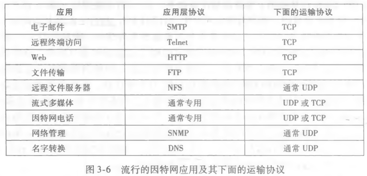
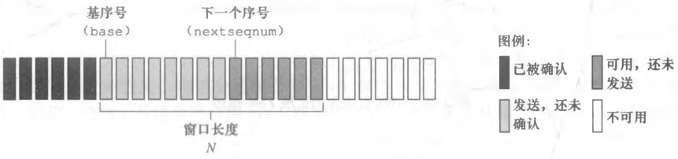
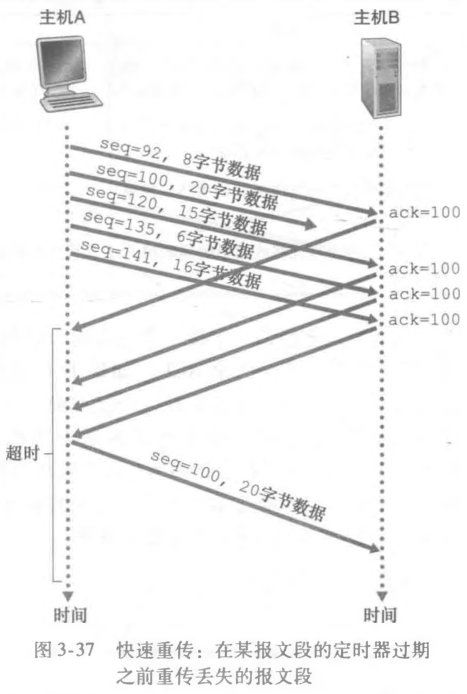
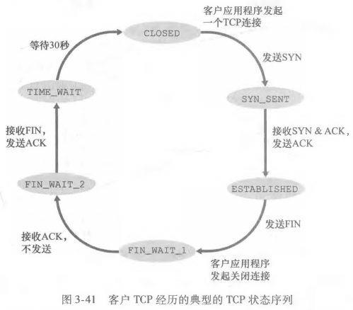
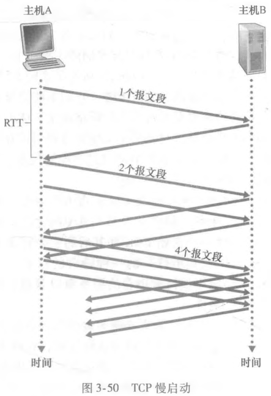

# 运输层

## 运输层协议原理

### 运输层和网络层的关系

- 网络层在不同主机之间提供逻辑通信；
- 运输层在不同主机上的进程之间提供逻辑通信；

### 运输层协议概述

##### 运输层

- 运输层负责不同主机的应用进程之间的通信服务；
  - TCP；
  - UDP；
- 运输层的分组称为报文段；

##### 运输层协议的要求

- 可靠数据传输；
- 吞吐量；
- 定时保证；
- 安全性；

##### TCP 服务

- 面向连接服务；
  - 应用层数据报文参数之前；
  - TCP 让客户端和服务器端交换运输层控制信息，该过程称作握手；
  - 握手完成之后，一个 TCP 连接在两个套接字中建立；
  - TCP 连接为全双工；
- 可靠数据服务；
  - TCP 具有纠错和堵塞控制机制；
- 面向字节流；
- 单播；

##### SSL 服务

- 安全套接字层 (Secure Sockets Layer)；
- 加强版的 TCP；
- 提供了进程到进程的安全性服务；

##### UDP 服务

- 轻量级运输协议，无握手过程；
- 不可靠数据服务；
- 面向报文；
- 可以实现单播，广播和多播；

### 多路复用和多路分解

#### 基础

##### 多路分解

- 将运输层报文段中的数据交付到正确的套接字；

##### 多路复用

- 主机在不同套接字中搜集数据块；
- 并为每个数据块封装首部信息 (用于多路分解)，从而生成报文段；
- 最后将报文段传输至网络层；

##### 多路复用的要求

- 源端口号字段：发送数据块的套接字的唯一标识符；
- 目的端口字段：该数据块应该交付的套接字的唯一标识符；

##### 端口号

- 端口号为一个 16 bit (0 - 65536)；
- 0 - 1023 称为周知端口号；

#### 无连接的多路复用和多路分解 (UDP)

##### 报文段组成

- 源端口号；
- 目标端口号；
- 数据块；
- 其他；

##### 流程

- 运输层创建一个报文段；
- 网络层将报文段封装到一个 IP 数据报，并尽力交付给目标主机；
- 若目标主机接受到报文段，将报文段数据接受到对应套接字；

#### 面向连接的多路复用和多路分解 (TCP)

##### 报文段组成

- 源 IP + 源端口号；
- 目标 IP + 目标端口号；
- 数据块；
- 其他；

##### 与 UDP 的不同

- 若具有两个不同 IP 地址或源端口号的报文段到达目标主机；
- UDP 通过相同的套接字定向到相同的进程；
- TCP 通过不同的套接字定向到相同的进程；

## 无连接运输: UDP

### 适用场景

##### UDP 的适用场景

- 对于数据的进行精细控制；
- 无需连接建立；
- 无状态连接；
- 分组首部开销小；

##### 流行的因特网应用极其运输协议

### UDP 报文段结构

##### UDP 报文段结构

- RFC 768 定义；
- 首部字段：源端口号 + 目标端口号 + 报文段长度 + 检验和；
- 数据字段：应用层报文；

##### UDP 检验和

- 用于差错检测功能；
- 计算方法；
  - 报文段的所有 16 bit 字节的和进行反码运算作为检验和；
    - 若和溢出，即为 17 bit；
    - 将第一位 bit 与其后 16 bit 进行相加运算；
  - 接收方将报文段的所有 16 bit 字和检验和进行相加；
  - 所有比特都为 1；
- UDP 只能检查错误，无法修复错误；

## 可靠数据传输

### 可靠数据传输原理

##### 可靠数据传输协议

- 可靠数据传输协议保证运输层数据不会损坏；
- 但是运输层的下层协议不一定可靠；

##### 单向数据传输

- 单工；
- 数据从发送端到接收端；

##### 双向数据传输

- 全双工；
- 发送端和接收端皆可发送和接受数据；

### 构造可靠运输协议

#### 经完全可靠信道的可靠数据传输

- 发送端发送分组到信道；
- 接收端从信道接受分组；
- 发送端和接收端不需要额外操作；

#### 经具有比特差错信道的可靠数据传输

##### 经具有比特差错信道的可靠数据传输

- 自动重传请求协议 (ARQ)：接收端发送一个控制报文表示什么数据被正确接收，什么数据错误需要重传；
  - 差错检测：检查接受的分组是否正确；
  - 接收方反馈：接收端发送控制报文 (ACK/NAK)；
  - 重传：接收方接受错误分组，发送方重传该报文；

##### 停等协议

- 发送方发送分组后；
- 在接受到接收方的控制报文之前；
- 不会发送新的分组；

##### ARQ 的缺陷与解决方法

- 缺陷；
  - 接收方发送的 ACK/NCK 也可能受损；
- 解决方法；
  - 发送方对数据分组进行编号；
  - 接收方通过序号确定接受的分组是否是重传分组；

##### NCK 的移除

- 接收方接受错误分组后，返回上一个分组的 ACK；
- 发送方连续收到同一个分组的 ACK，认为接受方接受错误分组；
- 发送方接受到一个受损的分组，认为接受方接受错误分组

#### 经具有比特差错的丢包信道的可靠数据传输

##### 比特交替协议

- 使用 1 bit 标识序号 (0 和 1)；
- ack 序号 0 和 1 之间来回交替；
- 只使用 ACK 判断接收方是否接受错误分组；

##### 丢包的可能性

- 发送方发送的分组丢包；
- 接收方发送的控制报文丢包；

##### 检查丢包的机制

- 通过定时器检验是否丢包；
- 一旦超过一定时间，就判断其为丢包；
- 重新发送该分组；

### 流水线可靠数据传输协议

##### 比特交替协议的缺陷

- 比特交替协议为停等协议；
- 浪费网路链路性能；

##### 流水线

- 不使用停等协议；
- 允许发送方发送多个分组；

##### 流水线的要求

- 增加序号范围；
- 接收方和发送方需要缓存多个分组确保分组接受或发送成功；

##### 流水线发送速度

- 详见堵塞控制；

##### 回退 N 步协议 (GBN)

- 发送方；
  - 允许发送方发送多个分组；
  - 要求流水线中确定一个长度为 N 的窗口；
  - 发送方只有最左侧分组具有一个定时器，一旦出现超时，重传窗口中已经发送但是还未确定的分组；
  - 窗口随着最左边分组的确定不断向右边滑动；
- 接收方；
  - 接收方接受到失序分组直接丢弃；
  - 等待窗口全部接受完毕

##### 选择重传 (SR)

- 发送方；
  - 允许发送方发送多个分组；
  - 要求流水线中确定一个长度为 N 的窗口；
  - 依次发送窗口内所有分组直至所有分组发送完毕，等待 ACK；
  - 发送方每个分组具有一个定时器，一旦出现超时，重传超时的对应分组；
  - 窗口随着最左侧分组的确定不断向右边滑动；
- 接收方；
  - 接收方缓存多个分组；
  - 要求流水线中确定一个长度为 N 的窗口；
  - 窗口随着最左侧分组的确定不断向右边滑动；
  - 窗口非最左侧的分组正确接受后，缓存该分组；

## TCP

### TCP 连接

##### 面向连接

- 两个进程发送数据之前必须互相握手；
- 确定数据传输的参数；

##### 发送缓存和接受缓存

- 三次握手期间设置；
- 发送缓存；
  - TCP 通过套接字接受数据保存至发送缓存；
  - TCP 不定时从发送缓存取出一块数据发送至网络层；
- 接收缓存；
  - TCP 接受网络层的数据保存到接收缓存；
  - TCP 通过套接字将接受缓存的数据发送至进程；

##### MSS 和 MTU

- MSS：最大报文段长度；
- MTU：最大传输单元 (最大链路层帧长度)；
- 经典值；
  - MSS：1460 byte；
  - MTU：1460 + 40 (TCP/IP 首部长度) byte；

### TCP 报文段结构

##### TCP 报文段结构

- 首部字段；
  - 源端口号字段；
  - 目标端口号字段；
  - 检验和字段；
  - 序号字段；
  - 接收窗口字段：流量控制；
  - 首部长度字段；
  - 选项字段；
  - 标志字段；
- 数据字段；
  - 应用层报文；

##### 序号 (Seq)

- TCP 第一次报文的序号字段为该报文段首字节的字节流编号；
- 以后为另一方最新发送报文的 ACK 号；
- 双方的起始序号不一定相同；

##### 确认号 (ACK)

- 接受主机预期接受的字节流序号，即字节流中第一个未被确认的字节的序号；
- 称为累计确认；
- 另一方发送的 Seq + 1；

##### 失序到达

- RFC 为规定 TCP 接受到失序报文段后的行为；
- 可采用回退 N 步或选择重传；
- 一般使用选择重传；

### 往返时间的估计与超时

#### 估计往返时间

- 通过发送一个样本报文段估计；
- 由于网络环境的变换，估计往返时间也会发生变换；
- 假设估计往返时间为 EstimatedRTT，实际往返时间为 SampleRTT，偏差为 DevRTT；
- 推荐的经验公式如下；

$$EstimatedRTT = 0.875*EstimatedRTT + 0.125*SampleRTT$$
$$DevRTT = 0.75*SampleRTT + 0.25*|SampleRTT-EstimatedRTT|$$

#### 设置和管理超时时间

##### 经验公式

- TimeoutInterval 推荐初始值为 1 s，一旦超时乘 2；
- 收到第一个报文段并更新 EstimatedRTT 后，根据下列公式计算；

$$TimeoutInterval =EstimatedRTT+4*DevRTT$$

### 流量控制

##### 缓存溢出

- TCP 发送方发送数据太快；
- TCP 接收方的数据缓存溢出；

##### 流量控制

- TCP 发送方和接收方应用程序读取速度相匹配；
- TCP 发送方维护一个接收窗口；
  - TCP 为全双工，两端都维护一个接收窗口；
  - 通过若干变量设置 TCP 可以发送的数据量；
    - RcvBuffer：接收方缓存区大小；
    - LastByteRead：接收方应用程序读取的数据流最后一个字节编号；
    - LastByteRcvd：接收方接受的数据流最后一个字节编号；
    - rwnd：缓存可用空间；
    - LastByteSend：发送方发送的数据流最后一个字节编号；
    - LastByteAcked：发送方确认的数据流最后一个字节编号；
- 根据 rwnd 设置滑动窗口大小；

$$rwnd=RcvBuffer-(LastByteRcvd-LastByteRead)$$
$$rwnd \ge LastByteSend-LastByteAcked$$

### 可靠数据传输

##### 单一重传定时器

- RFC 6298 推荐使用单一的重传定时器；
- 仅记录一个最小序号的发送但未被确认的报文段；

##### 简化的 TCP 发送方

- 三个事件；
  - 接收应用层数据；
  - 定时器超时；
  - 接受 ACK；
- 变量；
  - NextSeqNum：报文段首字节的字节流编号；
  - SendBase：字节流中第一个，发送但未被确认的字节的序号；

##### 接受方差错检验

- 检验和；

##### 超时间隔加倍

- 每次 TCP 重传时，并不使用计算的超时间隔；
- 而是没超时一次便将超时间隔加倍；

##### 快速重传

- TCP 接收方大量发送冗余 ACK；
  - 发送机制；
    - 所期望的报文到达发送对应 ACK，记作 a；
    - 失序报文段到达，立刻发送冗余 ACK a；
- 发送发一旦接受 3 个冗余 ACK，立刻重传该报文段；

##### GNB 还是 SR

- GNB；
  - TCP 发送方使用单一计时器；
  - TCP 发送方只记录发送过但未确认的最小序号；
- SR；
  - TCP 发送方重传至多重传一个报文段，即发送但未确认的最小序号；
  - TCP 接收方使用一个窗口记录失序报文段；
- TCP 类似于 GNB 和 SR 的混合体；

##### 流量控制和堵塞控制

- 略；

### TCP 连接管理

#### 三次握手

##### 第一次握手

- 客户端向服务器端发送一个 TCP 报文段，称作 SYN 报文段；
  - 首部 SYN 表示为设置为 1；
  - 设置客户端初始序号 client_isn；
- 该报文段不包含应用层数据；

##### 第二次握手

- 服务器接受客户端发送 SYN 报文段；
- 为该 TCP 连接分配 TCP 缓存和变量；
- 服务器向客户端发送允许连接的 TCP 报文段，称为 SYNACK 报文段；
  - 首部 SYN 表示为设置为 1；
  - 设置 ACK 字段为 client_isn + 1；
  - 设置服务器初始序号 server_isn；
- 该报文段不包含应用层数据；

##### 第三次握手

- 客户端接受 SYNACK 报文段；
- 为该 TCP 连接分配 TCP 缓存和变量；
- 客户端向服务器发送一个确认报文段；
  - 首部 SYN 表示为设置为 0；
  - 设置 ACK 字段为 server_isn + 1；
- 该报文段可以包含应用层数据；

##### 三次握手作用

- 第一次握手：服务器知道客户端发送，服务器接受能力正常；
- 第二次握手：客户端知道客户端和服务器的发送和接受能力正常；
- 第三次握手：服务器知道客户端接受能力正常；

#### 四次握手

##### 四次握手

- 主动关闭方进行第一次握手，通常为客户端；
- 客户端向服务器发送一个特殊 TCP 报文段；
  - 设置客户端初始序号 client_isn；
  - FIN 设置为 1；
- 服务器接受该报文段后发送一个确认报文段；
  - ACK 为 client_isn + 1；
- 服务器处理完当前所有数据后，服务器发送自己的终止报文段；
  - FIN 设置为 1；
  - 设置服务器随机序号 server_isn；
- 客户端接受服务器发送的终止报文段，发送一个确认报文段；
  - ACK 为 server_isn + 1；

##### 四次握手的原因

- 确保双方正确关闭连接，并处理完所有数据；
- 第三次握手时，被关闭一方可能具有未处理完成的数据；
- 等待数据处理完成，发送 FIN 报文；

#### 状态

##### 客户端状态

- 客户端发送 SYN 报文，进入 SYN_SENT 状态；
- 客户端接受 SYN ACK 报文，并发送 ACK 报文，建立 TCP 连接，进入 ESTABLISHED 状态；
- 客户端关闭 TCP 连接，发送 FIN 报文，进入 FIN_WAIT_1 状态；
- 客户端接受服务器 ACK 报文，进入 FIN_WAIT_2 状态；
- 客户端接受服务器 FIN 报文，发送客户端 ACK 报文，进入 TIME_WAIT 状态；
- 等待若干时间，关闭连接，进入 CLOSE 状态；

##### 服务器状态

- 创建 TCP，进入 LISTEN 状态；
- 接受客户端 SYN 报文，并发送 ACK 报文，进入 SYN_RCVD 状态；
- 接受客户端 ACK 报文，建立 TCP 链接，进入 ESTABLISHED 状态；
- 接受客户端 TIN 报文，发送服务器 ACK 报文，进入 CLOSE_WAIT 状态；
- 发送服务器 FIN 报文，进入 LAST_ACK 状态；
- 接受客户端 ACK 报文，关闭 TCP 连接，进入 CLOSE 状态；

#### SYN 洪泛攻击

- 服务器发送 SYNACK 报文后需要等待客户端的确认；
  - 服务器需要维持一个半开连接；
- 攻击者发送大量 SYN 报文段但不确认服务器发送的 SYNACK 报文；
  - 服务器维护大量半开连接导致资源消耗殆尽；
- 防御手段；
  - SYN cookie；
    - 服务器接受到 SYN 报文后，不生成一个半开连接；
    - 基于 SYN 报文的 IP 地址和端口号生成一个 TCP 序列号，即 server_isn；
    - 服务器接受到客户端发送的合法 ACK 报文后才会生成一个全开连接；

### TCP 缺陷

#### 粘包

##### 原因

- TCP 基于字节流发送，发送数据可能一次性发送，也可能分包发送；
- 接收端无法辨别接受数据属于那个消息；

##### 处理方法

- 长度控制；
  - 设置消息长度，根据长度读取报文；
- 特殊字符；
  - 消息末尾设置特殊字符，根据特殊字符辨别消息；
- 消息头：
  - 添加特殊标记，根据特殊标记辨别消息；

#### 队首堵塞

- TCP 使用滑动窗口实现流水线协议；
- 滑动窗口队首字节的丢失，会堵塞滑动窗口的移动，称为队首堵塞 (HOL)；
- HOL 作用于运输层，应用程序对此一无所知；
- 由于分组到达时间未知，应用程序通过套接字读取数据具有不可预知延迟，称为抖动；

## 堵塞控制

### 基础

##### 流量控制和堵塞控制的区别

- 流量控制作用于滑动窗口大小，防止发送方发送过多数据导致接收方来不及处理；
- 堵塞控制作用于滑动窗口分组发送速度，防止网络链路堵塞；

### 堵塞控制原因

##### 2 个发送方和无限大缓存的路由器

- 分组传输速率接近链路容量导致堵塞；
- 速率小于 r/2；

##### 2 个发送方和有限大缓存的路由器

- 分组传输速率取决于重传方式；
- 速率小于 r/2；

##### 四个发送方, 多台有限大缓存的路由器和多条路径

- 下游路由器的堵塞会导致上游路由器转发到该路由器使用的传输容量浪费；
- 速率小于 r/2；

### 堵塞控制方法

##### 端到端堵塞控制

- 端通过观察网络层的行为判断是否堵塞；

##### 网络辅助的堵塞控制

- 路由器向发送方提供关于网络堵塞状态的信息；
  - 路由器向发送方发送一个堵塞分组；
  - 路由器在分组中添加一个表示堵塞信息，通过接收方发送的 ACK 告知发送方；
    - 至少需要一个 RTT；

### TCP 堵塞控制

#### 基础

##### 控制原理

- 通过网络行为调整发送速率；

##### 堵塞窗口

- 设置一个额外变量 cwnd，称作堵塞窗口；

$$min\{rwnd, cwnd\} \ge LastByteSend-LastByteAcked$$

##### TCP 判断机制

- 通过观察是否丢包确认是否堵塞；
  - 报文段超时；
  - 接受到 3 个冗余 ACK；

#### TCP 堵塞控制算法

##### 慢启动

- cwnd 初始值为 MSS；
- 每经过一个 RTT 发送速率翻倍；
  - 每接受一个报文，cwnd += MSS；
- 停止机制；
  - 发生超时事件 cwnd 重置为 MSS，设置 ssthresh 为发送堵塞时的 cwnd/2，重新慢启动；
  - 当 ssthresh 存在且 cwnd 达到 ssthresh 后进入堵塞避免模式；
  - 当接受到 3 个冗余 ACK 后执行快速重传并进入快速恢复状态，设置 ssthresh 为发送堵塞时的 cwnd/2；

##### 堵塞避免

- 进入堵塞避免状态后；
- 每经过一个 RTT 发送速率增加一个 MSS；
  - 每接受一个报文，cwnd += MSS\*(MSS/cwnd)；
- 停止机制和慢启动相同；

##### 快速恢复

- cwnd 设置为 ssthresh + 3\*MSS；
- 每收到一个 ACK 增加一个 MSS；
- 接受到缺失报文的 ACK 后计入堵塞避免状态；
  - cwnd 设置为 ssthresh；
- 出现丢包事件同慢启动；

#### 网络辅助堵塞控制

##### 明确堵塞通告

- IP 数据报首部设置 ECN 字段表示堵塞信息；
