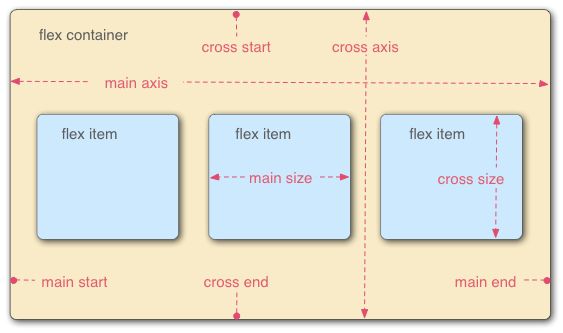

# flex 布局

## flex 模型

- main axis；
  - main start；
  - main end；
- cross axis；
  - cross start；
  - cross end；
- flex container；
- flex items；
- main size；
- cross size；



## flex-flow 属性

### 基础

##### 作用

- 设置 flex main-axis 方向和换行方向；

```css
element {
  flex-flow: column;
}

element {
  flex-flow: column-reverse wrap;
}
```

##### 成分属性

- flex-wrap 属性；
- flex-direction 属性；

##### 简写机制

- flex-wrap；
- flex-direction；
- flex-wrap + flex-direction；

### flex-direction 属性

- 设置 flex items main-axis 方向；

```css
#col-rev {
  /* 默认值，从 block-start 到 block-end */
  flex-direction: row;
  /* 从 block-end 到 block-start */
  flex-direction: row-reverse;
  /* 从 inline-start 到 inline-end */
  flex-direction: column;
  /* 从 inline-end 到 inline-start */
  flex-direction: column-reverse;
}
```

### flex-wrap 属性

- 设置 flex item 换行；

```css
.content {
  display: flex;
  /* 默认值，不换行 */
  flex-wrap: nowrap;
  /* 自动换行，从 main-start 到 main-end */
  flex-wrap: wrap;
  /* 自动换行，从 main-end 到 main-start */
  flex-wrap: wrap-reverse;
}
```

## flex 属性

### 基础

##### 作用

- 设置 flex item 拉伸参数；

```css
#flex-container > .flex-item {
  flex: auto;
}
```

##### 成分属性

- flex-grow 属性
- flex-shrink 属性
- flex-basis 属性

##### 简写机制

- auto；
- flex-grow；
- flex-basis；
- flex-grow + flex-shrink；
- flex-grow + flex-basis；
- flex-grow + flex-shrink + flex-basis；

##### 常见属性值

- flex：1 = flex：1 1 0%；
- flex：2 = flex：2 1 0%；
- flex：auto = flex：1 1 auto；

### flex-grow 属性

##### 作用

- 设置 flex item 拉伸参数；
- 默认为 1；

```css
.box1 {
  flex-grow: 2;
}
```

##### 机制

- 在 cross/main-axis 方向拉伸；
- 若多个 flex item cross/main-axis 方向大小依次为 a_1，a_2，。。.a_n
- flex-grow 依次为 b_1，b_2，。。.b_n 时；
- 当存在剩余空间，且假设其大小为 x；
- 对应 flex item 大小增加溢出空间 x 的 $\frac{a_i * b_i}{\sum^n_{i=1}{a_i * b_i}}$

### flex-shrink 属性

##### 作用

- 设置 flex item 拉伸参数；
- 默认为 1；

```css
.box1 {
  flex-shrink: 2;
}
```

##### 机制

- 在 cross/main-axis 方向收缩；
- 若多个 flex item cross/main-axis 方向大小依次为 a_1，a_2，。。.a_n
- flex-grow 依次为 b_1，b_2，。。.b_n 时；
- 当 flex item 溢出容器，且假设其溢出空间大小为 x；
- 对应 flex item 大小缩小溢出空间 x 的 $\frac{a_i * b_i}{\sum^n_{i=1}{a_i * b_i}}$

### flex-basic 属性

- 设置 flex item 在 cross/main-axis 方向的基础尺寸；

```css
.box1 {
  /* 根据容器尺寸设置大小，若无尺寸，视为 content */
  flex-basis: auto;
  /* 根据容器内容设置大小 */
  flex-basis: content;
  /* length 类型 */
  flex-basis: 3px;
  /* percentage 类型 */
  flex-basis: 3%;
}
```

## order 属性

##### 作用

- 更改 flex/grid item 顺序；

##### 语法格式

```css
main > article {
  flex: 1;
  /* length 类型 */
  order: 2;
}
```

##### 排序机制

- order 数值越小越靠前；

## 垂直/水平对齐

### 方向

- align：cross axis 方向；
- justify：main axis 方向；

### align/justify-items 属性

#### 作用

- 设置 flex/grid 所有 item 的网格对齐样式；
- item 在 flex/gird 网格中的 cross/main axis 位置；
- justify-items 在 flex 无效；
  - flex 为一维结构；
  - flex 在 main axis 无网格概念；

```css
.flex {
  /* 默认值，替换元素为 start，其余为 stretch */
  align-items: normal;
  /* cross/cross/main-size 拉伸， margin box edges 和 outline edges 对齐 */
  align-items: stretch;
  /* 垂直居中 */
  align-items: center;
  /* 标签与其容器的 cross/cross/main-start edge 对齐 */
  align-items: start;
  /* 标签与其容器的 cross/cross/main-end edge 对齐 */
  align-items: end;
  /* 单独作用于 flex 标签 */
  align-items: flex-start;
  align-items: flex-end;
}
```

### align/justify-self 属性

- 设置单个 flex/grid item 对齐样式；
- 属性值同 align-item 属性；

```css
.flex-items {
  align-self: stretch;
}
```

### align/justify-content 属性

#### 作用

- 设置 flex/grid 的 item 内部内容的对齐样式；
- item 内容在 item 盒子模型的对齐位置；

```css
#container {
  display: flex;
  /* 默认值，stretch； */
  justify-content: normal;
  /* cross/cross/main-size 拉伸， margin box edges 和 outline edges 对齐 */
  justify-content: stretch;
  /* 垂直居中 */
  justify-content: center;
  /* 标签与其容器的 cross/cross/main-start edge 对齐 */
  justify-content: start;
  /* 标签与其容器的 cross/cross/main-end edge 对齐 */
  justify-content: end;
  /* 单独作用于 flex 标签 */
  justify-content: flex-start;
  justify-content: flex-end;
  /* 标签与其容器的 left edge 对齐 */
  justify-content: left;
  /* 标签与其容器的 right edge 对齐 */
  justify-content: right;

  /* 沿 cross/main-axis 水平分布，item 之间间距相等 */
  /* 两端 item 与容器两端对齐 */
  justify-content: space-between;
  /* 两端 item 与容器两端间距为 item 之间间距的一半 */
  justify-content: space-around;
  /* 两端 item 与容器两端间距和 item 之间间距相同 */
  justify-content: space-evenly;
}
```
