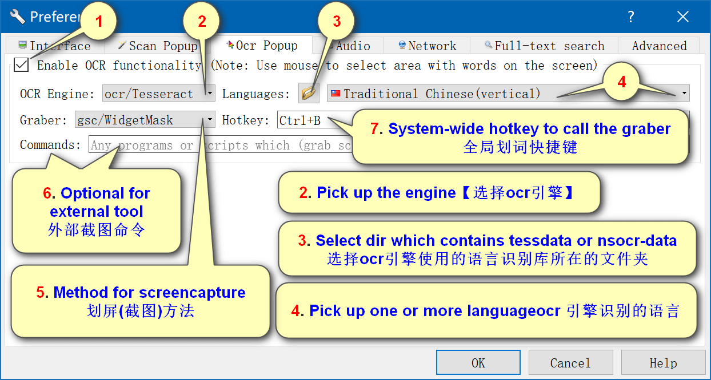

# GoldenDict++OCR

## 下载

[下载地址](https://www.autoptr.top/gdocr/GoldenDict-OCR-Deployment/)

## 安装 (windows)

- 解压压缩包，
- 运行 GoldenDict.exe。

## 配置

### 设置便携模式

- 在 GoldenDict(.exe) 所在的目录中创建一个名称为 portable 的文件夹，
- Windows 的"系统盘符：\Users\用户名\AppData\Roaming\GoldenDict" 下的所有文件及文件夹移动到建好的 portable 文件夹中去。

### 添加字典

- 打开 `编辑-辞典-来源-文件`，
- 添加 mdx 词库对应文件夹，
- 重新扫描。

### 开启划词插件

##### 配置流程

- 打开 `编辑-首选项-划词`，
- 开启划词翻译功能，配置相应选项。



##### 划词插件目录

- gdp 文件夹：划词插件储存目录；
- tessdata 文件夹：Tesseract 引擎数据；
- nsocr 文件夹：Nicomsoft 引擎数据。

##### 划词引擎对比

| Name      | File Name            | Platform | Ratings |
| --------- | -------------------- | -------- | ------- |
| Tesseract | gdp.ocr.tesseract.\* | All      | **\***  |
| Nicomsoft | gdp.ocr.nicomsoft.\* | Windows  | \*\*\*  |

### 添加谷歌翻译

- 使用[google-translate-for-goldendict 插件](https://github.com/xinebf/google-translate-for-goldendict)，
- 需要 python3.7 及以上，
  - pip3 install google-translate-for-goldendict。
- 打开`GoldenDict-编辑-辞典-来源-程序`，
- 输入下列参数，
  - 类型：`Html`
  - 名称：`Google Translate`
  - 命令行：`python -m googletranslate zh-CN %GDWORD% -p 127.0.0.1:7890`
  - 图示：`H:\PathTo\google_translate.png`
- 可选参数如下。

```code
positional arguments:
  target          target language (eg: zh-CN)
  query           query string

optional arguments:
  -h，--help      show this help message and exit
  -p PROXY        proxy server (eg：127.0.0.1：1080)
  -a ALTERNATIVE  alternative language (default：en)
  -r TYPE         result type (default：html)
  -k TKK          tkk
  -m              show synonyms
  -d              show definitions
  -e              show examples
```
