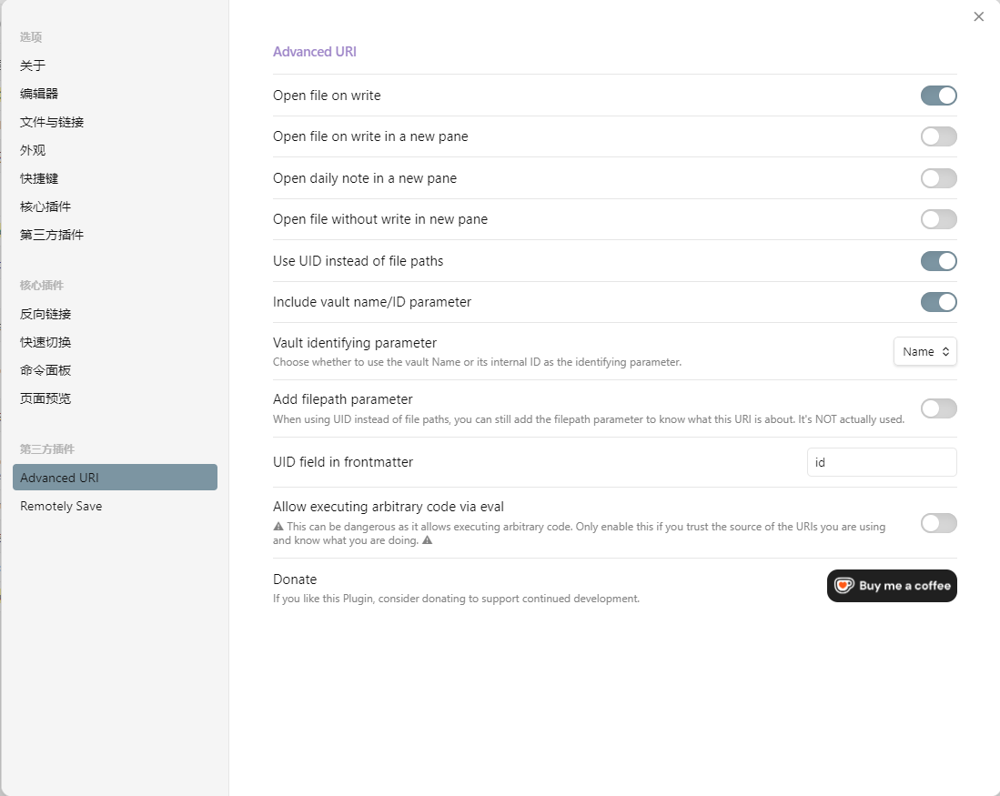

# obsidian

## 同步

### 同步方案

- remotely save 插件：obsidian 同步插件；
- 火山云 oss：远程同步方式；

### API 访问秘钥

- 进入[API 访问秘钥](https://console.volcengine.com/iam/keymanage/)；
- 创建并获取 Access Key ID 和 Secret Access Key；

### oss

##### oss 购买

- 登录[火山云控制台](https://console.volcengine.com/home)，进入对象存储；
- 首先购买对象存储资源包，标准存储容量包即可，一年 9 元；

##### 桶创建

- 点击`对象存储-桶列表-创建桶`；
- 设置；
  - 桶名称；
  - 区域；
  - 桶策略：建议私有；
  - 高级设置；
    - 服务端加密：选择 SSE-TOS；

##### 地址和区域

- 点击`对象存储-桶列表-创建桶`；
- 服务器地址：S3 endpoint 外网访问地址；
- 区域：服务其地址中的 cn-xxx；

### remotely save

##### oss 设置

- 依次设置“S3 设置-服务地址、区域、Access Key ID、Secret Access Key、桶名字”；
  - 桶名字即“桶创建”中的桶名称；
- 点击“检查可否连接”检测 oss 连接；

##### 加密

- 设置“基本设置-密码”即可实现端对端加密；

##### 自动同步

- 设置“基本设置-自动运行”和“基本设置-启动后运行一次”；

##### 正则表达式

- 通过“基本设置-忽略的文件或文件夹的正则表达式”和“基本设置-允许同步的文件或文件夹的正则表达式”；
- 设置忽略文件和同步文件；

##### 同步方向

- 设置“进阶设置-同步方向”即可；
- 日常使用“双向同步”、“增量推送带删除”和“增量拉取带删除”；

## url

### 基础

- advanced url 插件；
- 每个笔记独特超链接；

### 配置

