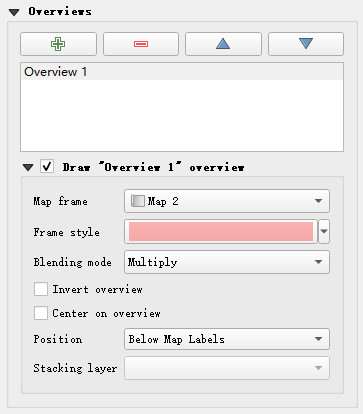
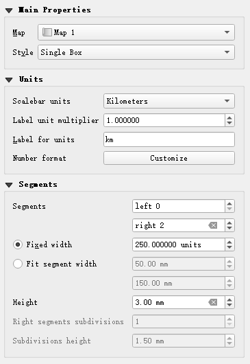

# 空间数据可视化表达

## 专题地图制作

### 地貌图

##### 地形晕渲法原理

- 利用 dem 数据生成 hillshade/relief 数据；
- hillshade/relief 设置透明度并数据叠加至 dem 数据上；

##### 操作方法

- 加载 dem 数据；
- `dem 数据 - layer properties - symbology`，选择合适显示方式
  - singleband pseudocolor；
  - 选择好看的色带；
- 生成 shillshade/relief 图层；
- 加载 hillshade/relief 数据；
- `hillshade/relief 数据 - layer properties-transparency - global opacity`，设置透明度为 40%-60%；
- `hillshade/relief 数据 - layer properties - symbology`；
  - band rendering 使用默认的灰色波段即可；
  - 配置 `layer rendering - blending mode`，建议使用 multiply；

## 地图绘制

### 布局和地图

#### 布局设计

##### 创建打印布局

- `菜单栏 - Project - create print layout`；
- 输入打印布局名称 (可空)；

#### 地图操作

##### 添加地图数据框

- `菜单栏 - Add Item - Add Map`；
- 移动鼠标确定地图数据框范围；

##### 调整屏幕显示范围

- 菜单栏对应工具栏，如下图所示；
- 依次为放大，缩小，1：1 比例，全屏，刷新；

##### 移动地图显示范围

- `菜单栏 - Edit - Move Content`；
- 左栏工具栏；

##### 调整地图比例

- 手动设定
  - `右栏 - 选择 item`；
  - `选择 Item Properties - Main Properties - Scale`；
- 自动设定
  - Item Properties 对应位置，如下图所示；
  - 以此为传入/出地图显示范围，传入/出地图比例；

##### 锁定 item

- `右栏 - 选择 item`；
- 选择 `Item Properties - Layers`；
- 勾选 `Lock layers/Lock styles for layers；
  - 锁定图层及其样式；
  - 不受数据视图影响；

##### 地图边框

- `右栏 - 选择 item`；
- 选择 `Item Properties - Frame`；
- 设置样式；

##### 高亮副图

- `右栏 - 选择主图 item`；
- 选择 `Item Properties - Overviews`；
- 点击 + 号；
- 选择对应 Map frame；
- 设置 Frame style/Blending mode；

##### 地图输出

- `layout - export as image`；
- 选择图片格式；
- 选择输出精度；
  - export resolution：分辨率，越高越清楚；

### 地图常规符号

#### 地图格网

##### 建立格网

- `右栏 - 选择 item`；
- 选择 `Item Properties - Grids`；
- 单击 + 号；

##### 修饰格网

- 选择格网；
- 单击 `Modify Grids`；

##### 设置样式

- Appearance：格网总体样式；
- Frame：格网边框样式；
- Draw Coordinate：边框经纬度样式；

#### 地图图例

##### 添加图例

- `菜单栏 - Add Item - Add legend`；
- 地图框选范围；
- 右栏设置；

##### main properties 设置

- title：图例题目；
- map：对应地图；
- arrangement：图例符号位置；

##### legend items 设置

- 自动更新；
  - auto update：根据地图字段自动更新
- 手动设置
  - 取消勾选 `autoupdate`；
  - 单击 item，右键设置显示级别；
  - 下列图标依次为
    - 向下移动；
    - 向上移动；
    - 添加新组；
    - 添加 item；
    - 删除 item；
    - 修改 item 样式；
    - label expression；
    - 显示 item 对应要素数量；

#### 地图比例尺

##### 添加比例尺

- `菜单栏 - Add Item - Add scale bar`；
- 地图框选范围；

##### 比例尺样式

- Main Properties；
  - map：标注地图；
  - style：比例尺样式；
- Unit；
  - unit：比例尺单位；
  - label for unit：单位标注；
- segments；
  - segment：比例尺样式参数；
  - fix width：比例尺固定宽度；
  - fit segment width：比例尺自适应宽度；
  - height：比例尺高度；

#### 地图指北针

##### 添加指北针

- `菜单栏 - Add Item - Add north arrow`；
- 地图框选范围；
- 右栏选择指北针；

### 地图特殊符号

#### 地图几何图形

##### 添加固定形状

- `菜单栏 - Add Item - Add shape`；
  - rec：矩形；
  - eli：椭圆；
  - tri：三角形；
- 地图框选范围；
- 右栏设置；
  - main properties：设置固定形状样式；

##### 添加点

- `菜单栏 - Add Item - Add maker`；
- 地图框选位置；
- 右栏设置；
  - main properties：点样式；
  - marker rotation：点方向设置；

##### 添加箭头

- `菜单栏 - Add Item - Add arrow`；
- 地图框选位置，左键绘制，右键结束；
- 右栏设置；
  - main properties：箭头总体样式；
  - line makrkers：箭头箭头样式；

##### 添加折线

- `菜单栏 - Add Item - Add node item - add polylines`；
- 其余操作同添加箭头；

##### 添加自定义多边形

- `菜单栏 - Add Item - Add node item - add polygon`；
- 地图框选位置，左键绘制，右键结束；
- 右栏设置；
  - main properties：填充颜色；

#### 地图图片和标注

##### 添加图片

- `菜单栏 - Add Item - Add picture`；
- 地图框选范围；
- 右栏选择图案；

##### 添加标注

- `菜单栏 - Add Item - Add label`；
- 地图框选范围；
- 右栏设置；
  - Main Properties：标注内容；
  - Appearance：标注样式；

### 通用设置

##### position and size

- 位置和大小；

##### rotation

- rotation：旋转角度；

##### rendering

- 渲染样式和透明度；

##### Main properties symbol

- 符号自定义样式；
  - 右上角符号依次为；
    - 添加图层；
    - 删除图层；
    - 复制图层；
    - 向上移动；
    - 向下移动；
    - 锁定图层；
  - color：颜色；
  - opacity：透明度；
  - unit 单位；
  - 下框：图层预设样式；
  - 单击具体图层，具体设置各图层样式；

