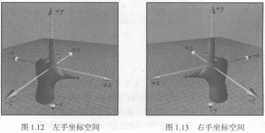
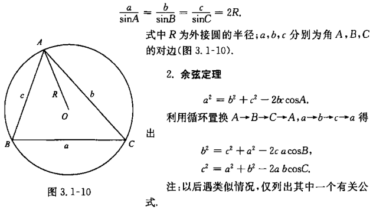

# 笛卡尔坐标系

## 二维笛卡尔空间

##### 二维笛卡尔坐标系

##### 计算机屏幕坐标系

##### 笛卡尔坐标

- (x, y) 分别指定 x 轴和 y 轴的投影位置;

## 三维笛卡尔空间

##### 三维笛卡尔坐标空间

##### 三维笛卡尔坐标

- (x, y, z) 分别指定 x 轴, y 轴和 z 轴的投影位置;

##### 左手坐标系和右手坐标系

- 相同种类的坐标系可以通过旋转使轴对齐;
- 拇指, 食指和中指分别指向 x, y, z;

##### 左手规则和右手规则

- 规定旋转的正方向;
- 拇指指向旋转轴的正方向;
- 手指弯曲方向即正方向;

##### 基本约定

- 使用左手坐标系和左手规则;

## 其他

### 求和和求积的表示法

##### 求和表示法

$$\sum^n_{i=1}a_i = a_1 + \cdots + a_n$$

##### 求积表示法

$$\prod^n_{i=1}a_1 = a_1 \times \cdots \times a_n$$

### 区间符号

##### 区间符号

$$[a,b]\qquad a \le x \le b$$
$$(a,b)\qquad a \lt x \lt b$$
$$[a,b)\qquad a \le x \lt b$$
$$(a,b]\qquad a \lt x \le b$$

### 角度, 度数和弧度

$$360\degree = 2 \pi \ rad$$

### 三角函数

##### 三角函数定义

##### 三角函数特殊值

##### 任意三角函数诱导公式

- 通用解法: 奇变偶不变, 符号看象限;
- 奇变偶不变;
  - 当 k 为偶数是, 三角函数符号不变;
  - 当 k 为奇数是, 三角函数符号翻转对应形式;
- 符号看象限;
  - 计算 $\frac{k}{2}\pi + \alpha$ 对应角度所在象限;
  - 三角函数的正负号即原三角函数符号对应的角度在该象限的正负值;

$$sin(\frac{k}{2}\pi + \alpha)$$

##### sin

##### cos

##### tan

##### cot

##### sec

##### csc

##### 两角和公式

##### 倍角公式

##### 半角公式

##### 和差化积

##### 正弦定理和余弦定理

