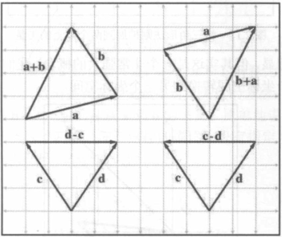
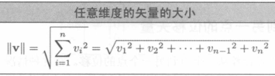

# 向量

## 基础

##### 向量下标表示法

## 向量的几何意义

##### 大小和方向

- 大小: 向量的长度;
- 方向: 向量在空间中的方向;

##### 向量的头部和尾部

- 头部: 向量的终点;
- 尾部: 向量的起点;

## 使用笛卡尔坐标指定向量

##### 二维向量

- [x, y];

##### 三维向量

- [x, y, z];

##### 向量分解

- 向量可以分解为按轴向对齐的分量, 分量大小即 x, y, z;

##### 零向量

- 没有大小和方向;

- $[0,\cdots,0]$

## 向量与点

##### 向量和点的关系

- 向量可以描述相对位置;
- 向量描述了原点到点的位移;
- 任何点都可以表示为来自原点的向量;

## 负向量

### 线性代数规则

### 几何意义

##### 几何意义

- 产生大小相同但方向相反的向量;

## 标量和矢量的乘法

### 线性代数规则

##### 线性代数规则

### 几何解释

##### 几何解释

- 方向不变, 大小缩放 k 倍;

## 向量的加减法

### 线性代数规则

##### 线性代数规则

##### 交换

- 向量加法可以交换;
- 向量减法是反交换;

$$a+b=b+a$$
$$a-b=-(b-a)$$

### 几何解释

##### 三角形法则

- 向量 a 和 b 相加;
- 使 a 的头部与 b 的尾部向量;
- 绘制从 a 的尾部到 b 的头部的向量;
- 适用于向量的加减法;
- 可拓展至 n 个向量的加减法;

### 从一点到另一点的位移向量

##### 计算方法

- 点 a 到点 b;
- 位移向量为 b - a;

## 向量大小

### 线性代数规则

##### 线性代数规则

### 几何解释

##### 几何解释

- 直角三角形的斜边;

## 单位向量

### 单位向量和法线

##### 单位向量和法线

- 单位向量强调大小为 1;
- 法线强调法线向量与某物垂直, 大小通常为 1;

### 线性代数规则

##### 线性代数规则

### 几何解释

##### 几何解释

- 尾部为原点;
- 头部为向量方向与原点为中心的单位圆(球)的交点;

## 距离公式

##### 距离公式

## 向量点积 (内积)

### 线性代数规则

##### 向量点积

- 结果为标量;

$$a \cdot b = \sum^n_{i=1}a_ib_i$$
$$a \cdot b = a_xb_x + a_yb_y$$
$$a \cdot b = a_xb_x + a_yb_y + a_zb_z$$

##### 交换律

- 向量点积是可交换的;

$$a \cdot b = b \cdot a$$

##### 结合律

##### 点积的加减法分布

$$a \cdot (b+c) = a \cdot b + a \cdot c$$

### 几何解释

##### 投影

- $a \cdot b$ 解释为 b 投影到 a 的任意平行线上的有符号长度, 乘以 a 的长度;

##### 特定方向上的位移

- a 为单位向量, b 为任意长度的向量;
- $a \cdot b$ 解释为 b 在 a 方向上的位移;

##### 向量分解

- a 为单位向量, b 为任意长度的向量;

$$b_{\parallel}=(a \cdot b)a$$
$$b_{\perp}=b-(a \cdot b)a$$

##### 三角函数解释

- a 和 b 的点积是 a 到 b 的角度的余弦;

$$a \cdot b = |a||b|cos\theta$$

## 向量叉积

### 线性代数规则

##### 线性代数规则

##### 交换律

$$a \times b = -(b \times a)$$

### 几何解释

##### 大小

- a 和 b 的叉乘的长度等于 a 和 b 大小的乘积再乘以 a 到 b 的角度的正弦值;
- a 和 b 的叉乘的长度 a 和 b 构成的平行多边形的面积;

$$|a \times b| = |a||b|\sin\theta$$

##### 方向

- 根据坐标系选择旋转法则;
- 拇指指向 a, 食指指向 b, 方向即中指方向;

##### 基本轴的叉积

## 线性代数恒等式

##### 线性代数恒等式

