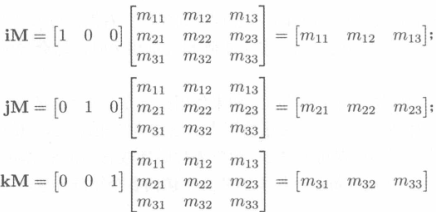
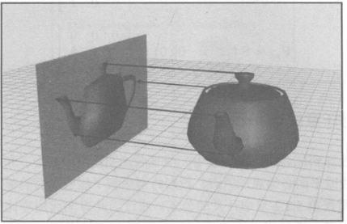
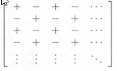
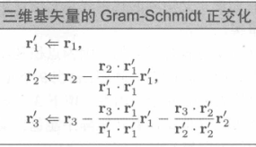

# 矩阵

## 矩阵的数学定义

### 矩阵维度和表示法

##### 矩阵维度

- 具有 r 行 c 列的矩阵；
- 称作 $r \times c$；

##### 表示法

- 下标表示法；

$$
\begin{bmatrix}
m_{11} & m_{12} & m_{13} \\
m_{21} & m_{22} & m_{23} \\
m_{31} & m_{32} & m_{33}
\end{bmatrix}
$$

### 方形矩阵

##### 方形矩阵

- 具有相同行数和列数的矩阵；

##### 对角元素

- 行和列索引相同的元素；

##### 对角矩阵

- 非对角元素均为 0；

$$
\begin{bmatrix}
1 & 0 & 0 \\
0 & 0 & 0 \\
0 & 0 & 3
\end{bmatrix}
$$

##### 单位矩阵

- 对角元素为 1，其余元素为 0，称作 I；

$$
\begin{bmatrix}
1 & 0 & 0 \\
0 & 1 & 0 \\
0 & 0 & 1
\end{bmatrix}
$$

### 作为矩阵的向量

##### 行向量和列向量

- 行向量：$1 \times n$；
- 列向量：$n \times 1$；

### 矩阵转置

##### 矩阵转置

- $r \times c$ 矩阵 M；
- 其转置矩阵 $c \times r, \quad M^T$ 即 M 行列翻转；

##### 性质

- $(M^T)^T=M$；
- 对角矩阵 D，$D^T=D$；

### 矩阵和标量相乘

##### 矩阵和标量相乘

### 矩阵相乘

##### 矩阵相乘

- $r \times n$ 矩阵 A 可与 $n \times c$ 矩阵 B 相乘；
- 结果为 $r \times c$ 矩阵 C；

##### 计算公式

- 对于 C 中的第 i 行，第 j 列的元素；
- 对应 A 中的第 i 行，B 中的第 j 列；
- A 和 B 的行和列的对应元素相乘求和；

$$c_{ij} = \sum^n_{k=1}a_{ik}b_{kj}$$

##### 性质

- MI = IM = M；
- $AB \neq BA$；
- (AB)C = A(BC)；
- (kA)B = k(AB) = A(kB)；
- $(AB)^T = B^TA^T$

### 向量和矩阵相乘

##### 向量和矩阵相乘

- 行向量位于左侧，结果为行向量；
- 列向量位于右侧，结果为列向量；

## 矩阵的几何解释

##### 矩阵的几何解释

- 矩阵表示空间坐标变换；
- 矩阵的行可解释为坐标空间的基向量；
- 向量乘矩阵从一个坐标空间变换为另一个坐标空间；
  - 对于标准基向量，标准基向量乘矩阵即经过矩阵变换后的坐标空间的基向量；
- p，q，r 表示一组基向量；

## 矩阵变换

### 旋转

##### 二维旋转矩阵

$$
\begin{bmatrix}
cos\theta & sin\theta \\
-sin\theta & cos\theta
\end{bmatrix}
$$

##### 围绕 x 轴的三维旋转

$$
\begin{bmatrix}
1 & 0 & 0 \\
0 & cos\theta & sin\theta \\
0 & -sin\theta & cos\theta
\end{bmatrix}
$$

##### 围绕 y 轴的三维旋转

$$
\begin{bmatrix}
cos\theta & 0 & sin\theta \\
0 & 1 & 0 \\
sin\theta & 0 &  cos\theta
\end{bmatrix}
$$

##### 围绕 z 轴的三维旋转

$$
\begin{bmatrix}
cos\theta & sin\theta  & 0 \\
-sin\theta & cos\theta & 0 \\
0 & 0 & 1
\end{bmatrix}
$$

##### 围绕任意轴的三维旋转

- 看看就行；

### 缩放

##### k 因子

- k < 1：缩小；
- k = 1：不变；
- k > 1：拉伸；
- k = 0：正交投影；

##### 沿主轴缩放的二维矩阵

$$
\begin{bmatrix}
k_x & 0 \\
0 & k_y
\end{bmatrix}
$$

##### 沿主轴缩放的三维矩阵

$$
\begin{bmatrix}
k_x & 0 & 0 \\
0 & k_y & 0 \\
0 & 0 & k_z
\end{bmatrix}
$$

##### 任意方向缩放的二维矩阵

##### 任意方向缩放的三维矩阵

### 正交投影

##### 投影到 x 轴

$$
\begin{bmatrix}
1 & 0 \\
0 & 0
\end{bmatrix}
$$

##### 投影到 y 轴

$$
\begin{bmatrix}
0 & 0 \\
0 & 1
\end{bmatrix}
$$

##### 投影到 xy 平面

$$
\begin{bmatrix}
1 & 0 & 0 \\
0 & 1 & 0 \\
0 & 0 & 0
\end{bmatrix}
$$

##### 投影到 yz 平面

$$
\begin{bmatrix}
0 & 0 & 0 \\
0 & 1 & 0 \\
0 & 0 & 1
\end{bmatrix}
$$

##### 投影到 zx 平面

$$
\begin{bmatrix}
1 & 0 & 0 \\
0 & 0 & 0 \\
0 & 0 & 1
\end{bmatrix}
$$

##### 投影到任意线的二维矩阵

##### 投影到任意平面的三维矩阵

### 反射

##### 反射和缩放

- 当缩放矩阵的 k 值 为 -1 时；
- 即对对应轴进行反射；

##### 任意轴反射的二维矩阵

##### 任意平面反射的三维矩阵

### 错切

##### x 的二维错切矩阵

- x' = x + sy；

$$
\begin{bmatrix}
1 & 0 \\
s & 1
\end{bmatrix}
$$

##### y 的二维错切矩阵

- y' = sx + y；

$$
\begin{bmatrix}
1 & s \\
0 & 1
\end{bmatrix}
$$

##### 三维错切矩阵

$$
H_{xy} =
\begin{bmatrix}
1 & 0 & 0 \\
0 & 1 & 0 \\
s & t & 1
\end{bmatrix}
$$

$$
H_{yz} =
\begin{bmatrix}
1 & s & t \\
0 & 1 & 0 \\
0 & 0 & 1
\end{bmatrix}
$$

$$
H_{zx} =
\begin{bmatrix}
1 & 0 & 0 \\
s & 1 & t \\
0 & 0 & 1
\end{bmatrix}
$$

### 组合变换

##### 组合变换

- 多个矩阵变换的乘积；

### 变换的分类

##### 线性函数

- 当下列公式成立时，映射 F 为线性的；

$$F(a+b) = F(a) + F(b)$$
$$F(ka) = kF(a)$$

##### 线性变换

- 通过矩阵乘法实现的变换都是线性变换；

$$F(a+b) = (a + b)M = aM + bM =  F(a) + F(b)$$
$$F(ka) = (ka)M = k(aM) = kF(a)$$

##### 仿射变换

- 符合下列形式的变换都是仿射变换；
  - 本章所有变换 + 平移；

$$v' = vM + b$$

##### 可逆变换

- 符合下列形式的变换都是可逆变换；

$$F^{-1}(F(a)) = F(F^{-1}(a)) = a$$

##### 保持角度的变换

- 变换后角度的大小和方向没有变换；
  - 平移 + 旋转 + 均匀缩放；

##### 正交变换

- 保留长度，角度，面积和体积的**大小**的变换；
  - 平移 + 旋转 + 反射；
- 所有的正交变换都是仿射和可逆的；

##### 刚体变换

- 不改变其形状的变换；
  - 平移 + 旋转；
- 所有的刚体变换都是正交的，保持角度的；

## 矩阵的行列式

### 二维矩阵和三维矩阵的行列式

##### 二维矩阵的行列式

$$
|M| =
\begin{bmatrix}
1 & s \\
0 & 1
\end{bmatrix}=
m_{11}m_{22}-m_{12}m_{21}
$$

##### 三维矩阵的行列式

##### 三维矩阵行列式与三维矢量三重积

### 子矩阵行列式和余子式

##### 子矩阵行列式

##### 矩阵的余子式

$$C^{ij} = (-1)^{i+j}M^{ij}$$

### 任意维度矩阵的行列式

##### 任意维度矩阵的行列式

$$|M|=\sum^n_{j=1}m_{ij}C^{ij}=\sum^n_{j=1}m_{ij}(-1)^{i+j}M^{ij}$$

### 行列式的重要特性

##### 单位矩阵的行列式

$$|I|=1$$

##### 矩阵乘积的行列式

$$|AB|=|A||B|$$

##### 转置矩阵的行列式

$$|M^T|=|M|$$

##### 行或列全为 0 的矩阵

- 若矩阵某行或某列全为零；
- 该矩阵行列式为 0；

##### 交换行或列

- 若矩阵交换某行或某列；
- 该矩阵行列式变负；

##### 某行添加到另一行

### 行列式的几何解释

##### 二维矩阵

- 基向量构成的平行四边形的面积；

##### 三维矩阵

- 基向量构成的平行六面体的体积；

## 逆矩阵

### 基础

$$M(M^{-1})=M^{-1}M=I$$

### 经典伴随矩阵

##### 经典伴随矩阵

- 计算矩阵的逆矩阵；

### 逆矩阵

##### 计算公式

$$M^{-1} = \frac{adjM}{|M|}$$

##### 重要特性

- 矩阵的逆矩阵的逆矩阵是原始矩阵；
- 单位矩阵的逆矩阵是自己；
- 矩阵转置的逆矩阵是逆矩阵的转置；
- 矩阵乘积的逆等于矩阵的逆的乘积；
- 逆矩阵的行列式是原始矩阵行列式的倒数；

$$(M^{-1})^{-1}=M$$
$$I^{-1}=I$$
$$(M^T)^{-1}=(M^{-1})^T$$
$$(AB)^{-1}=B^{-1}A^{-1}$$
$$|M^{-1}|=\frac{1}{|M|}$$

### 逆矩阵的几何解释

##### 逆矩阵的几何解释

- 撤销原始矩阵变换；

## 正交矩阵

### 正交矩阵

##### 正交矩阵

- 正交矩阵满足以下公式；

$$MM^T=I$$
$$M^T = M^{-1}$$

### 正交矩阵的几何解释

##### 正交矩阵的解释

- 矩阵每行为单位向量；
- 矩阵的行相互垂直；
- 即标准正交基；

### 矩阵的正交化

##### Gram-Schmidt 正交化

## 4\*4 齐次矩阵

### 四维齐次空间

##### 二维齐次坐标

- (x，y，w)；
- (x，y) 用齐次坐标表示为 (x，y，1)；
- (x，y，w) 映射到 (x/w，y/w)；

##### 三维齐次坐标

- (x，y，z，w)；
- (x，y，z) 用齐次坐标表示为 (x，y，z，1)；
- (x，y，z，w) 映射到 (x/w，y/w，z/w)；
- 当 w = 0 时称为无限远的点；

### 平移矩阵

##### 三维变换矩阵拓展至四维

##### 平移矩阵

### 一般仿射变换

##### 一般仿射变换

- 首先经过平移矩阵平移到原点；
- 在原点执行三维变换矩阵；
- 通过平移矩阵的逆矩阵返回值原来位置；

$$TR(T^{-1})$$

### 针孔相机

##### 投影到 z = -d 平面

##### 投影到 z = d 平面

### 投影透视矩阵

##### 投影透视矩阵

