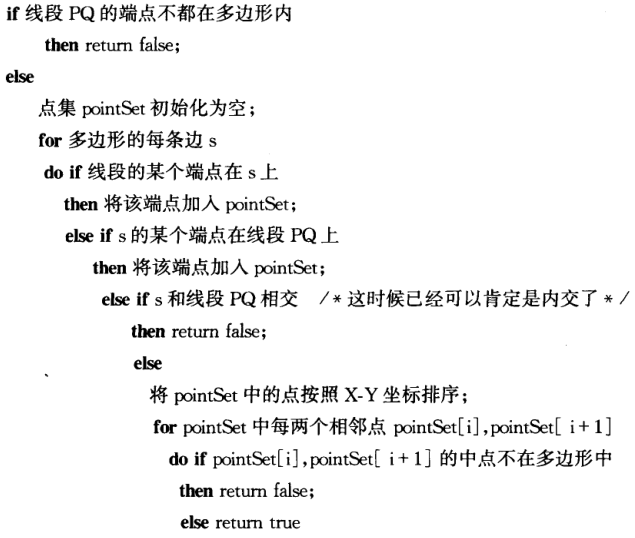

# 二维布尔运算

## 折线段的拐向

##### 折线段的拐向


## 点是否在线段上

##### 几何定义

- 设点 Q，线段 P1P2；

##### 计算步骤

1. 检验点是否在线段的 BBox 中;

```typescript
if (x < minX || x > maxX || y < minY || y > maxY) return false;
else return true;
```

2. 检验 Q 是否在 P1P2 形成的直线上;

$$QP_1 \times P_1P_2 = 0$$

## 两线段是否相交

##### 几何定义

- 设线段 Q1Q2，P1P2；

##### 计算步骤

1. 快速排斥实验: 检验两线段的 BBox 是否相交;

```typescript
if (maxXQ < minXP || minXQ > maxXP || maxYQ < minYP || minYQ > maxYP)
  return false;
else return true;
```

2. 跨立实验: 检验两线段是否相交;

$$(QP_1 \times P_1P_2) \cdot (QP_2 \times P_1P_2) \leq 0$$

## 矩形是否包含点

##### 矩形是否包含点

```typescript
if (x < minX || x > maxX || y < minY || y > maxY) return false;
else return true;
```

## 线, 多边形是否在矩形中

##### 线, 面是否在矩形

- 依次判断所有端点是否在矩形中；

## 矩形是否在矩形中

##### 矩形是否在矩形中

```typescript
if (maxXQ < minXP || minXQ > maxXP || maxYQ < minYP || minYQ > maxYP)
  return false;
else return true;
```

## 圆是否在矩形中

##### 圆是否在矩形中

1. 圆心在矩形中;
2. 圆心到四个边的最短距离大于等于半径;

## 点是否在多边形中

### 射线法

##### 射线法

1. 从点 p 向任意方向 (通常为右) 发射一条射线;
2. 若射线与多边形交点为奇数, 点在多边形内部, 反之在多边形外部;

##### 特殊规则(以右为基准)

- 方向向上的边只计算其起始点；
- 方向向下的边只计算其终止点；
- 水平边不参与计算；

```typescript
pointInPolygon(point, polygon){
  let num = 0
  for (const edge of polygon) {
    if(x < point.x) continue
    if(edge.direction.y === 0) continue
    if(x === y.min && edge.direction.y > 0) num += 1
    if(x === y.max && edge.direction.y < 0) num += 1
    if(x < y.max && x > y.min) num += 1
  }
  return num %2 !== 0
}
```

### 转角法

##### 转角法

1. 从点 p 向任意方向 (通常为右) 发射一条射线交多边形于 q;
2. 计算点 p 与各顶点的连线与 pq 夹角的和;

- 若为 0 度，则在多边形外；
- 若为 180 度，则在多边形上；
- 若为 360 度，则在多边形内；

## 线段是否在多边形中

##### 线段是否在多边形中

1. 判断两个端点都在多边形内;
2. 判断线段和多边形是否内交;
   1. 计算线段和多边形各边是否相交;
      1. 判断线段端点是否在多边形边上;
      2. 判断多边形顶点是否在线段上;
      3. 若线段和边相交且不是上述两种情况, 多边形内交, 线段不在多边形内;
   2. 交点顺序根据 x 或 y 排序;
   3. 判断相邻交点的中点是否在多边形内;
      - 若不在多边形内，线段与多边形内交，线段不在多边形内；



## 多边形是否在多边形中

##### 多边形是否在多边形中

- 依次计算各边是否在多边形中；

## 折线串是否在多边形中

##### 折线串是否在多边形中

- 依次计算各边是否在多边形中；

## 圆是否在多边形中

##### 圆是否在多边形中

1. 圆心在矩形中;
2. 圆心到各边的最短距离大于等于半径;

## 判断点是否在圆内

##### 判断点是否在圆内

1. 计算点到圆心距离 r;
2. 若 r 小于半径则在圆内, 反之圆外;

## 判断线段, 多边形是否在圆内

##### 判断线段, 多边形是否在圆内

- 依次判断各顶点是否在圆内；
