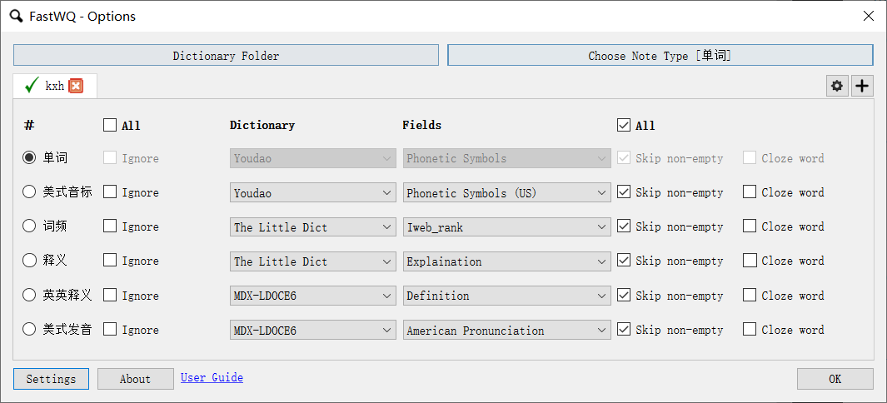

# anki

## 插件

### FastWordQuery

**插件项目地址**: [GitHub](https://github.com/sth2018/FastWordQuery)  
**功能**: 使用本地字典或现在网站, 自动填充自定义模板对应内容.

---

##### 安装

- 本地安装;
  - `工具-插件-查看本地文件`,
  - 将 addons21 文件夹储存至 anki 本地插件文件中.
- 在线安装.
  - `工具-插件-获取插件`,
  - 安装代码: 1807206748.

---

**配置**

##### 字典文件配置

- 点击 `工具-fastwq`, 打开 `option` 界面,
- 点击 `option` 左上方界面 `齿轮`,
- 修改已有配置文件(修改 DICT_PATH 为字典文件对应路径)或自行编写文件.

##### 插件界面配置

- dictionary folder: 添加自定义字典;
- chhoose note type: 选择卡牌模板;
- \#: 选中项为卡片正面与待查询字段;
- ignore: 即忽略该项;
- dictionary: 选择字典;
- fields: 字典相应字段;
- skip non-empty: 跳过模板中的非空字段;
- cloze word: 未知;
- settings: 默认即可.

---

**使用**

##### 浏览界面

- `菜单栏-浏览`,
- 选择指定单词,
- 点击 `fastwq-query selected` 或使用快捷键 `ctrl + q`.

##### 添加界面

- `菜单栏-添加`,
- 添加查询字段, 本处为"单词" 字段,
- 点击 `query-All Fields` 或使用快捷键 `ctrl + q`.
